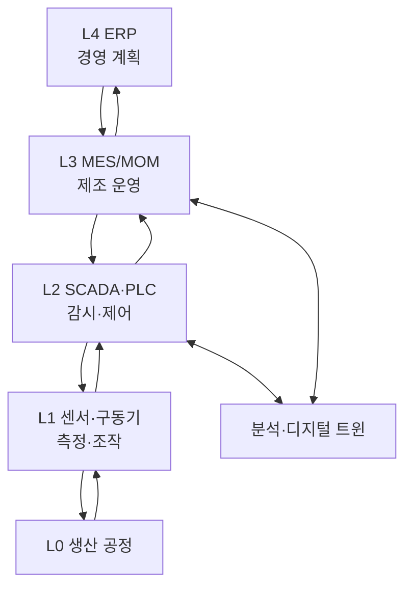

---
sidebar:
  order: 201
  label: "201. Smart Factory 스마트팩토리 (Smart Factory)"
  badge:
    text: "기출 · 85%"
    variant: note
title: "Smart Factory 스마트팩토리 (Smart Factory)"
date: "2026-07-27T23:59:59+09:00"
tags:
  - "notes-latest-tech"
weight: 201
extra:
  question_no: "201"
  source_status: "기출"
  source_history: "125회, 126회, 137회"
  priority: 85
  priority_note: "스마트팩토리의 연결·제어 구조가 여러 회차 반복됨"
---

## 미리 알고가기

- **Smart Factory(스마트 팩토리)**: 데이터를 기반으로 생산 전 과정을 연결·최적화하는 지능형 공장
- **IT/OT(아이티/오티)**: 정보 기술과 운영 기술이며, 두 영역의 연계가 생산 정보를 경영 의사결정으로 연결함
- **MES(엠이에스)**: Manufacturing Execution System의 약자로, 생산 지시·실적·품질을 관리하는 제조실행시스템
- **ERP(이알피)**: Enterprise Resource Planning의 약자로, 기업 자원을 계획·관리하는 전사적자원관리
- **ISA-95(아이에스에이 구십오)**: 기업과 제어 시스템의 기능 계층과 연계 기준을 정의한 국제 표준

## Ⅰ. 개요

- 정의/개념: 생산 데이터 연결 기반 실시간 제어·최적화 시스템
- 기존 한계: 설비별 자동화로 데이터 단절·국소 최적화 발생

### 쉽게 이해하기 (학습용)

- 기계별로 따로 움직이던 공장을 하나의 신경망처럼 연결하여 주문 변화와 품질 이상에 함께 대응하는 방식이다.

## Ⅱ. 특징

- **수직·수평 통합**: 설비부터 ERP까지 연결하고 공급망 정보를 연계
- **폐루프 최적화**: 현장 측정값을 분석하여 제어 조건에 지속 반영
- **추적성과 안전성**: 제품·공정 이력을 보존하고 승인 범위에서 제어

### 쉽게 이해하기 (학습용)

- 현장부터 경영까지 데이터를 연결해 분석 결과를 안전하게 생산 조건에 되돌리는 공장이다.

## Ⅲ. 아키텍처 및 구성요소

| 계층 | 책임 |
|:---|:---|
| L4 ERP | 수요·자원·생산계획 수립 |
| L3 MES/MOM | 작업 지시·실적·품질 관리 |
| L2 SCADA·PLC | 공정 감시와 실시간 제어 |
| L1 센서·구동기 | 상태 측정과 물리 동작 |
| L0 생산 공정 | 실제 제조·가공 수행 |
| 분석 계층 | 예측·최적화 결과 제공 |

> 요약: 계획부터 현장 제어까지 연결하여 생산 정보를 폐루프로 순환

### 쉽게 이해하기 (학습용)

- ERP가 계획하고 MES가 작업을 지시하며 PLC가 설비를 제어하고 현장 결과를 다시 올려보낸다.

## Ⅳ. 처리 절차 및 흐름

| 단계 | 핵심 활동 |
|:---|:---|
| 생산계획 | 수요·자원 기반 일정 수립 |
| 작업 지시 | 설비별 작업·조건 배포 |
| 공정 제어 | PLC로 설비 동작 제어 |
| 데이터 수집 | 실적·품질·상태 기록 |
| 분석·최적화 | 이상·병목·품질 원인 분석 |
| 승인·피드백 | 검증된 조건을 현장 반영 |

### 쉽게 이해하기 (학습용)

- 생산 지시부터 결과 분석까지 순환하되 제어 변경은 검증과 승인을 거친다.

## Ⅴ. 제조 운영 방식 비교

| 판단 기준 | 개별 자동화 | 스마트팩토리 | 디지털 팩토리 |
|:---|:---|:---|:---|
| 적용 기준 | 단일 설비 효율화 | 실제 공장 통합 운영 | 가상 설계·검증 중심 |
| 핵심 특징 | 설비별 독립 제어 | 데이터 기반 폐루프 최적화 | 시뮬레이션 기반 사전 검증 |
| 한계 | 데이터·공정 단절 | 통합·보안 복잡도 | 실제 현장 동기화 필요 |

### 쉽게 이해하기 (학습용)

- 스마트팩토리는 개별 설비 자동화를 넘어 실제 공장 전체를 데이터 폐루프로 운영한다.

## Ⅵ. 실무 사례

1. **자동차 조립 품질 최적화**: 체결 이력 기반 공정 조건 조정
2. **식품 설비 예지보전**: 진동 이상 기반 정비 일정 수립

### 쉽게 이해하기 (학습용)

- 체결 품질과 설비 진동을 분석해 불량 조건과 정비 시점을 생산 현장에 반영한다.

## Ⅶ. 결론

- **현장 단절이 핵심이면 수직·수평 통합**
- **품질 변동이 핵심이면 폐루프 최적화**
- **제어 변경은 안전 검증 후 승인 반영**

### 쉽게 이해하기 (학습용)

- 데이터 연결 자체보다 검증된 분석 결과가 안전하게 현장 개선으로 이어지는지가 핵심이다.
