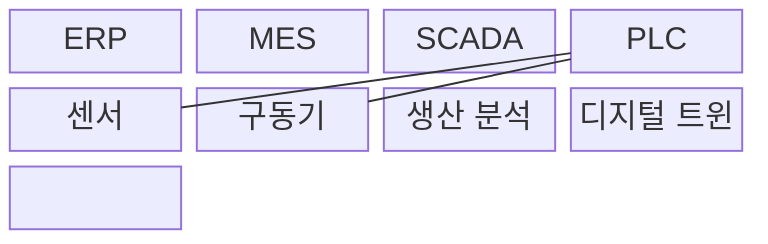
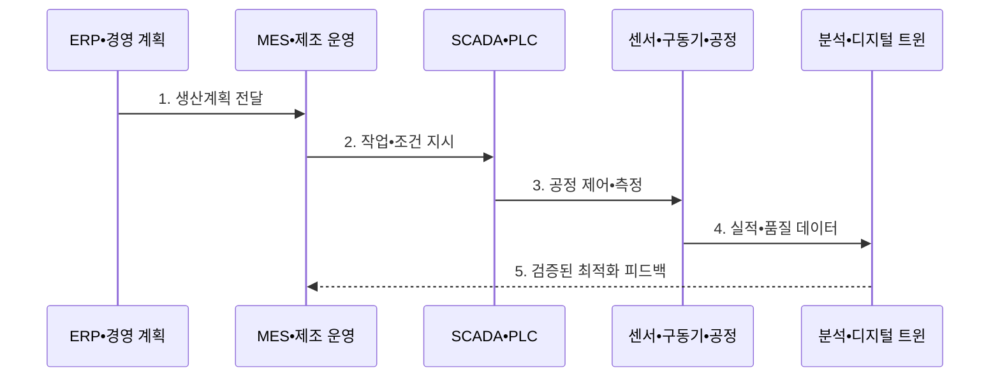

---
sidebar:
  order: 201
  label: "201. 스마트 팩토리 (Smart Factory)"
  badge:
    text: "기출 • 85%"
    variant: note
title: "스마트 팩토리 (Smart Factory)"
date: "2026-08-04T12:35:00+09:00"
tags:
  - "notes-latest-tech"
weight: 201
extra:
  question_no: "201"
  source_status: "기출"
  source_history: "125회, 126회, 137회"
  priority: 85
  priority_note: "스마트팩토리의 연결•제어 구조가 여러 회차 반복됨"
---

## Ⅰ. 개요

핵심 용어

- **스마트 팩토리(Smart Factory)**: 생산 데이터를 연결해 전 공정을 실시간 제어•최적화하는 지능형 공장이다.

- 정의/개념: **스마트 팩토리** 는 생산 데이터를 연결해 공정을 실시간 제어•최적화하는 공장
- 배경/필요성: 설비별 자동화는 공정 간 **데이터 단절•국소 최적화** 초래

#### 한줄 요약

- 기계별로 따로 움직이던 공장을 하나의 신경망처럼 연결하여 주문 변화와 품질 이상에 함께 대응하는 방식이다.

## Ⅱ. 특징

핵심 용어

- **수직•수평 통합**: 설비에서 경영 계층까지 연결하고 공정•공장•공급망 사이의 데이터를 연계하는 방식이다.
- **전사적 자원 관리(Enterprise Resource Planning, ERP)**: 수요•자재•원가•납기 계획을 관리하는 시스템이다.

- 설비부터 **ERP** 와 공급망을 연결하는 **수직•수평 통합**
- 현장 측정값을 제어 조건에 반영하는 **폐루프 최적화**
- 승인 범위에서 제품•공정 이력을 보존하는 **추적성•안전성**
#### 한줄 요약

- 현장부터 경영까지 데이터를 연결해 분석 결과를 안전하게 생산 조건에 되돌리는 공장이다.

## Ⅲ. 구조 및 구성요소

핵심 용어

- **제조실행시스템(Manufacturing Execution System, MES)**: 생산 지시•실적•품질을 관리해 계획과 현장을 연결하는 시스템이다.
- **감시 제어 및 데이터 수집(Supervisory Control and Data Acquisition, SCADA)**: 설비 상태를 수집•시각화하고 제어 명령을 전달하는 시스템이다.
- **프로그래머블 로직 컨트롤러(Programmable Logic Controller, PLC)**: 센서 입력과 제어 로직에 따라 구동기를 제어하는 산업용 제어기이다.
- **센서**: 공정의 물리 상태를 측정해 제어 데이터로 변환하는 장치이다.
- **구동기**: 제어 명령을 물리적 동작으로 변환하는 장치이다.
- **생산 분석**: 생산 데이터로 품질•고장•공정 성능을 예측하는 기능이다.
- **디지털 트윈**: 실제 공정의 상태와 동작을 가상 모델로 재현해 개선안을 검증하는 기술이다.

**ERP** 계획을 **MES** 가 작업으로 변환하고, **SCADA** 와 **PLC** 가 현장을 제어한다.

| 구성요소 | 책임 |
|:---|:---|
| ERP | 수요•자원 기반 **생산계획** 수립 |
| MES | **작업 지시•실적•품질** 관리 |
| SCADA | 공정 상태 **감시•시각화** |
| PLC | 제어 로직 기반 **실시간 제어** |
| 센서 | 공정의 **물리 상태 측정** |
| 구동기 | 제어 명령의 **물리 동작 수행** |
| 생산 분석 | 품질•고장의 **예측•최적화** |
| 디지털 트윈 | 개선안의 **가상 검증** |

#### 한줄 요약

- ERP가 계획하고 MES가 작업을 지시하며 PLC가 설비를 제어하고 현장 결과를 다시 올려보낸다.

## Ⅳ. 흐름도

핵심 용어

- **폐루프 최적화**: 현장 측정 결과를 분석하여 검증된 공정 조건으로 다시 반영하는 순환 방식이다.

**동작 원리**

1. **생산계획 전달**: 수요•자원 기반 일정과 목표 배포
2. **작업•조건 지시**: 공정•설비별 작업과 허용 조건 설정
3. **공정 제어•측정**: **PLC** 제어와 센서 상태 수집
4. **실적•품질 데이터**: 생산 이력과 이상•품질 신호 전달
5. **검증된 최적화 피드백**: 안전 검증•승인 후 조건을 **MES** 에 반영

#### 한줄 요약

- 생산 지시부터 결과 분석까지 순환하되 제어 변경은 검증과 승인을 거친다.

## Ⅴ. 종류 및 비교

핵심 용어

- **디지털 팩토리(Digital Factory)**: 가상 모델과 시뮬레이션을 이용해 공장과 생산 공정을 설계•검증하는 체계다.

| 판단 기준 | 개별 자동화 | 스마트팩토리 | 디지털 팩토리 |
|:---|:---|:---|:---|
| 적용 기준 | **단일 설비 효율화** | 실제 공장의 **통합 운영** | **가상 설계•검증** 중심 |
| 핵심 특징 | 설비별 **독립 제어** | 데이터 기반 **폐루프 최적화** | 시뮬레이션 기반 **사전 검증** |
| 한계 | **데이터•공정 단절** | **통합•보안 복잡도** | 실제 현장과 **동기화 필요** |

#### 한줄 요약

- 스마트팩토리는 개별 설비 자동화를 넘어 실제 공장 전체를 데이터 폐루프로 운영한다.

## Ⅵ. 실무 고려사항 및 대책

핵심 용어

- **ISA-95**: 기업과 제어 시스템의 기능 계층과 정보 연계 기준을 정의한 국제표준이다.
- **국제자동화학회(International Society of Automation, ISA)**: 산업 자동화 표준을 개발하는 전문 기관이다.
- **운영기술(Operational Technology, OT)**: 물리 설비•공정을 감시하고 제어하는 기술 체계이다.

| 문제 | 대책 | 효과 |
|:---|:---|:---|
| **정보기술•OT 데이터 의미 불일치** | **ISA-95** 기반 자산•공정 식별자 표준화 | 수직 통합의 **정확도 향상** |
| 분석 결과의 **위험한 자동 제어** | 한계값•가상 검증•작업자 승인 | **설비•인명 안전** 확보 |
| 레거시 연결의 **공격면 증가** | 구역 분리•게이트웨이•최소 권한 | **OT 장애•침해 확산 억제** |

#### 한줄 요약

- 생산 데이터를 분석해 찾은 불량 조건은 안전성을 확인한 뒤 현장 공정에 반영한다.

## Ⅶ. 결론

핵심 용어

- **제어 안전성**: 분석 결과를 현장에 반영하기 전에 허용 한계와 승인 절차로 위험한 동작을 차단하는 성질이다.

- 공정 연계 범위에 따라 **수직•수평 통합** 을 적용하고 **제어 안전성** 검증

#### 한줄 요약

- 스마트 팩토리는 연결된 데이터가 검증된 현장 개선으로 안전하게 이어져야 한다.
