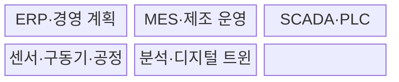
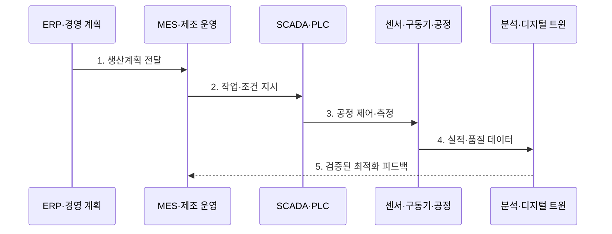

---
sidebar:
  order: 201
  label: "201. 스마트 팩토리 (Smart Factory)"
  badge:
    text: "기출 · 85%"
    variant: note
title: "스마트 팩토리 (Smart Factory)"
date: "2026-07-31T08:56:50+09:00"
tags:
  - "notes-latest-tech"
weight: 201
extra:
  question_no: "201"
  source_status: "기출"
  source_history: "125회, 126회, 137회"
  priority: 85
  priority_note: "스마트팩토리의 연결·제어 구조가 여러 회차 반복됨"
---

## 미리 알고가기

- **Smart Factory(스마트 팩토리)**: 데이터를 기반으로 생산 전 과정을 연결·최적화하는 지능형 공장
- **IT/OT(아이티/오티)**: 정보 기술과 운영 기술이며, 두 영역의 연계가 생산 정보를 경영 의사결정으로 연결함
- **MES(엠이에스)**: Manufacturing Execution System의 약자로, 생산 지시·실적·품질을 관리하는 제조실행시스템
- **ERP(이알피)**: Enterprise Resource Planning의 약자로, 기업 자원을 계획·관리하는 전사적자원관리
- **ISA-95(아이에스에이 구십오)**: 기업과 제어 시스템의 기능 계층과 연계 기준을 정의한 국제 표준

> **키워드:** 스마트 팩토리 (Smart Factory)

## Ⅰ. 개요

- 정의/개념: **스마트 팩토리**는 생산 데이터를 연결해 공정을 실시간 제어·최적화하는 공장
- 배경/필요성: 설비별 자동화는 공정 간 **데이터 단절·국소 최적화** 초래

### 쉽게 이해하기 (학습용)

- 기계별로 따로 움직이던 공장을 하나의 신경망처럼 연결하여 주문 변화와 품질 이상에 함께 대응하는 방식이다.

## Ⅱ. 특징

- 설비부터 ERP와 공급망을 연결하는 **수직·수평 통합**
- 현장 측정값을 제어 조건에 반영하는 **폐루프 최적화**
- 승인 범위에서 제품·공정 이력을 보존하는 **추적성·안전성**
### 쉽게 이해하기 (학습용)

- 현장부터 경영까지 데이터를 연결해 분석 결과를 안전하게 생산 조건에 되돌리는 공장이다.

## Ⅲ. 구조 및 구성요소

| 구성요소 | 책임 |
|:---|:---|
| ERP·경영 계획 | 수요·자원 기반 **생산계획** 수립 |
| MES·제조 운영 | **작업 지시·실적·품질** 관리 |
| SCADA·PLC | 공정 감시와 **실시간 제어** |
| 센서·구동기·공정 | **상태 측정·제조 동작** 수행 |
| 분석·디지털 트윈 | **예측·최적화·가상 검증** |

### 쉽게 이해하기 (학습용)

- ERP가 계획하고 MES가 작업을 지시하며 PLC가 설비를 제어하고 현장 결과를 다시 올려보낸다.

## Ⅳ. 흐름도

**동작 원리**

1. **생산계획 전달**: 수요·자원 기반 일정과 목표 배포
2. **작업·조건 지시**: 공정·설비별 작업과 허용 조건 설정
3. **공정 제어·측정**: PLC 제어와 센서 상태 수집
4. **실적·품질 데이터**: 생산 이력과 이상·품질 신호 전달
5. **검증된 최적화 피드백**: 안전 검증·승인 후 조건을 MES에 반영

### 쉽게 이해하기 (학습용)

- 생산 지시부터 결과 분석까지 순환하되 제어 변경은 검증과 승인을 거친다.

## Ⅴ. 종류 및 비교

| 판단 기준 | 개별 자동화 | 스마트팩토리 | 디지털 팩토리 |
|:---|:---|:---|:---|
| 적용 기준 | **단일 설비 효율화** | 실제 공장의 **통합 운영** | **가상 설계·검증** 중심 |
| 핵심 특징 | 설비별 **독립 제어** | 데이터 기반 **폐루프 최적화** | 시뮬레이션 기반 **사전 검증** |
| 한계 | **데이터·공정 단절** | **통합·보안 복잡도** | 실제 현장과 **동기화 필요** |

### 쉽게 이해하기 (학습용)

- 스마트팩토리는 개별 설비 자동화를 넘어 실제 공장 전체를 데이터 폐루프로 운영한다.

## Ⅵ. 실무 고려사항 및 대책

| 고려사항 | 대책 | 효과 |
|:---|:---|:---|
| **IT·OT 데이터 의미 불일치** | **ISA-95** 기반 자산·공정 식별자 표준화 | 수직 통합의 **정확도 향상** |
| 분석 결과의 **위험한 자동 제어** | 한계값·가상 검증·작업자 승인 | **설비·인명 안전** 확보 |
| 레거시 연결의 **공격면 증가** | 구역 분리·게이트웨이·최소 권한 | OT **장애·침해 확산 억제** |

### 쉽게 이해하기 (학습용)

- 생산 데이터를 분석해 찾은 불량 조건은 안전성을 확인한 뒤 현장 공정에 반영한다.

## Ⅶ. 결론

- 공정 연계 범위에 따라 **수직·수평 통합**을 적용하고 **제어 안전성** 검증

### 쉽게 이해하기 (학습용)

- 스마트 팩토리는 연결된 데이터가 검증된 현장 개선으로 안전하게 이어져야 한다.
