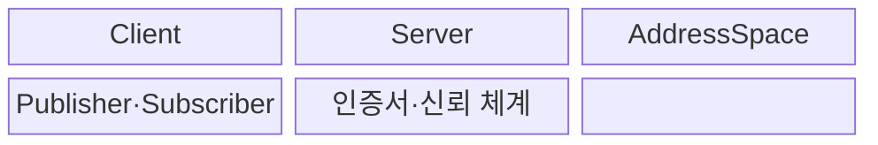
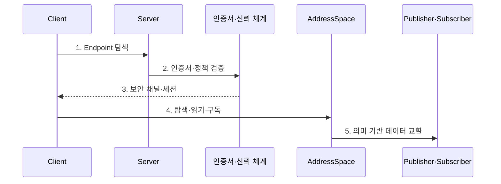

---
sidebar:
  order: 202
  label: "202. OPC UA 산업 표준 통신 (OPC Unified Architecture)"
  badge:
    text: "기출 · 70%"
    variant: note
title: "OPC UA 산업 표준 통신 (OPC Unified Architecture)"
date: "2026-07-31T08:57:21+09:00"
tags:
  - "notes-latest-tech"
weight: 202
extra:
  question_no: "202"
  source_status: "기출"
  source_history: "137회"
  priority: 70
  priority_note: "OPC UA 정보 모델·보안 통신이 최근 출제됨"
---

## Ⅰ. 개요

핵심 용어

- **OPC 통합 아키텍처(OPC Unified Architecture, OPC UA)**: 산업 데이터의 의미·통신·보안을 통합하여 이기종 설비의 상호운용을 지원하는 표준이다.

- 정의/개념: **OPC 통합 아키텍처(OPC Unified Architecture, OPC UA)** 는 산업 데이터의 의미·통신·보안을 통합한 상호운용 표준
- 배경/필요성: 공급사별 태그의 **의미·주소 체계 불일치** 로 설비 연계 제약

#### 한줄 요약

- 서로 다른 제조사의 장비가 공통 사전과 통신 규칙을 사용하여 값뿐 아니라 값의 의미까지 교환하는 방식이다.

## Ⅱ. 특징

핵심 용어

- **의미 기반 정보 모델**: 설비 객체를 노드·속성·참조 관계로 표현해 값의 의미까지 교환하게 한다.

- 노드·속성·참조로 설비를 표현하는 **의미 기반 정보 모델**
- 클라이언트-서버(Client-Server)·**발행-구독(Publish-Subscribe, PubSub)** 을 지원하는 **복수 통신 모델**
- 인증·서명·암호화·권한 제어를 제공하는 **통합 보안**
#### 한줄 요약

- 제조사가 다른 설비도 같은 의미 체계와 보안 규칙으로 데이터를 주고받게 한다.

## Ⅲ. 구조 및 구성요소

핵심 용어

- **주소 공간(AddressSpace)**: 설비 객체와 그 관계를 노드·속성·참조로 표현하는 OPC 통합 아키텍처의 정보 공간이다.
- **클라이언트·서버 서비스**: 탐색·읽기·쓰기·호출·구독으로 주소 공간의 정보와 기능을 이용하는 통신 모델이다.
- **발행-구독(PubSub)**: 게시자가 데이터셋 메시지를 발행하고 다수 구독자가 비동기로 수신하는 전송 모델이다.
- **정보 모델**: 공통 타입·객체·변수·참조로 설비의 의미와 관계를 상호운용 가능하게 표현한 규약이다.
- **인증서·신뢰 체계**: 애플리케이션 신원과 보안 채널을 인증서로 검증하고 메시지를 서명·암호화하는 보안 기반이다.

**OPC 통합 아키텍처(OPC Unified Architecture, OPC UA)** 서버의 주소 공간(AddressSpace)을 클라이언트가 탐색하며, **발행-구독(Publish-Subscribe, PubSub)** 모델은 데이터셋을 여러 구독자에게 전달한다.

| 구성요소 | 책임 |
|:---|:---|
| Client | **탐색·읽기·쓰기·구독** 요청 |
| Server | **서비스·세션** 관리 |
| AddressSpace | **노드·속성·참조 관계** 표현 |
| Publisher·Subscriber | **DataSet 메시지** 발행·수신 |
| 인증서·신뢰 체계 | **인증서·키·권한** 관리 |

#### 한줄 요약

- 주소 공간이 설비 의미를 설명하고 통신 계층이 그 정보를 안전하게 전달한다.

## Ⅳ. 흐름도

핵심 용어

- **보안 채널**: 인증서를 검증한 통신 주체 사이에서 메시지의 서명과 암호화를 제공하는 연결이다.

**동작 원리**

1. **Endpoint 탐색**: 주소·보안 정책·지원 프로파일 확인
2. **인증서·정책 검증**: 발급자·유효기간·폐기·신뢰 목록 확인
3. **보안 채널·세션**: 서명·암호화와 사용자 인증 수립
4. **탐색·읽기·구독**: AddressSpace의 노드·속성·참조 이용
5. **의미 기반 데이터 교환**: 클라이언트-서버(Client-Server) 또는 **발행-구독(Publish-Subscribe, PubSub)** 으로 값과 의미 전달

#### 한줄 요약

- 설비를 탐색해 보안 통신을 만들고 값과 상태 변경 이력을 교환한다.

## Ⅴ. 종류 및 비교

핵심 용어

- **발행-구독(PubSub)**: 발행자와 구독자를 분리하여 데이터셋 메시지를 여러 수신자에게 배포하는 통신 모델이다.

| 판단 기준 | OPC 통합 아키텍처(OPC Unified Architecture, OPC UA) 클라이언트-서버 | OPC UA 발행-구독(Publish-Subscribe, PubSub) | 단순 태그 프로토콜 |
|:---|:---|:---|:---|
| 적용 기준 | **질의·명령·상태 구독** | 다수 대상 **실시간 배포** | **단순 값 교환** |
| 핵심 특징 | 세션 기반 **서비스 호출** | 송수신자 분리 **메시징** | **주소·값 중심 통신** |
| 한계 | **연결·세션 관리** 부담 | **배포·키 관리** 필요 | **의미·보안 표준** 부족 |

#### 한줄 요약

- 개별 요청은 Client-Server, 다수 배포는 PubSub가 적합하며 둘 다 정보 모델이 필요하다.

## Ⅵ. 실무 고려사항 및 대책

핵심 용어

- **동반 명세(Companion Specification)**: 산업별 장비와 데이터의 공통 의미 모델을 정의해 공급사 간 해석 차이를 줄이는 명세다.

| 문제 | 대책 | 효과 |
|:---|:---|:---|
| 공급사별 **Namespace·모델 차이** | **Companion Specification**·매핑 규칙 적용 | 의미 **상호운용성 향상** |
| 만료·미신뢰 **인증서 연결 중단** | 자동 갱신·신뢰 목록·폐기 절차 운영 | 안전한 **가용성 확보** |
| 과도한 **쓰기·Method 권한** | 역할별 노드·서비스 최소 권한 | **설비 오조작 방지** |

#### 한줄 요약

- 제조사가 다른 설비도 공통 정보 모델과 신뢰 체계를 사용하면 같은 의미로 안전하게 연동할 수 있다.

## Ⅶ. 결론

핵심 용어

- **클라이언트-서버(Client-Server)**: 클라이언트가 서버의 서비스를 호출하고 상태 변경을 구독하는 세션 기반 통신 모델이다.

- 질의·배포 패턴에 따라 **클라이언트-서버(Client-Server)·발행-구독(Publish-Subscribe, PubSub)** 을 선택하고 **인증서** 검증

#### 한줄 요약

- **OPC 통합 아키텍처(OPC Unified Architecture, OPC UA)** 는 연결 방식과 함께 설비 의미와 신뢰 관리를 표준화해야 한다.
