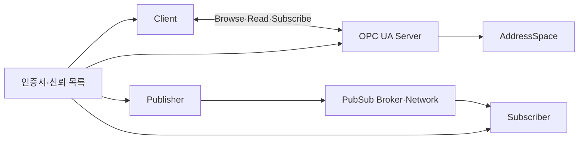

---
sidebar:
  order: 202
  label: "202. OPC UA 산업 표준 통신 (OPC Unified Architecture)"
  badge:
    text: "기출 · 70%"
    variant: note
title: "OPC UA 산업 표준 통신 (OPC Unified Architecture)"
date: "2026-07-27T23:59:59+09:00"
tags:
  - "notes-latest-tech"
weight: 202
extra:
  question_no: "202"
  source_status: "기출"
  source_history: "137회"
  priority: 70
  priority_note: "OPC UA 정보 모델·보안 통신이 최근 출제됨"
---

## 미리 알고가기

- **OPC UA(오피씨 유에이)**: OPC Unified Architecture의 약자로, 산업 데이터의 의미·통신·보안을 통합한 상호운용 표준
- **OPC**: 초기 OLE for Process Control에서 출발했으나, 현재는 플랫폼 독립 산업 표준의 고유 명칭으로 사용
- **AddressSpace(어드레스 스페이스)**: 설비 객체를 노드·속성·참조 관계로 표현하는 정보 공간
- **Client-Server(클라이언트-서버)**: 요청·응답과 구독으로 데이터를 교환하는 통신 방식
- **PubSub(펍섭)**: Publisher-Subscriber의 줄임말로, 발행자와 구독자를 분리한 메시지 배포 방식

## Ⅰ. 개요

- **정의/개념**: 산업 데이터 의미·통신·보안의 상호운용 표준
- **기존 한계**: 공급사별 태그 의미 불일치로 설비 연계 제한

### 쉽게 이해하기 (학습용)

- 서로 다른 제조사의 장비가 공통 사전과 통신 규칙을 사용하여 값뿐 아니라 값의 의미까지 교환하는 방식이다.

## Ⅱ. 특징

- **의미 기반 정보 모델**: 노드·속성·참조로 설비 구조와 의미 표현
- **복수 통신 모델**: Client-Server·PubSub 병행 지원
- **통합 보안**: 인증서 기반 인증·서명·암호화·권한 제어 제공

### 쉽게 이해하기 (학습용)

- 제조사가 다른 설비도 같은 의미 체계와 보안 규칙으로 데이터를 주고받게 한다.

## Ⅲ. 아키텍처 및 구성요소

| 구성요소 | 책임 |
|:---|:---|
| Client | 탐색·읽기·쓰기·구독 요청 |
| Server | 서비스 제공과 세션 관리 |
| AddressSpace | 노드·속성·참조 관계 표현 |
| Publisher | DataSet 메시지 발행 |
| Subscriber | 메시지 수신·처리 |
| 신뢰 체계 | 인증서·키·권한 관리 |

> 요약: 정보 모델과 통신 모델을 통합 보안 아래 결합

### 쉽게 이해하기 (학습용)

- 주소 공간이 설비 의미를 설명하고 통신 계층이 그 정보를 안전하게 전달한다.

## Ⅳ. 처리 절차 및 흐름

| 단계 | 핵심 활동 |
|:---|:---|
| 정보 모델 합의 | Namespace와 객체 형식 정의 |
| Endpoint 탐색 | 주소·정책·프로파일 확인 |
| 인증서 검증 | 발급자·유효기간·폐기 확인 |
| 채널·세션 수립 | 서명·암호화와 사용자 인증 |
| 서비스 이용 | Browse·Read·Subscribe 수행 |
| 운영 관리 | 인증서 갱신과 감사 기록 |

### 쉽게 이해하기 (학습용)

- 설비를 탐색해 보안 통신을 만들고 값과 상태 변경 이력을 교환한다.

## Ⅴ. 산업 통신 방식 비교

| 판단 기준 | OPC UA Client-Server | OPC UA PubSub | 단순 태그 프로토콜 |
|:---|:---|:---|:---|
| 적용 기준 | 질의·명령·상태 구독 | 다수 대상 실시간 배포 | 단순 값 교환 |
| 핵심 특징 | 세션 기반 서비스 호출 | 송수신자 분리 메시징 | 주소·값 중심 통신 |
| 한계 | 연결·세션 관리 부담 | 배포·키 관리 필요 | 의미·보안 표준 부족 |

### 쉽게 이해하기 (학습용)

- 개별 요청은 Client-Server, 다수 배포는 PubSub가 적합하며 둘 다 정보 모델이 필요하다.

## Ⅵ. 실무 사례

1. **포장 설비 상호운용**: 공통 모델로 상태·명령 의미 통일
2. **PLC 상태 대량 배포**: PubSub로 다수 분석계에 전송

### 쉽게 이해하기 (학습용)

- 설비 제어 요청과 대규모 상태 배포를 목적에 맞는 통신 모델로 나눈다.

## Ⅶ. 결론

- **질의·명령 중심이면 Client-Server**
- **다수 수신자 배포이면 PubSub**
- **모든 방식에 정보 모델과 신뢰 관리 적용**

### 쉽게 이해하기 (학습용)

- 연결 방식보다 설비 의미와 인증서·권한을 함께 표준화하는 것이 중요하다.
