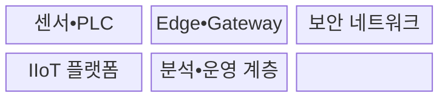
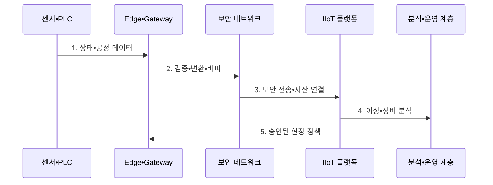

---
sidebar:
  order: 203
  label: "203. 산업용 사물인터넷 (Industrial IoT)"
  badge:
    text: "기출 • 70%"
    variant: note
title: "산업용 사물인터넷 (Industrial IoT)"
date: "2026-08-03T08:48:47+09:00"
tags:
  - "notes-latest-tech"
weight: 203
extra:
  question_no: "203"
  source_status: "기출"
  source_history: "137회"
  priority: 70
  priority_note: "산업 IoT의 현장 연결•보안 설계가 최근 출제됨"
---

## Ⅰ. 개요

핵심 용어

- **산업용 사물인터넷(Industrial Internet of Things, IIoT)**: 산업 설비와 센서를 연결하여 물리 공정을 감시•분석•제어하는 체계이다.

- 정의/개념: 산업 설비•센서를 연결해 공정을 감시•분석•제어하는 **산업용 사물인터넷(Industrial Internet of Things, IIoT) 체계**
- 배경/필요성: 고립된 설비는 원격 상태 파악과 **예측 정비 수행 곤란**

#### 한줄 요약

- 공장 곳곳의 설비 상태를 에지에서 먼저 판단하고 중앙 분석과 연결하여 고장과 품질 변화를 조기에 대응하는 구조다.

## Ⅱ. 특징

핵심 용어

- **현장 자율성**: 중앙 시스템이나 통신에 장애가 생겨도 에지가 필수 감시와 안전 제어를 지속하는 능력이다.

- 기존 설비 데이터를 변환•정제하는 **산업 자산•에지 연결**
- 장애 버퍼링•품질 검증을 적용한 **신뢰성 있는 데이터 흐름**
- 중앙 장애에도 로컬 제어를 유지하는 **현장 자율성**
#### 한줄 요약

- 오래된 산업 설비를 연결하되 안전 제어는 현장에 남기고 분석 범위만 확장한다.

## Ⅲ. 구조 및 구성요소

핵심 용어

- **산업 게이트웨이**: 기존 설비 프로토콜을 변환하고 데이터를 집계•보호하여 플랫폼과 연결하는 장치이다.
- **센서•PLC**: 공정 상태를 측정하고 결정적 제어를 실행하는 운영기술 현장 계층이다.
- **보안 네트워크**: 산업 구역을 분리하고 인증•암호화•접근 통제로 설비와 플랫폼 사이 통신을 보호한다.
- **IIoT 플랫폼**: 장치 등록•데이터 수집•명령•자산 모델•규칙 실행을 통합하는 산업용 사물인터넷 기반이다.
- **분석•운영 계층**: 설비 데이터를 이용해 상태 감시•예지 정비•품질 최적화 결과를 현장 운영에 환류한다.

프로그래머블 로직 컨트롤러(Programmable Logic Controller, PLC)의 데이터를 산업용 사물인터넷(Industrial Internet of Things, IIoT) 플랫폼에 연결한다.

| 구성요소 | 책임 |
|:---|:---|
| 센서•PLC | **상태 측정•실시간 제어** |
| Edge•Gateway | **변환•정제•버퍼•로컬 분석** |
| 보안 네트워크 | **구역 분리•암호화 전송** |
| IIoT 플랫폼 | **자산•시계열•이벤트** 관리 |
| 분석•운영 계층 | **예측•이상 분석 및 정비 의사결정** |

#### 한줄 요약

- 게이트웨이와 에지가 설비 데이터를 정리해 플랫폼으로 보내고 현장 제어는 독립 유지한다.

## Ⅳ. 흐름도

핵심 용어

- **저장 후 전달(Store-and-Forward)**: 통신 장애 동안 데이터를 저장하고 연결이 복구되면 순서대로 전송하는 방식이다.

프로그래머블 로직 컨트롤러(Programmable Logic Controller, PLC) 상태를 산업용 사물인터넷(Industrial Internet of Things, IIoT) 플랫폼으로 전달한다.

**동작 원리**

1. **상태•공정 데이터**: 센서 값과 PLC 상태 수집
2. **검증•변환•버퍼**: 단위•시간•결측 확인과 Store-and-Forward
3. **보안 전송•자산 연결**: 구역 경계를 거쳐 자산•시계열에 연결
4. **이상•정비 분석**: 고장•품질 위험 탐지와 작업 의사결정
5. **승인된 현장 정책**: 안전 인터록 범위의 정책만 에지에 반영

#### 한줄 요약

- 측정값을 현장에서 검증•저장한 뒤 승인된 조치만 다시 설비에 반영한다.

## Ⅴ. 종류 및 비교

핵심 용어

- **감시 제어 및 데이터 수집(Supervisory Control and Data Acquisition, SCADA)**: 제한된 산업 구역에서 설비 상태를 중앙 감시하고 공정을 제어하는 운영 기술 체계이다.

산업용 사물인터넷(Industrial Internet of Things, IIoT), 소비자 사물인터넷(Internet of Things, IoT), 감시 제어 및 데이터 수집(Supervisory Control and Data Acquisition, SCADA)은 적용 범위와 제어 특성이 다르다.

| 판단 기준 | IIoT | 소비자 IoT | 전통 SCADA |
|:---|:---|:---|:---|
| 적용 기준 | **산업 자산 분석•운영** | **생활 편의•개인 서비스** | 제한 구역의 **감시•제어** |
| 핵심 특징 | **에지•플랫폼•자산 통합** | **클라우드•앱 중심 연결** | 중앙 감시와 **결정적 제어** |
| 한계 | 기존 설비•**보안 통합 부담** | 산업 **안전•가용성 부족** | 전사 **분석•확장성 제한** |

#### 한줄 요약

- IIoT는 일반 IoT의 연결성을 산업 안전•가용성•기존 설비 제약에 맞게 확장한다.

## Ⅵ. 실무 고려사항 및 대책

핵심 용어

- **시간 동기화**: 센서와 설비의 측정 시각을 공통 기준에 맞춰 사건 순서와 분석 정확도를 보장하는 과정이다.

| 문제 | 대책 | 효과 |
|:---|:---|:---|
| 통신 단절 시 **데이터•제어 중단** | **Store-and-Forward•로컬 인터록** | 현장 자율성과 **데이터 연속성** |
| 레거시 프로토콜의 **취약한 보안** | 산업 게이트웨이•구역 분리•허용 목록 | 설비의 **직접 노출 방지** |
| 센서의 **시간•단위•품질 불일치** | 에지 검증•시간 동기화•품질 플래그 | **분석 오판 감소** |

#### 한줄 요약

- 전사 분석은 중앙에서 수행해도 저지연 안전 제어는 통신 장애와 무관하게 현장에서 동작해야 한다.

## Ⅶ. 결론

핵심 용어

- **에지 제어**: 데이터 발생 현장 가까이에서 저지연 판단과 안전 동작을 수행하는 제어 방식이다.

- 제어 지연•통신 복원력에 따른 **에지 제어•플랫폼 분석 역할 분리**

#### 한줄 요약

- 산업용 사물인터넷(Industrial Internet of Things, IIoT)은 통신이 끊겨도 현장 안전 제어가 계속 동작하도록 설계해야 한다.
