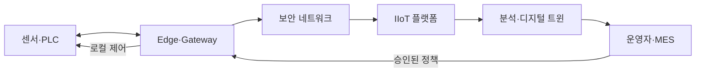

---
sidebar:
  order: 203
  label: "203. Industrial IoT 산업용 사물인터넷 (Industrial Internet of Things)"
  badge:
    text: "기출 · 70%"
    variant: note
title: "Industrial IoT 산업용 사물인터넷 (Industrial Internet of Things)"
date: "2026-07-27T23:59:59+09:00"
tags:
  - "notes-latest-tech"
weight: 203
extra:
  question_no: "203"
  source_status: "기출"
  source_history: "137회"
  priority: 70
  priority_note: "산업 IoT의 현장 연결·보안 설계가 최근 출제됨"
---

## 미리 알고가기

- **IIoT(아이아이오티)**: Industrial Internet of Things의 약자로, 산업 설비·센서를 연결하여 감시·분석·제어하는 산업용 사물인터넷
- **OT(오티)**: Operational Technology의 약자로, 설비와 물리 공정을 운용·제어하는 기술
- **Edge(에지)**: 데이터 발생 현장 가까이에서 전처리·판단하여 지연과 통신 의존도를 줄이는 계층
- **Gateway(게이트웨이)**: 기존 설비 프로토콜을 변환하고 데이터를 집계·보호하는 연결 장치
- **Store-and-Forward**: 통신 장애 시 데이터를 저장한 뒤 연결 복구 후 전송하는 방식

## Ⅰ. 개요

- **정의/개념**: 산업 자산 연결 기반 감시·분석·제어 체계
- **기존 한계**: 고립 설비로 원격 가시성·예측 정비 제한

### 쉽게 이해하기 (학습용)

- 공장 곳곳의 설비 상태를 에지에서 먼저 판단하고 중앙 분석과 연결하여 고장과 품질 변화를 조기에 대응하는 구조다.

## Ⅱ. 특징

- **산업 자산·에지 연결**: 기존 설비 데이터를 변환·정제하여 수집
- **신뢰성 있는 데이터 흐름**: 장애 버퍼링·품질 검증 적용
- **안전·보안·현장 자율성**: 중앙 장애에도 로컬 제어 유지

### 쉽게 이해하기 (학습용)

- 오래된 산업 설비를 연결하되 안전 제어는 현장에 남기고 분석 범위만 확장한다.

## Ⅲ. 아키텍처 및 구성요소

| 구성요소 | 책임 |
|:---|:---|
| 센서·PLC | 상태 측정과 실시간 제어 |
| Edge·Gateway | 변환·정제·버퍼·로컬 분석 |
| 보안 네트워크 | 구역 분리와 암호화 전송 |
| IIoT 플랫폼 | 자산·시계열·이벤트 관리 |
| 분석 계층 | 예측·이상·최적화 분석 |
| 운영 계층 | 승인·정비·생산 의사결정 |

> 요약: 현장 자율성을 유지하며 산업 데이터를 분석·운영 계층에 연결

### 쉽게 이해하기 (학습용)

- 게이트웨이와 에지가 설비 데이터를 정리해 플랫폼으로 보내고 현장 제어는 독립 유지한다.

## Ⅳ. 처리 절차 및 흐름

| 단계 | 핵심 활동 |
|:---|:---|
| 자산·위험 식별 | 중요도·통신·안전 경계 정의 |
| 수집·검증 | 값·시간·단위·결측 검증 |
| 전송·버퍼 | 암호화와 장애 데이터 보존 |
| 자산 모델링 | 설비 관계와 시계열 통합 |
| 분석·경보 | 이상·고장·품질 위험 탐지 |
| 승인·현장 조치 | 인터록 범위에서 조치 실행 |
| 결과 피드백 | 조치 효과와 모델 성능 갱신 |

### 쉽게 이해하기 (학습용)

- 측정값을 현장에서 검증·저장한 뒤 승인된 조치만 다시 설비에 반영한다.

## Ⅴ. 산업 연결 방식 비교

| 판단 기준 | IIoT | 소비자 IoT | 전통 SCADA |
|:---|:---|:---|:---|
| 적용 기준 | 산업 자산 분석·운영 | 생활 편의·개인 서비스 | 제한 구역 감시·제어 |
| 핵심 특징 | 에지·플랫폼·자산 통합 | 클라우드·앱 중심 연결 | 중앙 감시와 결정적 제어 |
| 한계 | 기존 설비·보안 통합 부담 | 산업 안전·가용성 부족 | 전사 분석·확장성 제한 |

### 쉽게 이해하기 (학습용)

- IIoT는 일반 IoT의 연결성을 산업 안전·가용성·기존 설비 제약에 맞게 확장한다.

## Ⅵ. 실무 사례

1. **풍력 터빈 예지보전**: 진동 추세 기반 정비 일정 수립
2. **화학 공정 이상 대응**: 압력 이상 시 로컬 인터록 수행

### 쉽게 이해하기 (학습용)

- 예측 분석은 중앙에서 하더라도 급박한 안전 대응은 현장 인터록이 수행한다.

## Ⅶ. 결론

- **저지연·안전 제어는 에지에 유지**
- **전사 분석·자산 관리는 플랫폼에 통합**
- **통신 장애에는 저장 후 전송 적용**

### 쉽게 이해하기 (학습용)

- 산업 연결은 데이터 수집보다 통신이 끊겨도 안전하게 계속 운전하는 설계가 우선이다.
