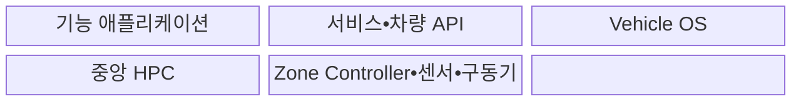
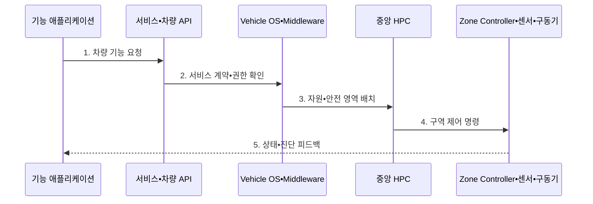

---
sidebar:
  order: 204
  label: "204. 소프트웨어 정의 차량 (Software Defined Vehicle)"
  badge:
    text: "기출 • 70%"
    variant: note
title: "소프트웨어 정의 차량 (Software Defined Vehicle)"
date: "2026-08-03T08:48:47+09:00"
tags:
  - "notes-latest-tech"
weight: 204
extra:
  question_no: "204"
  source_status: "기출"
  source_history: "138회"
  priority: 70
  priority_note: "소프트웨어 정의 차량의 중앙화 구조가 최근 출제됨"
---

## Ⅰ. 개요

핵심 용어

- **소프트웨어 정의 차량(Software Defined Vehicle, SDV)**: 중앙 컴퓨팅과 서비스 기반 구조에서 차량 기능과 가치를 소프트웨어로 지속 구현•갱신하는 차량이다.

- 정의/개념: 중앙 컴퓨팅•서비스 기반으로 차량 기능을 지속 갱신하는 **소프트웨어 정의 차량(Software Defined Vehicle, SDV) 구조**
- 배경/필요성: 기능별 분산 전자제어장치(Electronic Control Unit, ECU) 증가는 **통합 복잡도•변경 비용** 초래

#### 한줄 요약

- 기능마다 별도 상자를 추가하던 차량을 공통 컴퓨터와 운영 기반 위에서 앱처럼 기능을 개선하는 구조로 바꾸는 것이다.

## Ⅱ. 특징

핵심 용어

- **하드웨어 추상화**: 장치별 차이를 공통 응용 프로그래밍 인터페이스(Application Programming Interface, API)로 감춰 차량 기능을 하드웨어 구현과 분리하는 방식이다.

- 전자제어장치(Electronic Control Unit, ECU)를 고성능 컴퓨터(High-Performance Computer, HPC)•구역 제어기로 통합하는 **중앙 컴퓨팅•존 구조**
- 공통 응용 프로그래밍 인터페이스(Application Programming Interface, API)로 장치 의존성을 분리하는 **하드웨어 추상화•서비스화**
- 검증•무선 업데이트(Over-the-Air Update, OTA Update)•관측을 통한 **전 생애주기 갱신**
#### 한줄 요약

- 차량 기능을 개별 ECU에 묶지 않고 공통 컴퓨팅과 서비스로 계속 개선한다.

## Ⅲ. 구조 및 구성요소

핵심 용어

- **구역 제어기(Zone Controller)**: 차량 구역별 센서•구동기 연결과 전력•통신을 집약해 중앙 컴퓨터와 연결하는 제어기이다.
- **중앙 고성능 컴퓨터(HPC)**: 여러 차량 기능을 통합 실행하고 구역 제어기와 고속 네트워크로 연결되는 연산 플랫폼이다.
- **차량 운영체제(Vehicle OS)**: 하드웨어 자원•통신•안전•업데이트 서비스를 표준 인터페이스로 제공하는 실행 기반이다.
- **서비스•차량 API**: 애플리케이션이 하드웨어 위치와 구현에 의존하지 않고 차량 기능을 호출하게 하는 계약이다.
- **기능 애플리케이션**: 소프트웨어 배포와 업데이트로 사용자•주행•차체 기능을 구현하는 상위 계층이다.

차량 운영체제(Vehicle Operating System, Vehicle OS)와 고성능 컴퓨터(High-Performance Computer, HPC)는 응용 프로그래밍 인터페이스(Application Programming Interface, API)로 기능과 장치를 분리한다.

| 구성요소 | 책임 |
|:---|:---|
| 기능 애플리케이션 | 사용자•주행 **기능 구현** |
| 서비스•차량 API | 기능 계약과 **장치 추상화** |
| Vehicle OS | **자원•격리•통신•생명주기** 관리 |
| 중앙 HPC | 고성능 기능의 **통합 실행** |
| Zone Controller•센서•구동기 | 구역별 **입출력 집약•물리 제어** |

#### 한줄 요약

- 구역 제어기가 장치를 모으고 중앙 컴퓨터가 공통 서비스 위에서 차량 앱을 실행한다.

## Ⅳ. 흐름도

핵심 용어

- **서비스 계약**: 차량 기능이 제공하는 인터페이스•데이터•권한•버전의 합의를 정의한 명세이다.

응용 프로그래밍 인터페이스(Application Programming Interface, API), 차량 운영체제(Vehicle Operating System, Vehicle OS), 고성능 컴퓨터(High-Performance Computer, HPC)가 서비스 계약에 따라 기능을 실행한다.

**동작 원리**

1. **차량 기능 요청**: 애플리케이션이 표준 API로 기능 호출
2. **서비스 계약•권한 확인**: 호출자•데이터•장치 접근 계약 검증
3. **자원•안전 영역 배치**: OS가 실행 자원과 격리•우선순위 관리
4. **구역 제어 명령**: 중앙 계산 결과를 구역 제어기로 전달
5. **상태•진단 피드백**: 센서 결과와 오류를 기능•관측 계층에 환류

#### 한줄 요약

- 기능을 서비스로 설계해 검증•배포하고 운행 중 상태를 다음 개선으로 연결한다.

## Ⅴ. 종류 및 비교

핵심 용어

- **중앙 고성능 컴퓨터(Central High-Performance Computer, Central HPC)**: 여러 차량 기능의 고성능 연산을 통합 실행하는 중앙 컴퓨터이다.

전자제어장치(Electronic Control Unit, ECU), 소프트웨어 정의 차량(Software Defined Vehicle, SDV), 하드웨어•소프트웨어(Hardware•Software, HW•SW)의 결합 수준을 비교한다.

| 판단 기준 | 분산 ECU 차량 | 커넥티드 차량 | SDV |
|:---|:---|:---|:---|
| 적용 기준 | 기능별 **독립 제어** | **원격 서비스 연결** | 기능의 **지속 개발•갱신** |
| 핵심 특징 | ECU별 **HW•SW 결합** | **통신 모듈 중심 연결** | **중앙 컴퓨팅•서비스 추상화** |
| 한계 | **통합•변경 비용** 증가 | **분산 기능 구조** 유지 | **플랫폼•안전 검증 복잡도** |

#### 한줄 요약

- SDV는 ECU 통합을 넘어 차량 기능의 개발•배포 구조를 소프트웨어 중심으로 바꾼다.

## Ⅵ. 실무 고려사항 및 대책

핵심 용어

- **파티셔닝**: 안전 등급과 자원 요구가 다른 기능을 실행 영역으로 분리해 상호 간섭을 제한하는 방식이다.

| 문제 | 대책 | 효과 |
|:---|:---|:---|
| 안전•비안전 기능의 **상호 간섭** | 자동차 안전 무결성 수준(Automotive Safety Integrity Level, ASIL) 기반 파티셔닝•시간•메모리 격리 | 안전 기능의 **결정성 확보** |
| 응용 프로그래밍 인터페이스(Application Programming Interface, API) 변경의 **연쇄 장애** | 버전 계약•호환 시험•점진 폐기 | 생애주기 **호환성 확보** |
| 중앙 고성능 컴퓨터(Central High-Performance Computer, Central HPC)의 **고장 영향 집중** | 고장 격리•중복 실행•안전 상태 전환 | 기능 **상실 범위 축소** |

#### 한줄 요약

- 조명•도어 기능을 공통 API로 제공해 여러 차량 앱이 재사용하게 하되 제동 등 안전 제어는 별도 실행영역과 검증 절차로 격리한다.

## Ⅶ. 결론

핵심 용어

- **서비스화**: 차량 기능을 표준 인터페이스로 제공하여 여러 애플리케이션이 재사용하고 독립 갱신하게 하는 설계이다.

- **소프트웨어 정의 차량(Software Defined Vehicle, SDV) 적용**: 변경이 잦은 기능은 서비스화하고 안전 기능은 격리 실행

#### 한줄 요약

- 자주 바뀌는 기능은 서비스화하고 생명과 직결된 제어는 분리해 검증해야 한다.
