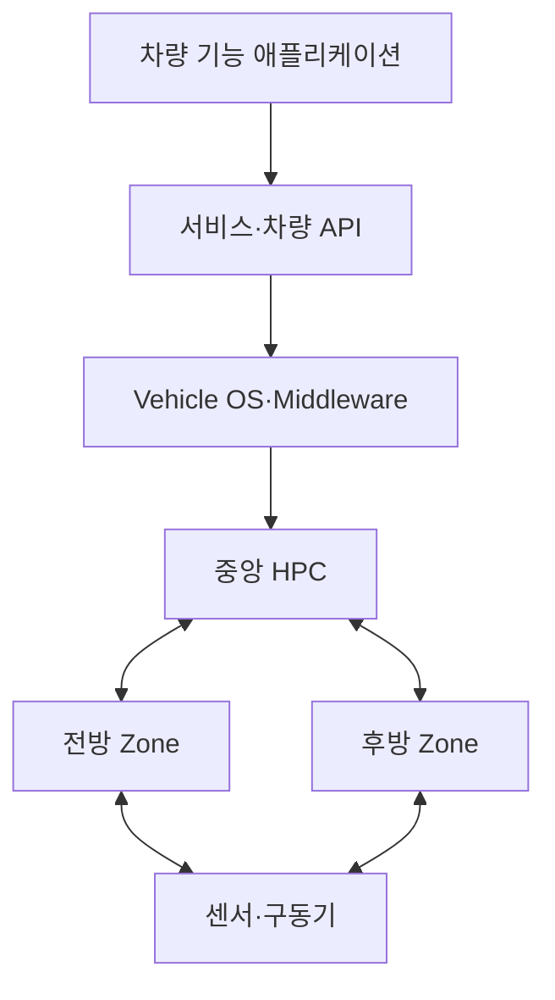

---
sidebar:
  order: 204
  label: "204. Software Defined Vehicle 소프트웨어 정의 차량 (Software Defined Vehicle)"
  badge:
    text: "기출 · 70%"
    variant: note
title: "Software Defined Vehicle 소프트웨어 정의 차량 (Software Defined Vehicle)"
date: "2026-07-27T23:59:59+09:00"
tags:
  - "notes-latest-tech"
weight: 204
extra:
  question_no: "204"
  source_status: "기출"
  source_history: "138회"
  priority: 70
  priority_note: "소프트웨어 정의 차량의 중앙화 구조가 최근 출제됨"
---

## 미리 알고가기

- **SDV(에스디브이)**: Software Defined Vehicle의 약자로, 차량 기능과 가치를 소프트웨어로 지속 구현·갱신하는 차량
- **ECU(이씨유)**: Electronic Control Unit의 약자로, 차량의 특정 기능을 제어하는 전자제어장치
- **HPC(에이치피씨)**: High-Performance Computer의 약자로, 여러 차량 기능을 통합 실행하는 고성능 컴퓨터
- **Zone Controller(존 컨트롤러)**: 차량 구역별 센서·구동기 연결과 전력·통신을 집약하는 제어기
- **OTA(오티에이)**: Over-the-Air의 약자로, 차량 소프트웨어를 무선으로 배포·설치하는 방식

## Ⅰ. 개요

- **정의/개념**: 중앙 컴퓨팅·서비스 기반 차량 기능 갱신 구조
- **기존 한계**: 분산 ECU로 통합 복잡도·기능 개선 비용 증가

### 쉽게 이해하기 (학습용)

- 기능마다 별도 상자를 추가하던 차량을 공통 컴퓨터와 운영 기반 위에서 앱처럼 기능을 개선하는 구조로 바꾸는 것이다.

## Ⅱ. 특징

- **컴퓨팅 중앙화·존 구조**: ECU를 HPC·구역 제어기로 통합
- **하드웨어 추상화·서비스화**: 공통 API로 기능과 장치 의존성 분리
- **전 생애주기 갱신**: 검증·OTA·관측으로 출시 후 기능 지속 개선

### 쉽게 이해하기 (학습용)

- 차량 기능을 개별 ECU에 묶지 않고 공통 컴퓨팅과 서비스로 계속 개선한다.

## Ⅲ. 아키텍처 및 구성요소

| 구성요소 | 책임 |
|:---|:---|
| 기능 애플리케이션 | 사용자·주행 기능 구현 |
| 서비스·차량 API | 기능 간 계약과 장치 추상화 |
| Vehicle OS | 자원·격리·통신·생명주기 관리 |
| 중앙 HPC | 고성능 기능 통합 실행 |
| Zone Controller | 구역별 입출력·통신 집약 |
| 센서·구동기 | 환경 인지와 물리 동작 |

> 요약: 중앙 컴퓨팅과 공통 서비스로 하드웨어와 차량 기능을 분리

### 쉽게 이해하기 (학습용)

- 구역 제어기가 장치를 모으고 중앙 컴퓨터가 공통 서비스 위에서 차량 앱을 실행한다.

## Ⅳ. 처리 절차 및 흐름

| 단계 | 핵심 활동 |
|:---|:---|
| 기능·안전 경계 | 책임·ASIL·고장 대응 정의 |
| 서비스 설계 | API·데이터·장치 추상화 |
| 개발·가상 검증 | SIL·HIL 기반 기능 검증 |
| 차량 통합 검증 | 네트워크·성능·안전 검증 |
| 릴리스 승인 | 서명·호환성·규제 확인 |
| OTA 배포 | 대상 분할과 단계적 활성화 |
| 관측·개선 | 텔레메트리 기반 결함 개선 |

### 쉽게 이해하기 (학습용)

- 기능을 서비스로 설계해 검증·배포하고 운행 중 상태를 다음 개선으로 연결한다.

## Ⅴ. 차량 전자 아키텍처 비교

| 판단 기준 | 분산 ECU 차량 | 커넥티드 차량 | SDV |
|:---|:---|:---|:---|
| 적용 기준 | 기능별 독립 제어 | 원격 서비스 연결 | 기능의 지속 개발·갱신 |
| 핵심 특징 | ECU별 HW·SW 결합 | 통신 모듈 중심 연결 | 중앙 컴퓨팅·서비스 추상화 |
| 한계 | 통합·변경 비용 증가 | 기능 구조는 분산 상태 | 플랫폼·안전 검증 복잡도 |

### 쉽게 이해하기 (학습용)

- SDV는 ECU 통합을 넘어 차량 기능의 개발·배포 구조를 소프트웨어 중심으로 바꾼다.

## Ⅵ. 실무 사례

1. **차체 기능 서비스화**: 조명·도어를 공통 API로 제공
2. **중앙 ADAS 기능 갱신**: HPC 앱 갱신과 안전 제어 분리

### 쉽게 이해하기 (학습용)

- 공통 기능과 고성능 앱을 서비스화하되 안전 제어는 격리한다.

## Ⅶ. 결론

- **기능 변화가 잦으면 서비스 추상화**
- **배선·ECU 복잡도는 중앙·존 구조로 완화**
- **안전 기능은 격리·검증 후 단계 배포**

### 쉽게 이해하기 (학습용)

- 자주 바뀌는 기능은 서비스화하고 생명과 직결된 제어는 분리해 검증해야 한다.
