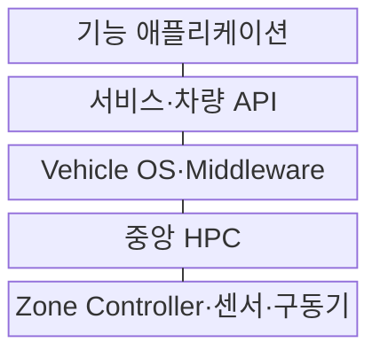
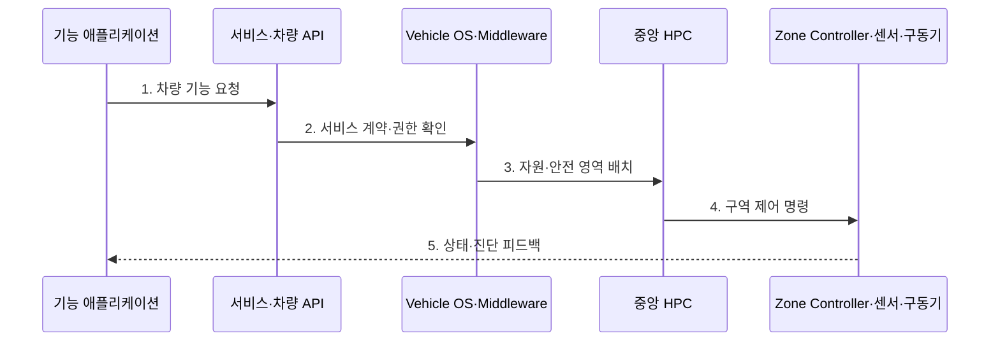

---
sidebar:
  order: 204
  label: "204. 소프트웨어 정의 차량 (Software Defined Vehicle)"
  badge:
    text: "기출 · 70%"
    variant: note
title: "소프트웨어 정의 차량 (Software Defined Vehicle)"
date: "2026-07-27T23:59:59+09:00"
tags:
  - "notes-latest-tech"
weight: 204
extra:
  question_no: "204"
  source_status: "기출"
  source_history: "138회"
  priority: 70
  priority_note: "소프트웨어 정의 차량의 중앙화 구조가 최근 출제됨"
---

## 미리 알고가기

- **SDV(에스디브이)**: Software Defined Vehicle의 약자로, 차량 기능과 가치를 소프트웨어로 지속 구현·갱신하는 차량
- **ECU(이씨유)**: Electronic Control Unit의 약자로, 차량의 특정 기능을 제어하는 전자제어장치
- **HPC(에이치피씨)**: High-Performance Computer의 약자로, 여러 차량 기능을 통합 실행하는 고성능 컴퓨터
- **Zone Controller(존 컨트롤러)**: 차량 구역별 센서·구동기 연결과 전력·통신을 집약하는 제어기
- **OTA(오티에이)**: Over-the-Air의 약자로, 차량 소프트웨어를 무선으로 배포·설치하는 방식

## Ⅰ. 개요

- 정의/개념: 중앙 컴퓨팅·서비스 기반 차량 기능 갱신 구조
- 기존 한계: 분산 ECU로 통합 복잡도·기능 개선 비용 증가

### 쉽게 이해하기 (학습용)

- 기능마다 별도 상자를 추가하던 차량을 공통 컴퓨터와 운영 기반 위에서 앱처럼 기능을 개선하는 구조로 바꾸는 것이다.

## Ⅱ. 특징

- **컴퓨팅 중앙화·존 구조**: ECU를 HPC·구역 제어기로 통합
- **하드웨어 추상화·서비스화**: 공통 API로 기능과 장치 의존성 분리
- **전 생애주기 갱신**: 검증·OTA·관측으로 출시 후 기능 지속 개선

### 쉽게 이해하기 (학습용)

- 차량 기능을 개별 ECU에 묶지 않고 공통 컴퓨팅과 서비스로 계속 개선한다.

## Ⅲ. 구조 및 구성요소

| 구성요소 | 책임 |
|:---|:---|
| 기능 애플리케이션 | 사용자·주행 기능 구현 |
| 서비스·차량 API | 기능 간 계약과 장치 추상화 |
| Vehicle OS | 자원·격리·통신·생명주기 관리 |
| 중앙 HPC | 고성능 기능 통합 실행 |
| Zone Controller·센서·구동기 | 구역별 입출력 집약과 물리 인지·동작 |

> 요약: 중앙 컴퓨팅과 공통 서비스로 하드웨어와 차량 기능을 분리

### 쉽게 이해하기 (학습용)

- 구역 제어기가 장치를 모으고 중앙 컴퓨터가 공통 서비스 위에서 차량 앱을 실행한다.

## Ⅳ. 흐름도

### 동작 원리

1. **차량 기능 요청**: 애플리케이션이 표준 API로 기능 호출
2. **서비스 계약·권한 확인**: 호출자·데이터·장치 접근 계약 검증
3. **자원·안전 영역 배치**: OS가 실행 자원과 격리·우선순위 관리
4. **구역 제어 명령**: 중앙 계산 결과를 구역 제어기로 전달
5. **상태·진단 피드백**: 센서 결과와 오류를 기능·관측 계층에 환류

### 쉽게 이해하기 (학습용)

- 기능을 서비스로 설계해 검증·배포하고 운행 중 상태를 다음 개선으로 연결한다.

## Ⅴ. 차량 전자 아키텍처 비교

| 판단 기준 | 분산 ECU 차량 | 커넥티드 차량 | SDV |
|:---|:---|:---|:---|
| 적용 기준 | 기능별 독립 제어 | 원격 서비스 연결 | 기능의 지속 개발·갱신 |
| 핵심 특징 | ECU별 HW·SW 결합 | 통신 모듈 중심 연결 | 중앙 컴퓨팅·서비스 추상화 |
| 한계 | 통합·변경 비용 증가 | 기능 구조는 분산 상태 | 플랫폼·안전 검증 복잡도 |

### 쉽게 이해하기 (학습용)

- SDV는 ECU 통합을 넘어 차량 기능의 개발·배포 구조를 소프트웨어 중심으로 바꾼다.

## Ⅵ. 실무 고려사항 및 대책

| 고려사항 | 대책 | 효과 |
|:---|:---|:---|
| 안전·비안전 기능 간 간섭 | ASIL 기반 파티셔닝·시간·메모리 격리 | 안전 기능 결정성 확보 |
| API 변경으로 차량 기능 연쇄 장애 | 버전 계약·호환 시험·점진 폐기 | 생애주기 호환성 확보 |
| 중앙 HPC 고장 영향 집중 | 고장 격리·중복 실행·안전 상태 전환 | 차량군 기능 상실 범위 축소 |

### 쉽게 이해하기 (학습용)

- 조명·도어 기능을 공통 API로 제공해 여러 차량 앱이 재사용하게 하되 제동 등 안전 제어는 별도 실행영역과 검증 절차로 격리한다.

## Ⅶ. 결론

- 차량 기능의 하드웨어 종속과 ECU 복잡도를 줄이기 위해 기능 변경 빈도·중앙 컴퓨팅·안전 등급·배포 독립성을 검토하여, 비안전 기능은 서비스화하고 안전 기능은 격리하는 SDV 구조를 적용해야 한다.

### 쉽게 이해하기 (학습용)

- 자주 바뀌는 기능은 서비스화하고 생명과 직결된 제어는 분리해 검증해야 한다.
