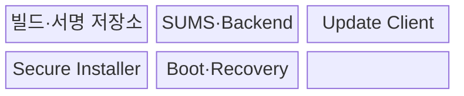
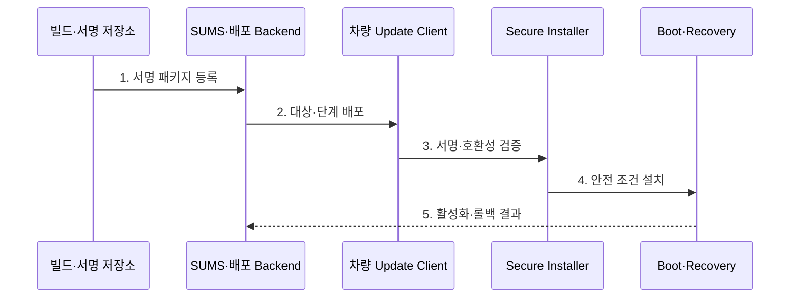

---
sidebar:
  order: 205
  label: "205. 무선 업데이트 (Over-the-Air Update, OTA)"
  badge:
    text: "기출 · 70%"
    variant: note
title: "무선 업데이트 (Over-the-Air Update, OTA)"
date: "2026-07-30T20:20:00+09:00"
tags:
  - "notes-latest-tech"
weight: 205
extra:
  question_no: "205"
  source_status: "기출"
  source_history: "138회"
  priority: 70
  priority_note: "OTA 갱신의 서명·복구 절차가 최근 출제됨"
---

## 미리 알고가기

- **OTA(오티에이)**: Over-the-Air의 약자로, 통신망을 통해 소프트웨어를 원격 배포·설치하는 갱신 방식
- **SOTA(소타)**: Software Over-the-Air의 약자로, 애플리케이션·지도 등 소프트웨어 중심 갱신
- **FOTA(포타)**: Firmware Over-the-Air의 약자로, ECU 펌웨어까지 포함하는 저수준 갱신
- **SUMS(섬스)**: Software Update Management System의 약자로, 차량 소프트웨어 갱신의 정책·절차·이력을 관리하는 체계
- **A/B Slot(에이비 슬롯)**: 현재 영역과 갱신 영역을 분리하여 실패 시 이전 버전으로 복구하는 방식

## Ⅰ. 개요

- 정의/개념: 차량 SW의 원격 검증·설치·복구 체계
- 배경/필요성: 방문·수동 갱신으로 비용 증가·결함 대응 지연

### 쉽게 이해하기 (학습용)

- 파일 전송에 그치지 않고 대상 차량 확인부터 안전 설치, 정상 부팅 확인, 실패 복구까지 책임지는 원격 정비 절차다.

## Ⅱ. 특징

- **1. 종단 간 신뢰성**: 패키지 서명·암호화·인증서로 위변조 방지
- **2. 호환성·안전 설치**: 차량 상태와 ECU 조합을 확인한 뒤 설치
- **3. 단계 배포·복구성**: 소규모 배포와 상태 감시로 실패 시 중단·롤백
### 쉽게 이해하기 (학습용)

- 원격 갱신은 파일 전송이 아니라 서명 검증·안전 설치·실패 복구까지 포함한다.

## Ⅲ. 구조 및 구성요소

| 구성요소 | 책임 |
|:---|:---|
| 빌드·서명 저장소 | 패키지 생성·서명·버전 보관 |
| SUMS·Backend | 대상·승인·배포·이력 관리 |
| Update Client | 다운로드·상태·호환성 확인 |
| Secure Installer | 서명 검증과 안전 설치 |
| Boot·Recovery | 정상 부팅 확인과 복구 |

### 쉽게 이해하기 (학습용)

- 서버가 서명한 패키지를 차량 관리자가 검증하고 ECU가 안전하게 설치·복구한다.

## Ⅳ. 흐름도

**동작 원리**

- **1. 서명 패키지 등록**: 재현 빌드·서명·버전·의존성 기록
- **2. 대상·단계 배포**: VIN·하드웨어·현재 버전별 집단 선정
- **3. 서명·호환성 검증**: 해시·신뢰 체인·저장 공간·의존성 확인
- **4. 안전 조건 설치**: 주행·전원 조건 확인 후 비활성 슬롯 설치
- **5. 활성화·롤백 결과**: 부팅·진단 성공 시 확정, 실패 시 복구·보고

### 쉽게 이해하기 (학습용)

- 차량 조건을 확인해 작은 집단부터 배포하고 이상 시 중단하거나 이전 버전으로 돌린다.

## Ⅴ. 종류 및 비교

| 판단 기준 | In-place Update | A/B Slot Update | Recovery Partition |
|:---|:---|:---|:---|
| 적용 기준 | 저장 공간이 제한된 ECU | 무중단 복구가 중요한 ECU | 별도 복구 환경이 필요한 ECU |
| 핵심 특징 | 현재 영역 직접 교체 | 비활성 영역 설치 후 전환 | 복구 영역에서 재설치 |
| 한계 | 중단 시 복구 위험 | 저장 공간이 약 두 배 필요 | 복구 이미지·절차 관리 필요 |

### 쉽게 이해하기 (학습용)

- 덮어쓰기는 공간이 적고 A/B는 복구가 빠르며 복구 파티션은 별도 이미지를 사용한다.

## Ⅵ. 실무 고려사항 및 대책

| 고려사항 | 대책 | 효과 |
|:---|:---|:---|
| 잘못된 대상·호환 조합 배포 | VIN·HW·SW 의존성 매니페스트 검증 | 차량 부팅 불능 방지 |
| 업데이트 중 전원·통신 단절 | 재개 다운로드·A/B 슬롯·원자 활성화 | 설치 실패 복구성 확보 |
| 결함의 차량군 확산 | 카나리·중단 기준·자동 롤백 | 장애 영향 범위 제한 |

### 쉽게 이해하기 (학습용)

- 서명된 업데이트를 차량 1%에 먼저 배포해 호환성·오류·복구 결과를 확인하고 정상 기준을 충족할 때만 전체 차량으로 확대한다.

## Ⅶ. 결론

- 원격 업데이트 실패가 차량군 장애로 확산되는 것을 막기 위해 서명·호환성·A/B 슬롯·선배포 결과·롤백을 검토하여, 안전하게 중단·복구 가능한 OTA만 단계 배포해야 한다.

### 쉽게 이해하기 (학습용)

- 편리한 원격 배포보다 실패해도 안전하게 이전 상태로 복구되는지가 중요하다.
