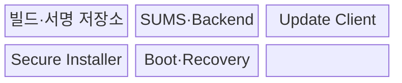
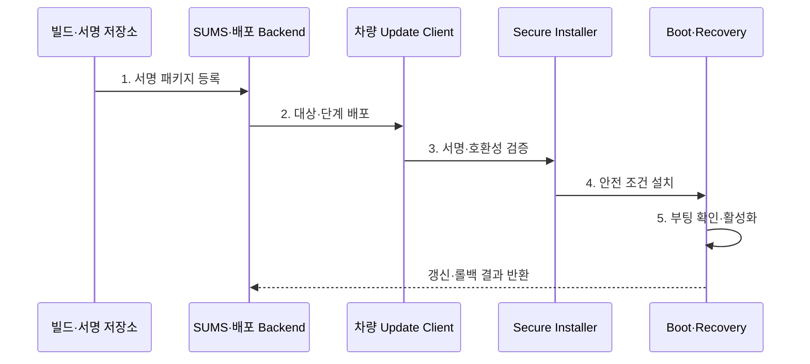

---
sidebar:
  order: 205
  label: "205. 무선 업데이트 (Over-the-Air Update, OTA)"
  badge:
    text: "기출 · 70%"
    variant: note
title: "무선 업데이트 (Over-the-Air Update, OTA)"
date: "2026-07-31T12:08:36+09:00"
tags:
  - "notes-latest-tech"
weight: 205
extra:
  question_no: "205"
  source_status: "기출"
  source_history: "138회"
  priority: 70
  priority_note: "OTA 갱신의 서명·복구 절차가 최근 출제됨"
---

## Ⅰ. 개요

핵심 용어

- **무선 업데이트(Over-the-Air Update, OTA Update)**: 통신망을 통해 차량 소프트웨어를 원격으로 배포하고 검증·설치·복구하는 갱신 체계이다.

- 정의/개념: 차량 소프트웨어를 원격 검증·설치·복구하는 **무선 업데이트(Over-the-Air Update, OTA Update) 체계**
- 배경/필요성: 방문·수동 갱신은 **정비 비용 증가·결함 대응 지연** 초래

#### 한줄 요약

- 파일 전송에 그치지 않고 대상 차량 확인부터 안전 설치, 정상 부팅 확인, 실패 복구까지 책임지는 원격 정비 절차다.

## Ⅱ. 특징

핵심 용어

- **펌웨어 무선 업데이트(Firmware Over-the-Air, FOTA)**: 애플리케이션뿐 아니라 전자제어장치(Electronic Control Unit, ECU) 펌웨어까지 원격으로 갱신하는 방식이다.

- 패키지 서명·암호화·인증서 기반 **종단 간 신뢰성**
- 애플리케이션의 **소프트웨어 무선 업데이트(Software Over-the-Air, SOTA)**부터 ECU 펌웨어의 **FOTA**까지 차량·장치 조합을 확인하는 **호환성·안전 설치**
- 소규모 배포와 실패 중단·롤백의 **단계 배포·복구성**
#### 한줄 요약

- 원격 갱신은 파일 전송이 아니라 서명 검증·안전 설치·실패 복구까지 포함한다.

## Ⅲ. 구조 및 구성요소

핵심 용어

- **소프트웨어 업데이트 관리 시스템(Software Update Management System, SUMS)**: 차량 소프트웨어 갱신의 정책·대상·절차·이력을 관리하는 체계이다.
- **빌드·서명 저장소**: 배포 패키지의 버전·해시·서명을 생성하고 변경 불가능하게 보관하는 공급 계층이다.
- **업데이트 클라이언트**: 대상 차량·장치가 캠페인 정책에 따라 패키지를 안전하게 내려받고 상태를 보고하는 구성요소이다.
- **보안 설치기**: 패키지의 서명·호환성·전제 조건을 검증한 뒤 허용된 파티션에 설치하는 구성요소이다.
- **부트·복구 영역**: 새 버전의 정상 기동을 확인하고 실패 시 이전 정상 버전으로 롤백하는 안전장치이다.

| 구성요소 | 책임 |
|:---|:---|
| 빌드·서명 저장소 | **패키지·서명·버전** 보관 |
| SUMS·Backend | **대상·승인·배포·이력** 관리 |
| Update Client | 다운로드 상태와 **호환성 확인** |
| Secure Installer | **서명 검증·안전 설치** |
| Boot·Recovery | **정상 부팅 확인·복구** |

#### 한줄 요약

- 서버가 서명한 패키지를 차량 관리자가 검증하고 전자제어장치(Electronic Control Unit, ECU)가 안전하게 설치·복구한다.

## Ⅳ. 흐름도

핵심 용어

- **단계 배포**: 작은 차량 집단부터 갱신하여 결과를 확인한 뒤 대상 범위를 점진적으로 넓히는 방식이다.

소프트웨어 업데이트 관리 시스템(Software Update Management System, SUMS)이 차량별 배포와 복구 이력을 관리한다.

**동작 원리**

1. **서명 패키지 등록**: 재현 빌드·서명·버전·의존성 기록
2. **대상·단계 배포**: 차량 식별 번호(Vehicle Identification Number, VIN)·하드웨어·현재 버전별 집단 선정
3. **서명·호환성 검증**: 해시·신뢰 체인·저장 공간·의존성 확인
4. **안전 조건 설치**: 주행·전원 조건 확인 후 비활성 슬롯 설치
5. **부팅 확인·활성화**: 성공 시 확정하고 실패 시 이전 슬롯 복구

#### 한줄 요약

- 차량 조건을 확인해 작은 집단부터 배포하고 이상 시 중단하거나 이전 버전으로 돌린다.

## Ⅴ. 종류 및 비교

핵심 용어

- **A/B 슬롯(A/B Slot)**: 현재 실행 영역과 갱신 영역을 분리하여 설치 실패 시 이전 버전으로 복구하는 방식이다.

전자제어장치(Electronic Control Unit, ECU)의 저장 공간과 복구 요구에 따라 설치 방식을 선택한다.

| 판단 기준 | In-place Update | A/B Slot Update | Recovery Partition |
|:---|:---|:---|:---|
| 적용 기준 | **저장 공간 제한** ECU | **무중단 복구** 중요 ECU | **별도 복구 환경** 필요 ECU |
| 핵심 특징 | 현재 영역 **직접 교체** | 비활성 영역 설치 후 **슬롯 전환** | 복구 영역에서 **재설치** |
| 한계 | 중단 시 **복구 위험** | 약 두 배의 **저장 공간** 필요 | **복구 이미지·절차** 관리 필요 |

#### 한줄 요약

- 덮어쓰기는 공간이 적고 A/B는 복구가 빠르며 복구 파티션은 별도 이미지를 사용한다.

## Ⅵ. 실무 고려사항 및 대책

핵심 용어

- **의존성 매니페스트**: 대상 차량의 하드웨어·소프트웨어 버전과 패키지 호환 조건을 기계 판독 형식으로 명시한다.

| 문제 | 대책 | 효과 |
|:---|:---|:---|
| 잘못된 **대상·호환 조합 배포** | 차량 식별 번호(Vehicle Identification Number, VIN)·하드웨어(Hardware, HW)·소프트웨어(Software, SW) **의존성 매니페스트** 검증 | 차량의 **부팅 불능 방지** |
| 갱신 중 **전원·통신 단절** | 재개 다운로드·A/B 슬롯·원자 활성화 | 설치 실패의 **복구성 확보** |
| 결함의 **차량군 확산** | 카나리·중단 기준·자동 롤백 | 장애의 **영향 범위 제한** |

#### 한줄 요약

- 서명된 업데이트를 차량 1%에 먼저 배포해 호환성·오류·복구 결과를 확인하고 정상 기준을 충족할 때만 전체 차량으로 확대한다.

## Ⅶ. 결론

핵심 용어

- **자동 롤백**: 갱신 후 정상 부팅이나 건강 검사가 실패하면 이전의 검증된 버전으로 되돌리는 복구 절차이다.

- 서명·호환성 검증 후 **A/B 슬롯** 기반 **단계 배포·자동 롤백** 적용

#### 한줄 요약

- 편리한 원격 배포보다 실패해도 안전하게 이전 상태로 복구되는지가 중요하다.
