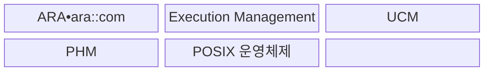
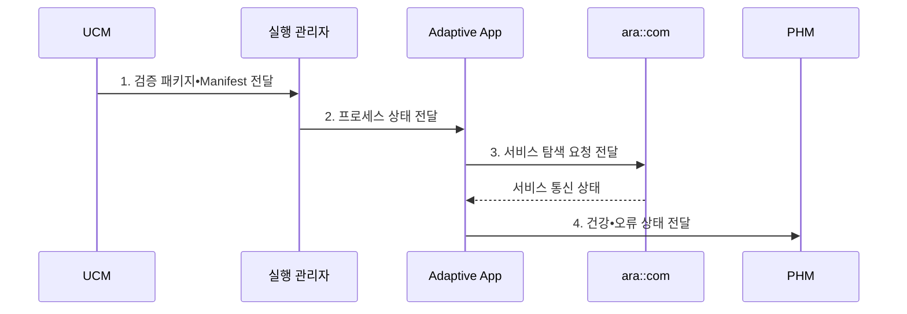

---
sidebar:
  order: 206
  label: "206. AUTOSAR Adaptive Platform"
  badge:
    text: "기출 • 70%"
    variant: note
title: "AUTOSAR Adaptive Platform"
date: "2026-08-04T16:26:00+09:00"
tags:
  - "notes-latest-tech"
weight: 206
extra:
  question_no: "206"
  source_status: "기출"
  source_history: "138회"
  priority: 70
  priority_note: "AUTOSAR Adaptive 서비스 구조가 최근 출제됨"
---

## Ⅰ. 개요

핵심 용어

- **AUTOSAR Adaptive Platform(Automotive Open System Architecture Adaptive Platform)**: 고성능 ECU 애플리케이션을 POSIX 프로세스와 동적 서비스로 실행•관리하는 차량 소프트웨어 플랫폼이다.
- **전자제어장치(Electronic Control Unit, ECU)**: 차량 기능의 센서 입력•연산•제어 출력을 담당하는 컴퓨터이다.
- **이식 가능 운영체제 인터페이스(Portable Operating System Interface, POSIX)**: 운영체제 간 호환 가능한 프로세스•파일•통신 인터페이스 표준이다.

- 정의/개념: 고성능 ECU 애플리케이션을 POSIX 프로세스와 동적 서비스로 실행하는 **AUTOSAR Adaptive Platform**
- 배경/필요성: Classic의 정적 구성은 고성능 서비스의 **동적 배포•갱신 수용 곤란**

#### 한줄 요약

- 정해진 제어를 반복하는 Classic과 달리, Adaptive는 고성능 컴퓨터에서 여러 앱과 서비스를 동적으로 연결•갱신한다.

## Ⅱ. 특징

핵심 용어

- **Adaptive 애플리케이션용 AUTOSAR 런타임(AUTOSAR Runtime for Adaptive Applications, ARA)**: Adaptive 애플리케이션이 통신•실행•진단 등 플랫폼 기능을 사용하는 표준 C++ 인터페이스이다.

- 이식 가능 운영체제 인터페이스(Portable Operating System Interface, POSIX) 기반 **독립 프로세스 실행•자원 격리**
- `ara::com` 기반 **동적 서비스 탐색•통신**
- 실행•건강•설정•갱신의 **플랫폼 생명주기 통합**
#### 한줄 요약

- 고성능 차량 앱을 독립 프로세스로 실행하고 표준 서비스로 통신•상태•갱신을 관리한다.

## Ⅲ. 구조 및 구성요소

핵심 용어

- **실행 관리(Execution Management)**: 의존성과 실행 상태에 따라 Adaptive 프로세스의 시작•중지•상태를 관리하는 서비스이다.
- **ara::com**: ARA에서 서비스 탐색과 이벤트•메서드•필드 통신을 제공하는 인터페이스이다.
- **응용 프로그래밍 인터페이스(Application Programming Interface, API)**: 소프트웨어 간 기능•데이터 교환 규칙을 정의한 접점이다.
- **업데이트•구성 관리(Update and Configuration Management, UCM)**: 소프트웨어 패키지와 차량 구성을 검증•설치•활성화•롤백하는 서비스이다.
- **플랫폼 건강 관리(Platform Health Management, PHM)**: 애플리케이션과 플랫폼의 생존•기한•논리 상태를 감시하는 서비스이다.

**ARA•UCM•PHM•POSIX** 가 Adaptive 애플리케이션의 실행 기반을 구성한다.

| 구성요소 | 책임 |
|:---|:---|
| ARA•ara::com | 플랫폼 기능 접근과 **서비스 탐색•통신** |
| Execution Management | 프로세스 **시작•중지•상태 관리** |
| UCM | 패키지 **검증•설치•활성화•롤백** |
| PHM | 애플리케이션•플랫폼의 **건강 상태 감시** |
| POSIX 운영체제 | **프로세스•자원•격리 기반 제공** |

#### 한줄 요약

- ARA가 앱과 실행•통신•진단•갱신 서비스를 연결해 하드웨어 차이를 감춘다.

## Ⅳ. 흐름도

핵심 용어

- **매니페스트(Manifest)**: 애플리케이션•서비스•실행•배포 구성을 기계 판독 형식으로 선언한 명세이다.

**UCM•PHM•ARA** 가 배포•통신•건강 상태를 관리한다.

**동작 원리**

1. **검증 패키지•Manifest 전달**: 서명•호환성 확인 후 실행•서비스 구성 설치
2. **프로세스 상태 전달**: 의존성과 실행 상태에 따른 프로세스 시작•중지
3. **서비스 탐색 요청 전달**: 제공•요청 서비스의 런타임 위치와 인스턴스 탐색
4. **건강•오류 상태 전달**: 감시 결과에 따른 재시작•기능 저하•안전 상태 전환

#### 한줄 요약

- 플랫폼이 앱을 시작해 서비스를 찾게 하고 상태를 감시하며 갱신 후 안전하게 재시작한다.

## Ⅴ. 종류 및 비교

핵심 용어

- **Classic Platform**: MCU 기반의 정적 구성과 결정적 실시간 제어에 적합한 AUTOSAR 플랫폼이다.
- **마이크로컨트롤러 유닛(Microcontroller Unit, MCU)**: 프로세서•메모리•입출력을 단일 칩에 통합한 제어용 컴퓨터이다.

AUTOSAR Classic Platform과 POSIX 기반 Adaptive Platform은 제어 특성과 실행 기반이 다르다.

| AUTOSAR 구성 | Classic Platform | Adaptive Platform | 혼합 아키텍처 |
|:---|:---|:---|:---|
| 적용 기준 | **결정적 MCU 제어** | **고성능•동적 서비스** | 제어와 **고성능 기능 공존** |
| 핵심 특징 | **정적 구성•실시간 실행** | **POSIX•서비스•프로세스** | 플랫폼 간 **역할 분리** |
| 한계 | **동적 기능•연산 확장 제한** | 엄격한 **실시간 제어 부적합** | **게이트웨이•안전 통합** 필요 |

#### 한줄 요약

- 빠르고 결정적인 제어는 Classic, 고성능 동적 앱은 Adaptive가 담당한다.

## Ⅵ. 실무 고려사항 및 대책

핵심 용어

- **시간 예산**: 기능이 입력부터 출력까지 완료해야 하는 최대 허용 시간이다.

| 문제 | 대책 | 효과 |
|:---|:---|:---|
| **실시간 경계** 미검증 시 일반 프로세스의 **결정성 부족** | 엄격 제어의 Classic 분리와 **시간 예산 검증** | 플랫폼 **결정성 경계** 보존 |
| **서비스 계약** 미검증 시 버전•인터페이스의 **호환성 실패** | 매니페스트•API 버전•**통합 시험** | 서비스 **버전 호환성** 확보 |
| **동적 갱신** 미검증 시 불완전 패키지의 **기능•안전 영향** | 서명•원자 설치•롤백•**재시작 전략** | 갱신 실패 **안전 영향** 제한 |

#### 한줄 요약

- 고성능 서비스와 결정적 제어의 시간•안전 책임을 분리하고 서비스 계약과 갱신 실패 시 복구 절차를 검증한다.

## Ⅶ. 결론

핵심 용어

- **혼합 아키텍처**: 결정적 제어를 Classic에, 고성능 동적 서비스를 Adaptive에 배치하여 역할을 분리하는 구조이다.

- 고성능 서비스는 **Adaptive**, 결정적 제어는 **Classic**으로 분리

#### 한줄 요약

- 플랫폼 선택보다 두 플랫폼 사이 통신•시간•안전 책임을 명확히 나누는 것이 중요하다.
