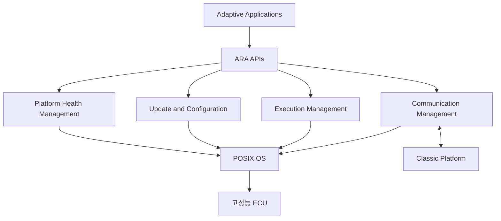

---
sidebar:
  order: 206
  label: "206. AUTOSAR Adaptive (AUTOSAR Adaptive)"
  badge:
    text: "기출 · 70%"
    variant: note
title: "AUTOSAR Adaptive (AUTOSAR Adaptive)"
date: "2026-07-27T23:59:59+09:00"
tags:
  - "notes-latest-tech"
weight: 206
extra:
  question_no: "206"
  source_status: "기출"
  source_history: "138회"
  priority: 70
  priority_note: "AUTOSAR Adaptive 서비스 구조가 최근 출제됨"
---

## 미리 알고가기

- **AUTOSAR(오토사)**: AUTomotive Open System ARchitecture에서 만든 명칭으로, 차량 소프트웨어 구조와 인터페이스를 표준화하는 개발 협력체·표준
- **Adaptive Platform(어댑티브 플랫폼)**: 고성능 ECU에서 동적 서비스와 애플리케이션을 실행하는 AUTOSAR 플랫폼
- **Classic Platform(클래식 플랫폼)**: MCU 기반의 정적·결정적 실시간 제어에 적합한 AUTOSAR 플랫폼
- **POSIX(포직스)**: Portable Operating System Interface의 약자로, 운영체제 API의 호환 기준
- **ARA(아라)**: AUTOSAR Runtime for Adaptive Applications의 약자로, Adaptive 앱이 플랫폼 기능을 쓰는 C++ 인터페이스

## Ⅰ. 개요

- 정의/개념: 고성능 차량 앱을 서비스 단위로 실행·관리하는 플랫폼
- 기존 한계: Classic 정적 구조로 동적 기능 수용 제한

### 쉽게 이해하기 (학습용)

- 정해진 제어를 반복하는 Classic과 달리, Adaptive는 고성능 컴퓨터에서 여러 앱과 서비스를 동적으로 연결·갱신한다.

## Ⅱ. 특징

- **프로세스 기반 실행**: POSIX에서 앱을 독립 격리
- **서비스 지향 통신**: ara::com으로 서비스 탐색·메시지 교환 지원
- **생명주기 관리**: 실행·상태·건강·업데이트를 플랫폼 서비스로 통합

### 쉽게 이해하기 (학습용)

- 고성능 차량 앱을 독립 프로세스로 실행하고 표준 서비스로 통신·상태·갱신을 관리한다.

## Ⅲ. 아키텍처 및 구성요소

| 구성요소 | 책임 |
|:---|:---|
| Adaptive App | 인지·경로·서비스 기능 실행 |
| ara::com | 서비스 탐색과 통신 |
| Execution Management | 프로세스 시작·중지·상태 관리 |
| UCM | SW 설치·갱신·구성 관리 |
| PHM | 건강 감시와 오류 대응 |
| POSIX OS | 프로세스·자원·격리 제공 |

> 요약: 표준 ARA 서비스로 고성능 앱의 통신과 생명주기를 관리

### 쉽게 이해하기 (학습용)

- ARA가 앱과 실행·통신·진단·갱신 서비스를 연결해 하드웨어 차이를 감춘다.

## Ⅳ. 처리 절차 및 흐름

| 단계 | 핵심 활동 |
|:---|:---|
| 경계 정의 | 안전 등급과 프로세스 격리 |
| 설계 | Manifest·서비스 계약 정의 |
| 설치·검증 | UCM으로 패키지 검증·설치 |
| 실행 | Execution Management가 기동 |
| 통신 | ara::com으로 서비스 연결 |
| 감시 | 상태·건강·자원 이상 확인 |
| 대응 | 재시작·저하·안전 상태 전환 |

### 쉽게 이해하기 (학습용)

- 플랫폼이 앱을 시작해 서비스를 찾게 하고 상태를 감시하며 갱신 후 안전하게 재시작한다.

## Ⅴ. AUTOSAR 플랫폼 비교

| 판단 기준 | Classic Platform | Adaptive Platform | 혼합 아키텍처 |
|:---|:---|:---|:---|
| 적용 기준 | 결정적 MCU 제어 | 고성능·동적 서비스 | 제어와 고성능 기능 공존 |
| 핵심 특징 | 정적 구성·실시간 실행 | POSIX·서비스·프로세스 | 플랫폼 간 역할 분리 |
| 한계 | 동적 기능·연산 확장 제한 | 엄격한 실시간 제어에 부적합 | 게이트웨이·안전 통합 필요 |

### 쉽게 이해하기 (학습용)

- 빠르고 결정적인 제어는 Classic, 고성능 동적 앱은 Adaptive가 담당한다.

## Ⅵ. 실무 사례

1. **중앙 ADAS 역할 분리**: 인지는 AP, 제동은 CP
2. **인포테인먼트 갱신**: UCM 설치 후 서비스 상태 감시

### 쉽게 이해하기 (학습용)

- 중앙 인지는 Adaptive에서 수행하되 최종 제동 같은 안전 제어는 Classic에 분리한다.

## Ⅶ. 결론

- **결정적 제어는 Classic Platform**
- **고성능 동적 기능은 Adaptive Platform**
- **혼합 시 통신·안전 경계를 명확히 분리**

### 쉽게 이해하기 (학습용)

- 플랫폼 선택보다 두 플랫폼 사이 통신·시간·안전 책임을 명확히 나누는 것이 중요하다.
