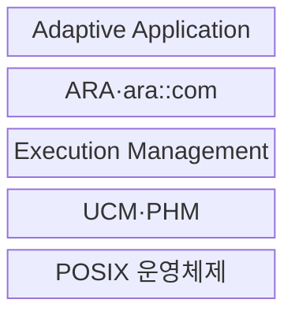

---
sidebar:
  order: 206
  label: "206. AUTOSAR Adaptive (AUTOSAR Adaptive)"
  badge:
    text: "기출 · 70%"
    variant: note
title: "AUTOSAR Adaptive (AUTOSAR Adaptive)"
date: "2026-07-30T11:10:21+09:00"
tags:
  - "notes-latest-tech"
weight: 206
extra:
  question_no: "206"
  source_status: "기출"
  source_history: "138회"
  priority: 70
  priority_note: "AUTOSAR Adaptive 서비스 구조가 최근 출제됨"
---

## 미리 알고가기

- **AUTOSAR(오토사)**: AUTomotive Open System ARchitecture에서 만든 명칭으로, 차량 소프트웨어 구조와 인터페이스를 표준화하는 개발 협력체·표준
- **Adaptive Platform(어댑티브 플랫폼)**: 고성능 ECU에서 동적 서비스와 애플리케이션을 실행하는 AUTOSAR 플랫폼
- **Classic Platform(클래식 플랫폼)**: MCU 기반의 정적·결정적 실시간 제어에 적합한 AUTOSAR 플랫폼
- **POSIX(포직스)**: Portable Operating System Interface의 약자로, 운영체제 API의 호환 기준
- **ARA(아라)**: AUTOSAR Runtime for Adaptive Applications의 약자로, Adaptive 앱이 플랫폼 기능을 쓰는 C++ 인터페이스
- **ECU(Electronic Control Unit)**: '이시유'로 읽으며, 차량의 센서·구동기·소프트웨어 기능을 제어하는 전자제어장치
- **UCM(Update and Configuration Management)**: '유시엠'으로 읽으며, 소프트웨어 패키지의 설치·갱신·구성을 관리하는 플랫폼 서비스
- **PHM(Platform Health Management)**: '피에이치엠'으로 읽으며, 애플리케이션과 플랫폼의 건강 상태를 감시하는 서비스
- **Manifest(매니페스트)**: 애플리케이션·서비스·실행·배포 구성을 기계 판독 형식으로 선언한 명세

## Ⅰ. 개요

- 정의/개념: 고성능 ECU의 애플리케이션을 **POSIX 프로세스·서비스 지향 통신·동적 생명주기**로 실행하는 AUTOSAR 플랫폼
- 배경/필요성: Classic Platform의 정적 구성만으로 수용하기 어려운 **고성능 인지·연결 서비스·동적 배포·갱신** 지원 필요

### 쉽게 이해하기 (학습용)

- 정해진 제어를 반복하는 Classic과 달리, Adaptive는 고성능 컴퓨터에서 여러 앱과 서비스를 동적으로 연결·갱신한다.

## Ⅱ. 특징

- POSIX 기반 **독립 프로세스 실행·자원 격리**
- `ara::com` 기반 **동적 서비스 탐색·통신**
- 실행·건강·설정·갱신의 **플랫폼 생명주기 통합**

### 쉽게 이해하기 (학습용)

- 고성능 차량 앱을 독립 프로세스로 실행하고 표준 서비스로 통신·상태·갱신을 관리한다.

## Ⅲ. 구조 및 구성요소

| 구성요소 | 책임 |
|:---|:---|
| Adaptive Application | **인지·경로·연결 서비스 기능 실행** |
| ARA·ara::com | 플랫폼 기능 접근과 **서비스 탐색·통신** |
| Execution Management | 프로세스 **시작·중지·상태 관리** |
| UCM·PHM | **패키지 갱신·구성·건강 감시** |
| POSIX 운영체제 | **프로세스·자원·격리 기반 제공** |

> 요약: 표준 ARA 서비스로 고성능 앱의 통신과 생명주기를 관리

### 쉽게 이해하기 (학습용)

- ARA가 앱과 실행·통신·진단·갱신 서비스를 연결해 하드웨어 차이를 감춘다.

## Ⅳ. 흐름도

### 동작 원리

- **1. 검증 패키지·Manifest 전달**: 서명·호환성 확인 후 실행·서비스 구성 설치
- **2. 프로세스 상태 전달**: 의존성과 실행 상태에 따른 프로세스 시작·중지
- **3. 서비스 탐색 요청 전달**: 제공·요청 서비스의 런타임 위치와 인스턴스 탐색
- **4. 서비스 통신 상태 전달**: 표준 인터페이스 기반 이벤트·메서드·필드 교환
- **5. 건강·오류 상태 전달**: 감시 결과에 따른 재시작·기능 저하·안전 상태 전환

### 쉽게 이해하기 (학습용)

- 플랫폼이 앱을 시작해 서비스를 찾게 하고 상태를 감시하며 갱신 후 안전하게 재시작한다.

## Ⅴ. 종류 및 비교

| AUTOSAR 구성 | Classic Platform | Adaptive Platform | 혼합 아키텍처 |
|:---|:---|:---|:---|
| 적용 기준 | 결정적 MCU 제어 | 고성능·동적 서비스 | 제어와 고성능 기능 공존 |
| 핵심 특징 | 정적 구성·실시간 실행 | POSIX·서비스·프로세스 | 플랫폼 간 역할 분리 |
| 한계 | 동적 기능·연산 확장 제한 | 엄격한 실시간 제어에 부적합 | 게이트웨이·안전 통합 필요 |

### 쉽게 이해하기 (학습용)

- 빠르고 결정적인 제어는 Classic, 고성능 동적 앱은 Adaptive가 담당한다.

## Ⅵ. 실무 고려사항 및 대책

| 고려사항 | 대책 | 효과 |
|:---|:---|:---|
| **실시간 경계** 미검증 시 일반 프로세스의 **결정성 부족** | 엄격 제어의 Classic 분리와 **시간 예산 검증** | 플랫폼 **결정성 경계** 보존 |
| **서비스 계약** 미검증 시 버전·인터페이스의 **호환성 실패** | Manifest·API 버전·**통합 시험** | 서비스 **버전 호환성** 확보 |
| **동적 갱신** 미검증 시 불완전 패키지의 **기능·안전 영향** | 서명·원자 설치·롤백·**재시작 전략** | 갱신 실패 **안전 영향** 제한 |

### 쉽게 이해하기 (학습용)

- 고성능 서비스와 결정적 제어의 시간·안전 책임을 분리하고 서비스 계약과 갱신 실패 시 복구 절차를 검증한다.

## Ⅶ. 결론

- **고성능 서비스·결정적 제어·동적 갱신·안전 책임**의 경계를 분리한 Adaptive·Classic 혼합 차량 플랫폼

### 쉽게 이해하기 (학습용)

- 플랫폼 선택보다 두 플랫폼 사이 통신·시간·안전 책임을 명확히 나누는 것이 중요하다.
