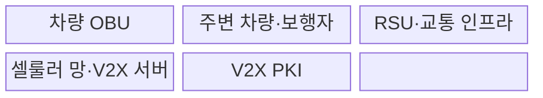
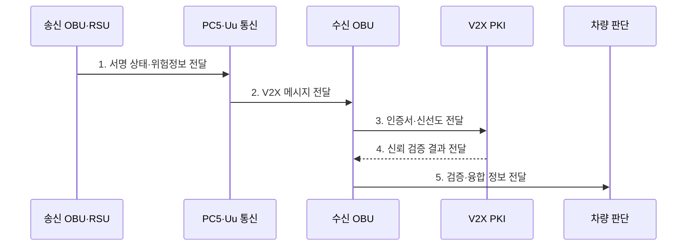

---
sidebar:
  order: 207
  label: "207. V2X 차량사물통신 (Vehicle-to-Everything)"
  badge:
    text: "기출 · 70%"
    variant: note
title: "V2X 차량사물통신 (Vehicle-to-Everything)"
date: "2026-07-31T08:59:53+09:00"
tags:
  - "notes-latest-tech"
weight: 207
extra:
  question_no: "207"
  source_status: "기출"
  source_history: "138회"
  priority: 70
  priority_note: "V2X 통신·신뢰 경계 설계가 138회 출제됨"
---

## Ⅰ. 개요

핵심 용어

**V2X**는 차량이 다른 차량·인프라·보행자·망과 위험 및 교통 정보를 교환하는 협력 통신 체계다.

- 정의/개념: **V2X**는 차량이 주변 참여자·인프라·망과 위험 정보를 교환하는 협력 통신 체계
- 배경/필요성: 탑재 센서만으로는 사각지대와 **가시거리 밖 위험 조기 인지 불가**

### 쉽게 이해하기 (학습용)

- 앞차와 신호기가 보이지 않는 위험까지 미리 알려 주되, 수신 정보는 차량 센서와 함께 검증하여 사용하는 방식이다.

## Ⅱ. 특징

핵심 용어

**C-V2X**는 셀룰러 기술을 기반으로 차량의 직접 통신과 광역 망 통신을 지원하는 방식이다.

- V2V·V2I·V2P·V2N 기반 **다중 교통 참여자 통신**
- PC5·Uu 기반 **저지연 직접·광역 망 통신**
- 서명·시간·위치·센서 일치성 기반 **메시지 신뢰 검증**
### 쉽게 이해하기 (학습용)

- 차량 센서 밖의 위험 정보를 주변 차량·도로 시설·통신망에서 미리 받는다.

## Ⅲ. 구조 및 구성요소

핵심 용어

**OBU**는 차량에 탑재되어 V2X 메시지를 생성·송수신·검증하고 센서 정보와 융합하는 장치다.

| 구성요소 | 책임 |
|:---|:---|
| 차량 OBU | **메시지 생성·검증·센서 융합** |
| 주변 차량·보행자 | **위치·속도·위험 상태 제공** |
| RSU·교통 인프라 | **도로·신호·교차로 정보 제공** |
| 셀룰러 망·V2X 서버 | **광역 교통·서비스 정보 제공** |
| V2X PKI | **인증서 발급·폐기·신뢰 관리** |

### 쉽게 이해하기 (학습용)

- 차량 장치가 직접·망 통신으로 메시지를 받고 PKI와 센서 정보로 신뢰성을 확인한다.

## Ⅳ. 흐름도

핵심 용어

**PKI**는 인증서를 발급·검증·폐기하여 V2X 메시지 송신자의 신뢰를 관리하는 공개키 기반구조다.

**동작 원리**

1. **서명 상태·위험정보 전달**: 위치·속도·사건·발생 시각을 표준 메시지로 구성·서명
2. **V2X 메시지 전달**: 인접 안전정보는 PC5, 광역 서비스는 Uu 경로로 교환
3. **인증서·신선도 전달**: 송신 인증서·서명·발생 시각·재전송 여부 검사
4. **신뢰 검증 결과 전달**: 인증서 상태와 메시지 무결성 기반 신뢰 여부 판정
5. **검증·융합 정보 전달**: 위치·물리 가능성을 차량 센서와 대조해 경고·보조 결정

### 쉽게 이해하기 (학습용)

- 메시지의 서명·시간·위치를 검증한 뒤 센서와 융합해 경고나 보조 제어에 사용한다.

## Ⅴ. 종류 및 비교

핵심 용어

**PC5**는 기지국을 거치지 않고 인접 차량과 단말이 직접 통신하는 C-V2X 인터페이스다.

| V2X 접속 방식 | DSRC·ITS-G5 | C-V2X PC5 | C-V2X Uu |
|:---|:---|:---|:---|
| 적용 기준 | 근거리 **직접 안전 통신** | 근거리 **셀룰러 직접 통신** | **광역 망 기반 서비스** |
| 핵심 특징 | IEEE 802.11 계열 **직접 통신** | 기지국 비경유 **PC5 통신** | 기지국·서버 경유 **Uu 통신** |
| 한계 | 별도 **노변 인프라** 필요 | 단말·자원 **운용 복잡도** | 망 **지연·가용성 의존** |

### 쉽게 이해하기 (학습용)

- 직접 통신은 인접 긴급 상황, 망 통신은 넓은 지역의 교통 서비스에 적합하다.

## Ⅵ. 실무 고려사항 및 대책

핵심 용어

**신선도 검증**은 메시지 발생 시각과 재전송 여부를 확인해 오래되거나 재사용된 위험 정보를 거부하는 절차다.

| 문제 | 대책 | 효과 |
|:---|:---|:---|
| **통신 품질** 미검증 시 혼잡·음영의 **지연·손실** | 채널 부하 제어·다중 경로·**성능 시험** | 통신 **지연·손실률** 감소 |
| **메시지 신뢰** 미검증 시 위조·재전송·**위치 조작** | PKI·신선도·물리 가능성 **교차 검증** | 위조·재전송 **수용률** 감소 |
| **차량 융합** 미검증 시 외부 정보의 **오경보·오제어** | 탑재 센서 대조·신뢰도·**안전한 실패** | **오경보·오제어** 방지 |

### 쉽게 이해하기 (학습용)

- 통신 지연·손실과 인증서 상태를 검증하고 외부 메시지를 탑재 센서와 교차 확인한 뒤 제한적으로 사용한다.

## Ⅶ. 결론

핵심 용어

**Uu**는 차량 단말이 기지국과 서버를 경유해 광역 교통 서비스를 이용하는 셀룰러 인터페이스다.

- 인접 위험은 **PC5**, 광역 서비스는 **Uu**로 교환하고 PKI·센서 검증

### 쉽게 이해하기 (학습용)

- V2X 메시지는 유용한 추가 센서이지만 차량의 자체 센서와 검증한 뒤 사용해야 한다.
