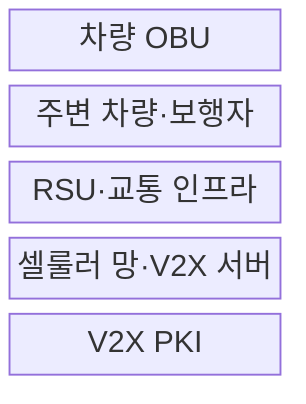
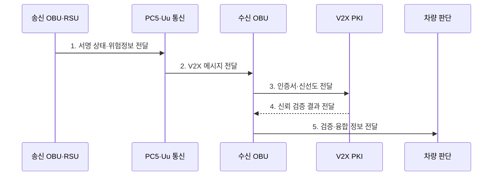

---
sidebar:
  order: 207
  label: "207. V2X 차량사물통신 (Vehicle-to-Everything)"
  badge:
    text: "기출 · 70%"
    variant: note
title: "V2X 차량사물통신 (Vehicle-to-Everything)"
date: "2026-07-27T23:59:59+09:00"
tags:
  - "notes-latest-tech"
weight: 207
extra:
  question_no: "207"
  source_status: "기출"
  source_history: "138회"
  priority: 70
  priority_note: "V2X 통신·신뢰 경계 설계가 138회 출제됨"
---

## 미리 알고가기

- **V2X(브이투엑스)**: Vehicle-to-Everything의 약자로, 차량이 다른 차량·인프라·보행자·망과 정보를 교환하는 통신 체계
- **V2V/V2I/V2P/V2N**: 차량 간·인프라 간·보행자 간·네트워크 간 통신 대상을 나타내는 표기
- **C-V2X(씨브이투엑스)**: Cellular V2X의 약자로, 셀룰러 기술 기반 차량 통신
- **PC5(피씨 파이브)**: 기지국을 거치지 않고 인접 단말이 직접 통신하는 인터페이스
- **Uu(유유)**: 기지국과 단말 사이의 셀룰러 인터페이스로, 광역 서비스에 사용
- **PKI(피케이아이)**: Public Key Infrastructure의 약자로, 인증서 기반으로 메시지 송신자를 검증하는 공개키 기반구조
- **OBU(On-Board Unit)**: '오비유'로 읽으며, 차량에 탑재되어 V2X 메시지를 송수신·검증하는 장치
- **RSU(Roadside Unit)**: '알에스유'로 읽으며, 도로·교차로에 설치되어 차량과 인프라 정보를 교환하는 장치
- **DSRC·ITS-G5**: '디에스알씨·아이티에스 지파이브'로 읽으며, IEEE 802.11 계열의 근거리 직접 차량 통신 기술

## Ⅰ. 개요

- 정의/개념: 차량이 차량·인프라·보행자·망과 **위험·교통 정보를 직접·셀룰러 경로로 교환**하는 협력 통신 체계
- 배경/필요성: 카메라·레이더 등 탑재 센서만으로 인지하기 어려운 **사각지대·가시거리 밖·광역 교통 위험**의 조기 공유 필요

### 쉽게 이해하기 (학습용)

- 앞차와 신호기가 보이지 않는 위험까지 미리 알려 주되, 수신 정보는 차량 센서와 함께 검증하여 사용하는 방식이다.

## Ⅱ. 특징

- V2V·V2I·V2P·V2N 기반 **다중 교통 참여자 통신**
- PC5·Uu 기반 **저지연 직접·광역 망 통신 병행**
- 서명·시간·위치·센서 일치성 기반 **메시지 신뢰 검증**

### 쉽게 이해하기 (학습용)

- 차량 센서 밖의 위험 정보를 주변 차량·도로 시설·통신망에서 미리 받는다.

## Ⅲ. 구조 및 구성요소

| 구성요소 | 책임 |
|:---|:---|
| 차량 OBU | **메시지 생성·검증·센서 융합** |
| 주변 차량·보행자 | **위치·속도·위험 상태 제공** |
| RSU·교통 인프라 | **도로·신호·교차로 정보 제공** |
| 셀룰러 망·V2X 서버 | **광역 교통·서비스 정보 제공** |
| V2X PKI | **인증서 발급·폐기·신뢰 관리** |

> 요약: 직접·망 통신으로 협력 정보를 교환하고 PKI로 신뢰를 검증

### 쉽게 이해하기 (학습용)

- 차량 장치가 직접·망 통신으로 메시지를 받고 PKI와 센서 정보로 신뢰성을 확인한다.

## Ⅳ. 흐름도

### 동작 원리

- **1. 서명 상태·위험정보 전달**: 위치·속도·사건·발생 시각을 표준 메시지로 구성·서명
- **2. V2X 메시지 전달**: 인접 안전정보는 PC5, 광역 서비스는 Uu 경로로 교환
- **3. 인증서·신선도 전달**: 송신 인증서·서명·발생 시각·재전송 여부 검사
- **4. 신뢰 검증 결과 전달**: 인증서 상태와 메시지 무결성 기반 신뢰 여부 판정
- **5. 검증·융합 정보 전달**: 위치·물리 가능성을 차량 센서와 대조해 경고·보조 결정

### 쉽게 이해하기 (학습용)

- 메시지의 서명·시간·위치를 검증한 뒤 센서와 융합해 경고나 보조 제어에 사용한다.

## Ⅴ. 종류 및 비교

| V2X 접속 방식 | DSRC·ITS-G5 | C-V2X PC5 | C-V2X Uu |
|:---|:---|:---|:---|
| 적용 기준 | 근거리 직접 안전 통신 | 근거리 셀룰러 직접 통신 | 광역 망 기반 서비스 |
| 핵심 특징 | IEEE 802.11 계열 직접 통신 | 기지국 비경유 직접 통신 | 기지국·서버 경유 통신 |
| 한계 | 별도 노변 인프라 필요 | 단말·자원 운용 복잡도 | 망 지연·가용성 의존 |

### 쉽게 이해하기 (학습용)

- 직접 통신은 인접 긴급 상황, 망 통신은 넓은 지역의 교통 서비스에 적합하다.

## Ⅵ. 실무 고려사항 및 대책

| 고려사항 | 위험 | 대책 |
|:---|:---|:---|
| 통신 품질 | 혼잡·음영의 **지연·손실** | 채널 부하 제어·다중 경로·**성능 시험** |
| 메시지 신뢰 | 위조·재전송·**위치 조작** | PKI·신선도·물리 가능성 **교차 검증** |
| 차량 융합 | 외부 정보의 **오경보·오제어** | 탑재 센서 대조·신뢰도·**안전한 실패** |

### 쉽게 이해하기 (학습용)

- 통신 지연·손실과 인증서 상태를 검증하고 외부 메시지를 탑재 센서와 교차 확인한 뒤 제한적으로 사용한다.

## Ⅶ. 결론

- **직접·망 통신 품질·PKI 신뢰·메시지 신선도·센서 일치성**을 검증하는 협력 차량 통신 체계

### 쉽게 이해하기 (학습용)

- V2X 메시지는 유용한 추가 센서이지만 차량의 자체 센서와 검증한 뒤 사용해야 한다.
