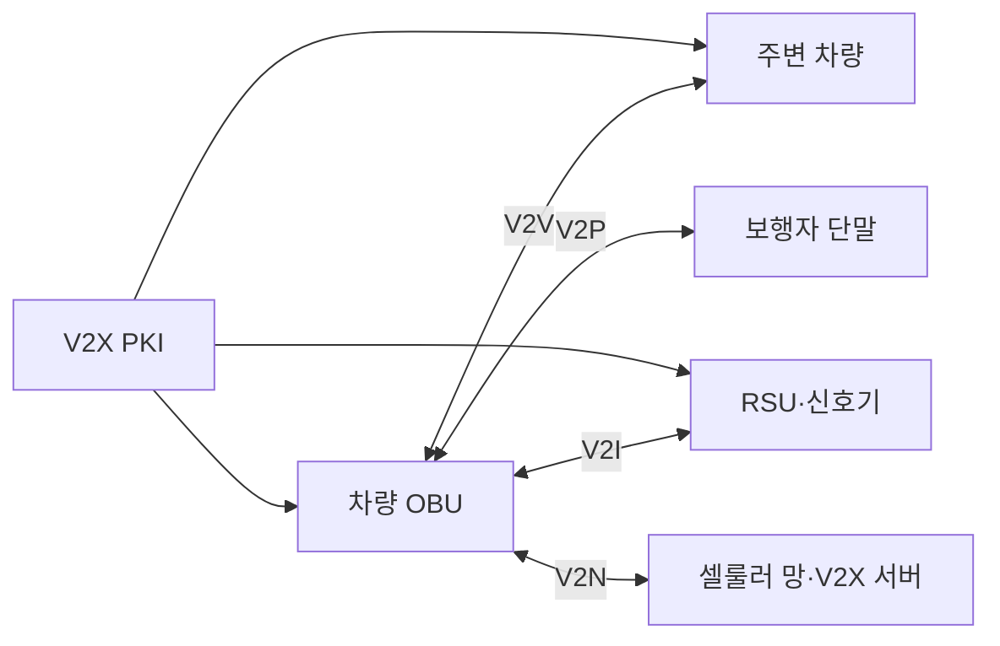
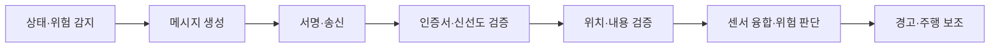

---
sidebar:
  order: 207
  label: "207. V2X 차량사물통신 (Vehicle-to-Everything)"
  badge:
    text: "기출 · 70%"
    variant: note
title: "V2X 차량사물통신 (Vehicle-to-Everything)"
date: "2026-07-27T23:59:59+09:00"
tags:
  - "notes-latest-tech"
weight: 207
extra:
  question_no: "207"
  source_status: "기출"
  source_history: "138회"
  priority: 70
  priority_note: "V2X 통신·신뢰 경계 설계가 138회 출제됨"
---

## 미리 알고가기

- **V2X(브이투엑스)**: Vehicle-to-Everything의 약자로, 차량이 다른 차량·인프라·보행자·망과 정보를 교환하는 통신 체계
- **V2V/V2I/V2P/V2N**: 차량 간·인프라 간·보행자 간·네트워크 간 통신 대상을 나타내는 표기
- **C-V2X(씨브이투엑스)**: Cellular V2X의 약자로, 셀룰러 기술 기반 차량 통신
- **PC5(피씨 파이브)**: 기지국을 거치지 않고 인접 단말이 직접 통신하는 인터페이스
- **Uu(유유)**: 기지국과 단말 사이의 셀룰러 인터페이스로, 광역 서비스에 사용
- **PKI(피케이아이)**: Public Key Infrastructure의 약자로, 인증서 기반으로 메시지 송신자를 검증하는 공개키 기반구조

## Ⅰ. 개요

- **정의/개념**: 차량·주변 참여자의 위험·교통 정보 교환 체계
- **기존 한계**: 탑재 센서만으로 사각지대·가시거리 밖 위험 인지 한계

### 쉽게 이해하기 (학습용)

- 앞차와 신호기가 보이지 않는 위험까지 미리 알려 주되, 수신 정보는 차량 센서와 함께 검증하여 사용하는 방식이다.

## Ⅱ. 특징

- **다중 참여자 통신**: V2V·V2I·V2P·V2N 지원
- **직접·망 통신 병행**: PC5·Uu를 범위별 활용
- **신뢰 기반 융합**: 서명·시간·위치를 검증하고 차량 센서와 결합

### 쉽게 이해하기 (학습용)

- 차량 센서 밖의 위험 정보를 주변 차량·도로 시설·통신망에서 미리 받는다.

## Ⅲ. 아키텍처 및 구성요소

| 구성요소 | 책임 |
|:---|:---|
| 차량 OBU | 메시지 생성·검증·센서 융합 |
| RSU | 도로·신호 정보 중계 |
| 보행자 단말 | 보행자 위치·위험 정보 제공 |
| V2X 서버 | 광역 교통·서비스 정보 제공 |
| V2X PKI | 인증서 발급·폐기·신뢰 관리 |

> 요약: 직접·망 통신으로 협력 정보를 교환하고 PKI로 신뢰를 검증

### 쉽게 이해하기 (학습용)

- 차량 장치가 직접·망 통신으로 메시지를 받고 PKI와 센서 정보로 신뢰성을 확인한다.

## Ⅳ. 처리 절차 및 흐름

| 단계 | 핵심 활동 |
|:---|:---|
| 상태·위험 감지 | 위치·속도·이벤트 수집 |
| 메시지 생성 | 표준 형식과 시간 정보 구성 |
| 서명·송신 | 인증서 서명 후 채널 전송 |
| 신뢰 검증 | 서명·인증서·재전송 확인 |
| 내용 검증 | 시간·위치·물리 가능성 확인 |
| 융합·판단 | 센서와 결합하여 위험 산정 |
| 경고·보조 | 운전자 경고나 제한적 보조 |

### 쉽게 이해하기 (학습용)

- 메시지의 서명·시간·위치를 검증한 뒤 센서와 융합해 경고나 보조 제어에 사용한다.

## Ⅴ. V2X 접속 방식 비교

| 판단 기준 | DSRC·ITS-G5 | C-V2X PC5 | C-V2X Uu |
|:---|:---|:---|:---|
| 적용 기준 | 근거리 직접 안전 통신 | 근거리 셀룰러 직접 통신 | 광역 망 기반 서비스 |
| 핵심 특징 | IEEE 802.11 계열 직접 통신 | 기지국 비경유 직접 통신 | 기지국·서버 경유 통신 |
| 한계 | 별도 노변 인프라 필요 | 단말·자원 운용 복잡도 | 망 지연·가용성 의존 |

### 쉽게 이해하기 (학습용)

- 직접 통신은 인접 긴급 상황, 망 통신은 넓은 지역의 교통 서비스에 적합하다.

## Ⅵ. 실무 사례

1. **교차로 사각지대 경고**: RSU 정보로 충돌 위험 경고
2. **전방 급제동 경고**: 서명 메시지로 후속 차량 조기 감속

### 쉽게 이해하기 (학습용)

- 교차로와 전방 차량의 보이지 않는 위험을 서명 메시지로 먼저 전달한다.

## Ⅶ. 결론

- **인접 긴급 위험은 직접 통신 적용**
- **광역 교통 서비스는 Uu 활용**
- **V2X 정보는 센서 검증 후 보조에 사용**

### 쉽게 이해하기 (학습용)

- V2X 메시지는 유용한 추가 센서이지만 차량의 자체 센서와 검증한 뒤 사용해야 한다.
