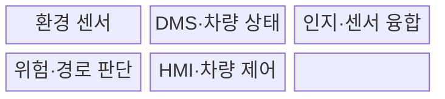
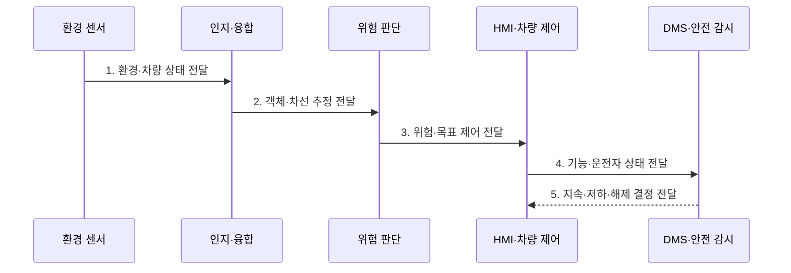

---
sidebar:
  order: 208
  label: "208. 첨단 운전자 지원 시스템 (ADAS)"
  badge:
    text: "기출 · 70%"
    variant: note
title: "첨단 운전자 지원 시스템 (Advanced Driver Assistance System, ADAS)"
date: "2026-07-31T12:09:14+09:00"
tags:
  - "notes-latest-tech"
weight: 208
extra:
  question_no: "208"
  source_status: "기출"
  source_history: "138회"
  priority: 70
  priority_note: "ADAS 인지·보조·운전자 경계가 최근 출제됨"
---

## Ⅰ. 개요

핵심 용어

- **첨단 운전자 지원 시스템(Advanced Driver Assistance System, ADAS)**: 환경과 운전자 상태를 인지해 경고·조향·가감속으로 운전자의 주행 과업을 보조하는 시스템이다.

- 정의/개념: 환경·운전자 상태를 인지해 경고·조향·가감속을 보조하는 **첨단 운전자 지원 시스템(Advanced Driver Assistance System, ADAS)**
- 배경/필요성: 운전자 오류 보조 기능의 확대는 **기능 한계·감독 책임 혼동** 위험

#### 한줄 요약

- 카메라와 레이더가 주변 위험을 먼저 살피고 운전자에게 알리거나 일부 조작을 돕지만, 지원 수준의 책임 경계는 유지된다.

## Ⅱ. 특징

핵심 용어

- **운전자 모니터링 시스템(Driver Monitoring System, DMS)**: 운전자의 주의·졸음·응답 상태를 확인하여 감독 가능성을 판단하는 시스템이다.

- 다중 센서 융합 기반 **객체·차선·충돌 위험 인지**
- 국제자동차기술자협회(Society of Automotive Engineers International, SAE International) Level 0~2 범위의 **자동 긴급 제동(Automatic Emergency Braking, AEB)·적응형 순항 제어(Adaptive Cruise Control, ACC) 기반 종방향 제어**
- 차로 이탈 방지를 위한 **차로 유지 보조(Lane Keeping Assist, LKA) 기반 횡방향 제어**
- DMS·센서 감시 기반 **운전자 감독·기능 저하 전환**
#### 한줄 요약

- ADAS는 운전자를 대신하는 자율주행이 아니라 정해진 범위에서 인지·제어를 보조한다.

## Ⅲ. 구조 및 구성요소

핵심 용어

- **센서 융합**: 카메라·레이더 등 여러 센서의 관측을 결합해 객체·차선·자차 상태를 추정하는 과정이다.

운전자 모니터링 시스템(Driver Monitoring System, DMS)과 인간-기계 인터페이스(Human-Machine Interface, HMI)가 운전자 상태와 경고·제어 결과를 연결한다.

| 구성요소 | 책임 |
|:---|:---|
| 환경 센서 | 카메라·레이더 기반 **객체·차선·거리 측정** |
| DMS·차량 상태 | **주의도·속도·고장·기능 상태 확인** |
| 인지·센서 융합 | **객체·차선·자차 상태 추정** |
| 위험·경로 판단 | **충돌 위험·목표 궤적 산정** |
| HMI·차량 제어 | **경고·조향·제동·가속 명령 제공** |

#### 한줄 요약

- 환경 센서와 운전자 감시 결과를 판단기가 결합해 경고·조향·제동 명령을 제한적으로 낸다.

## Ⅳ. 흐름도

핵심 용어

- **운행 설계 영역(Operational Design Domain, ODD)**: 도로·날씨·속도 등 운전자 지원 기능이 작동하도록 설계된 운행 조건 범위이다.

인간-기계 인터페이스(Human-Machine Interface, HMI)와 운전자 모니터링 시스템(Driver Monitoring System, DMS)이 기능 한계와 운전자 대응을 감시한다.

**동작 원리**

1. **환경·차량 상태 전달**: 센서 건강·가시성·ODD와 주변 데이터 수집
2. **객체·차선 추정 전달**: 다중 센서 기반 객체·차선·자차 상태 융합
3. **위험·목표 제어 전달**: 충돌 가능성과 목표 궤적에 따른 경고·제한 제어
4. **기능·운전자 상태 전달**: HMI 상태·제어 결과와 운전자 주의·응답 감시
5. **지속·저하·해제 결정 전달**: 한계·고장·미응답 시 기능 저하·해제·인수 요청

#### 한줄 요약

- 환경과 운전자 상태를 계속 확인하고 기능 한계를 넘으면 경고 후 제어를 운전자에게 돌린다.

## Ⅴ. 종류 및 비교

핵심 용어

- **동적 주행 과업(Dynamic Driving Task, DDT)**: 조향·가감속과 주행환경 감시를 포함하는 주행 과업이다.

국제자동차기술자협회(Society of Automotive Engineers International, SAE International)의 지원 수준에 따라 동적 주행 과업의 역할을 구분한다.

| SAE 지원 수준 | Level 0 | Level 1 | Level 2 |
|:---|:---|:---|:---|
| 적용 기준 | **순간 경고·보조** | 조향 또는 **가감속 보조** | 조향·가감속 **동시 보조** |
| 핵심 특징 | **지속 제어 없음** | 한 축의 **지속 지원** | 두 축의 **지속 지원** |
| 한계 | 운전자가 모든 **DDT 수행** | 운전자의 **환경 감시** 지속 | 운전자의 **감독·대응 책임** 유지 |

#### 한줄 요약

- Level 2도 조향·가감속을 함께 보조할 뿐 운전자가 환경 감시와 대응 책임을 가진다.

## Ⅵ. 실무 고려사항 및 대책

핵심 용어

- **안전한 해제**: 기능 한계나 운전자 미응답이 감지되면 경고와 단계적 제한을 거쳐 보조 기능을 종료하는 절차이다.

첨단 운전자 지원 시스템(Advanced Driver Assistance System, ADAS)은 운행 설계 영역(Operational Design Domain, ODD), 인간-기계 인터페이스(Human-Machine Interface, HMI), 운전자 모니터링 시스템(Driver Monitoring System, DMS)을 함께 검증한다.

| 문제 | 대책 | 효과 |
|:---|:---|:---|
| **기능 경계** 미검증 시 ADAS의 **자율주행 오인·과신** | ODD·책임·한계의 **명확한 HMI** | 기능 경계 **오인·과신** 감소 |
| **센서 성능** 미검증 시 악천후·가림의 **인지 성능 저하** | 진단·다중 센서·**기능 제한** | 악천후 **인지 실패 영향** 제한 |
| **운전자 감독** 미검증 시 주의 이탈·**인수 실패** | DMS·단계 경고·**안전한 해제** | **안전한 제어권 회수** |

#### 한줄 요약

- 기능의 ODD와 운전자 책임을 명확히 알리고 센서·운전자 상태 악화 시 단계적으로 제한·해제한다.

## Ⅶ. 결론

핵심 용어

- **SAE Level 2**: 국제자동차기술자협회(Society of Automotive Engineers International, SAE International) 기준에서 시스템이 조향과 가감속을 동시에 보조하지만 운전자가 환경 감시와 대응 책임을 유지하는 수준이다.

- **운행 설계 영역(Operational Design Domain, ODD)·센서 한계 원칙**: 기능을 저하·해제하고 운전자 감독 책임 유지

#### 한줄 요약

- 자동 제어 범위보다 운전자가 계속 감독해야 한다는 책임 경계를 먼저 이해해야 한다.
