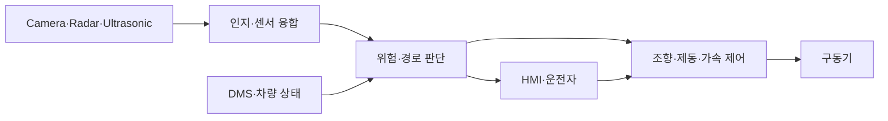
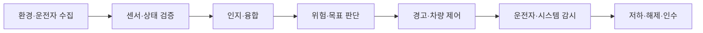

---
sidebar:
  order: 208
  label: "208. ADAS 첨단운전자지원시스템 (Advanced Driver Assistance System)"
  badge:
    text: "기출 · 70%"
    variant: note
title: "ADAS 첨단운전자지원시스템 (Advanced Driver Assistance System)"
date: "2026-07-27T23:59:59+09:00"
tags:
  - "notes-latest-tech"
weight: 208
extra:
  question_no: "208"
  source_status: "기출"
  source_history: "138회"
  priority: 70
  priority_note: "ADAS 인지·보조·운전자 경계가 최근 출제됨"
---

## 미리 알고가기

- **ADAS(에이다스)**: Advanced Driver Assistance System의 약자로, 운전자의 인지·판단·조작을 보조하는 첨단운전자지원시스템
- **AEB(에이이비)**: Automatic Emergency Braking의 약자로, 충돌 위험 시 자동으로 제동하는 기능
- **ACC(에이씨씨)**: Adaptive Cruise Control의 약자로, 앞차와의 거리를 유지하며 속도를 조절하는 기능
- **LKA(엘케이에이)**: Lane Keeping Assistance의 약자로, 차로 이탈을 막도록 조향을 보조하는 기능
- **DMS(디엠에스)**: Driver Monitoring System의 약자로, 운전자 주의·졸음·응답 상태를 확인하는 시스템
- **DDT(디디티)**: Dynamic Driving Task의 약자로, 조향·가감속과 주행환경 감시를 포함한 동적 주행 과업

## Ⅰ. 개요

- **정의/개념**: 환경·운전자 인지 기반 경고·주행 보조 시스템
- **기존 한계**: 운전자 인지·판단·반응 오류로 사고 위험 증가

### 쉽게 이해하기 (학습용)

- 카메라와 레이더가 주변 위험을 먼저 살피고 운전자에게 알리거나 일부 조작을 돕지만, 지원 수준의 책임 경계는 유지된다.

## Ⅱ. 특징

- **환경 인지·위험 판단**: 다중 센서로 객체·차선·충돌 위험 추정
- **제한적 주행 지원**: Level 0~2의 경고·차량 제어
- **운전자·고장 감시**: DMS로 주의 상태를 확인하고 센서 고장 시 기능 제한

### 쉽게 이해하기 (학습용)

- ADAS는 운전자를 대신하는 자율주행이 아니라 정해진 범위에서 인지·제어를 보조한다.

## Ⅲ. 아키텍처 및 구성요소

| 구성요소 | 책임 |
|:---|:---|
| 환경 센서 | 객체·차선·거리 측정 |
| DMS·차량 상태 | 주의도·속도·고장 확인 |
| 인지·융합 | 객체·차선·주행환경 추정 |
| 위험·경로 판단 | 충돌 위험과 목표 궤적 산정 |
| 차량 제어 | 조향·제동·가속 명령 생성 |
| HMI | 상태·경고·인수 요청 전달 |

> 요약: 환경과 운전자 상태를 함께 감시하여 제한된 주행 보조 수행

### 쉽게 이해하기 (학습용)

- 환경 센서와 운전자 감시 결과를 판단기가 결합해 경고·조향·제동 명령을 제한적으로 낸다.

## Ⅳ. 처리 절차 및 흐름

| 단계 | 핵심 활동 |
|:---|:---|
| 상태 수집 | 환경·차량·운전자 데이터 수집 |
| 상태 검증 | 센서 건강·가시성·ODD 확인 |
| 인지·융합 | 객체·차선·자차 상태 추정 |
| 위험 판단 | 충돌 가능성과 목표 산정 |
| 경고·제어 | HMI 경고와 제한적 제어 |
| 지속 감시 | 운전자 응답과 시스템 확인 |
| 안전 전환 | 기능 저하·해제·인수 요청 |

### 쉽게 이해하기 (학습용)

- 환경과 운전자 상태를 계속 확인하고 기능 한계를 넘으면 경고 후 제어를 운전자에게 돌린다.

## Ⅴ. SAE 운전자 지원 수준 비교

| 판단 기준 | Level 0 | Level 1 | Level 2 |
|:---|:---|:---|:---|
| 적용 기준 | 순간 경고·보조 | 조향 또는 가감속 보조 | 조향과 가감속 동시 보조 |
| 핵심 특징 | 지속 제어 없음 | 한 축의 지속 지원 | 두 축의 지속 지원 |
| 한계 | 운전자가 모든 DDT 수행 | 운전자가 환경을 계속 감시 | 운전자가 감독·대응 책임 유지 |

### 쉽게 이해하기 (학습용)

- Level 2도 조향·가감속을 함께 보조할 뿐 운전자가 환경 감시와 대응 책임을 가진다.

## Ⅵ. 실무 사례

1. **고속도로 Level 2 보조**: 차로 유지 중 운전자 상태 감시
2. **악천후 기능 저하**: 센서 저하 시 제한 알림·기능 해제

### 쉽게 이해하기 (학습용)

- 고속도로 보조 중 운전자 주의와 센서 상태가 나빠지면 기능을 제한하거나 해제한다.

## Ⅶ. 결론

- **한 축 지원은 Level 1로 분류**
- **두 축 지원도 운전자 감독이 필수**
- **센서·운전자 이상 시 저하·해제 전환**

### 쉽게 이해하기 (학습용)

- 자동 제어 범위보다 운전자가 계속 감독해야 한다는 책임 경계를 먼저 이해해야 한다.
