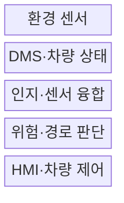
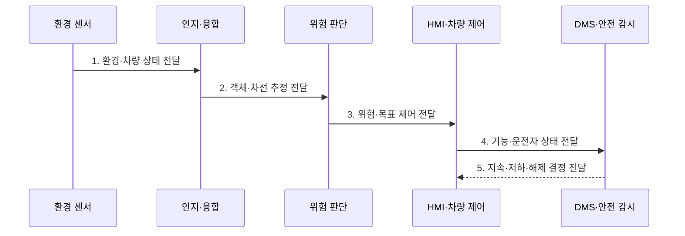

---
sidebar:
  order: 208
  label: "208. ADAS 첨단운전자지원시스템 (Advanced Driver Assistance System)"
  badge:
    text: "기출 · 70%"
    variant: note
title: "ADAS 첨단운전자지원시스템 (Advanced Driver Assistance System)"
date: "2026-07-30T11:10:21+09:00"
tags:
  - "notes-latest-tech"
weight: 208
extra:
  question_no: "208"
  source_status: "기출"
  source_history: "138회"
  priority: 70
  priority_note: "ADAS 인지·보조·운전자 경계가 최근 출제됨"
---

## 미리 알고가기

- **ADAS(에이다스)**: Advanced Driver Assistance System의 약자로, 운전자의 인지·판단·조작을 보조하는 첨단운전자지원시스템
- **AEB(에이이비)**: Automatic Emergency Braking의 약자로, 충돌 위험 시 자동으로 제동하는 기능
- **ACC(에이씨씨)**: Adaptive Cruise Control의 약자로, 앞차와의 거리를 유지하며 속도를 조절하는 기능
- **LKA(엘케이에이)**: Lane Keeping Assistance의 약자로, 차로 이탈을 막도록 조향을 보조하는 기능
- **DMS(디엠에스)**: Driver Monitoring System의 약자로, 운전자 주의·졸음·응답 상태를 확인하는 시스템
- **DDT(디디티)**: Dynamic Driving Task의 약자로, 조향·가감속과 주행환경 감시를 포함한 동적 주행 과업
- **HMI(Human-Machine Interface)**: '에이치엠아이'로 읽으며, 경고·기능 상태·운전자 인수 요청을 전달하는 사람-기계 인터페이스
- **ODD(Operational Design Domain)**: '오디디'로 읽으며, 도로·날씨·속도 등 기능이 작동하도록 설계된 운행 조건 범위
- **SAE 자동화 수준**: 운전자와 시스템의 DDT 수행 책임을 Level 0~5로 구분하는 분류

## Ⅰ. 개요

- 정의/개념: 환경·운전자 상태를 인지해 **경고 또는 조향·가감속을 제한적으로 보조**하는 운전자 지원 시스템
- 배경/필요성: 운전자의 인지·판단·반응 오류를 보완하되 **기능 한계와 운전자 감독 책임**을 명확히 유지할 필요

### 쉽게 이해하기 (학습용)

- 카메라와 레이더가 주변 위험을 먼저 살피고 운전자에게 알리거나 일부 조작을 돕지만, 지원 수준의 책임 경계는 유지된다.

## Ⅱ. 특징

- 다중 센서 융합 기반 **객체·차선·충돌 위험 인지**
- SAE Level 0~2 범위의 **경고·제한적 차량 제어**
- DMS·센서 건강 감시 기반 **운전자 감독·기능 저하 전환**

### 쉽게 이해하기 (학습용)

- ADAS는 운전자를 대신하는 자율주행이 아니라 정해진 범위에서 인지·제어를 보조한다.

## Ⅲ. 구조 및 구성요소

| 구성요소 | 책임 |
|:---|:---|
| 환경 센서 | 카메라·레이더 기반 **객체·차선·거리 측정** |
| DMS·차량 상태 | **주의도·속도·고장·기능 상태 확인** |
| 인지·센서 융합 | **객체·차선·자차 상태 추정** |
| 위험·경로 판단 | **충돌 위험·목표 궤적 산정** |
| HMI·차량 제어 | **경고·조향·제동·가속 명령 제공** |

> 요약: 환경과 운전자 상태를 함께 감시하여 제한된 주행 보조 수행

### 쉽게 이해하기 (학습용)

- 환경 센서와 운전자 감시 결과를 판단기가 결합해 경고·조향·제동 명령을 제한적으로 낸다.

## Ⅳ. 흐름도

### 동작 원리

- **1. 환경·차량 상태 전달**: 센서 건강·가시성·ODD와 주변 데이터 수집
- **2. 객체·차선 추정 전달**: 다중 센서 기반 객체·차선·자차 상태 융합
- **3. 위험·목표 제어 전달**: 충돌 가능성과 목표 궤적에 따른 경고·제한 제어
- **4. 기능·운전자 상태 전달**: HMI 상태·제어 결과와 운전자 주의·응답 감시
- **5. 지속·저하·해제 결정 전달**: 한계·고장·미응답 시 기능 저하·해제·인수 요청

### 쉽게 이해하기 (학습용)

- 환경과 운전자 상태를 계속 확인하고 기능 한계를 넘으면 경고 후 제어를 운전자에게 돌린다.

## Ⅴ. 종류 및 비교

| SAE 지원 수준 | Level 0 | Level 1 | Level 2 |
|:---|:---|:---|:---|
| 적용 기준 | 순간 경고·보조 | 조향 또는 가감속 보조 | 조향과 가감속 동시 보조 |
| 핵심 특징 | 지속 제어 없음 | 한 축의 지속 지원 | 두 축의 지속 지원 |
| 한계 | 운전자가 모든 DDT 수행 | 운전자가 환경을 계속 감시 | 운전자가 감독·대응 책임 유지 |

### 쉽게 이해하기 (학습용)

- Level 2도 조향·가감속을 함께 보조할 뿐 운전자가 환경 감시와 대응 책임을 가진다.

## Ⅵ. 실무 고려사항 및 대책

| 고려사항 | 대책 | 효과 |
|:---|:---|:---|
| **기능 경계** 미검증 시 ADAS의 **자율주행 오인·과신** | ODD·책임·한계의 **명확한 HMI** | 기능 경계 **오인·과신** 감소 |
| **센서 성능** 미검증 시 악천후·가림의 **인지 성능 저하** | 진단·다중 센서·**기능 제한** | 악천후 **인지 실패 영향** 제한 |
| **운전자 감독** 미검증 시 주의 이탈·**인수 실패** | DMS·단계 경고·**안전한 해제** | **안전한 제어권 회수** |

### 쉽게 이해하기 (학습용)

- 기능의 ODD와 운전자 책임을 명확히 알리고 센서·운전자 상태 악화 시 단계적으로 제한·해제한다.

## Ⅶ. 결론

- **제어 범위·운전자 감독·센서 한계·기능 저하·해제 조건**으로 책임 경계를 유지하는 운전자 지원 체계

### 쉽게 이해하기 (학습용)

- 자동 제어 범위보다 운전자가 계속 감독해야 한다는 책임 경계를 먼저 이해해야 한다.
