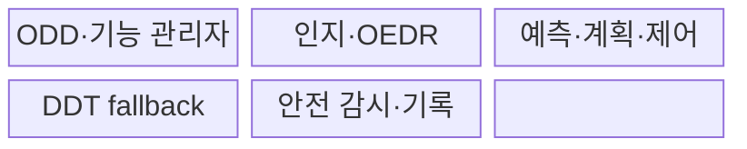
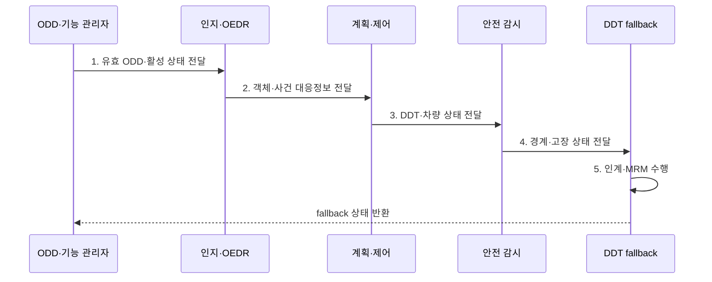

---
sidebar:
  order: 209
  label: "209. 자동주행 시스템 (ADS)"
  badge:
    text: "기출 · 70%"
    variant: note
title: "자동주행 시스템 (Automated Driving System, ADS)"
date: "2026-07-31T12:09:29+09:00"
tags:
  - "notes-latest-tech"
weight: 209
extra:
  question_no: "209"
  source_status: "기출"
  source_history: "138회"
  priority: 70
  priority_note: "ADS 자동화 단계·안전 책임이 최근 출제됨"
---

## Ⅰ. 개요

핵심 용어

- **자동주행 시스템(Automated Driving System, ADS)**: 정의된 운행 설계 영역(Operational Design Domain, ODD)에서 전체 동적 주행 과업(Dynamic Driving Task, DDT)과 비상 시 대체 대응을 수행하는 시스템이다.

- 정의/개념: 정의된 운행 설계 영역(Operational Design Domain, ODD)에서 전체 동적 주행 과업(Dynamic Driving Task, DDT)과 대체 대응을 수행하는 **자동주행 시스템(Automated Driving System, ADS)**
- 배경/필요성: 운전자 지원과 자동주행의 혼동은 **환경 감시·비상 대응 책임 공백** 초래

#### 한줄 요약

- 자율주행 등급은 차의 별명이 아니라 지금 켠 기능이 어느 조건에서 보고 운전하는지를 나타냄

## Ⅱ. 특징

핵심 용어

- **객체·사건 탐지 및 대응(Object and Event Detection and Response, OEDR)**: 주행 중 관련 객체와 사건을 탐지하고 상황에 맞는 대응을 생성하는 동적 주행 과업(Dynamic Driving Task, DDT) 기능이다.

- 조향·가감속·OEDR을 포함한 **전체 DDT 수행**
- 도로·날씨·속도에 따른 **명시적 운행 설계 영역(Operational Design Domain, ODD) 기반 작동 제한**
- 국제자동차기술자협회(Society of Automotive Engineers International, SAE International) Level 3 운전자·Level 4 이상 시스템의 **대체 대응 책임 구분**
#### 한줄 요약

- ODD에 따라 주행 범위를 정하고, 범위를 벗어나거나 고장 시 누가 운전할지 미리 약속함

## Ⅲ. 구조 및 구성요소

핵심 용어

- **동적 주행 과업 대체 대응(Dynamic Driving Task Fallback, DDT Fallback)**: 자동주행 시스템이 정상 주행 과업을 계속 수행할 수 없을 때 인계나 최소위험기동으로 대응하는 절차이다.
- **운행 설계 영역(ODD)**: 자동주행 기능이 의도대로 작동하도록 설계된 도로·속도·기상·시간·교통 조건의 범위이다.
- **동적 주행 과업(DDT)**: 차량의 종·횡방향 운동 제어와 객체·사건 탐지 및 대응을 포함한 실시간 주행 업무이다.
- **객체·사건 탐지 및 대응(OEDR)**: 주행 환경의 객체와 사건을 인식·분류하고 필요한 행동을 결정하는 기능이다.
- **최소위험기동(MRM)**: 정상 자동주행을 지속할 수 없을 때 위험을 최소화하는 상태로 차량을 이동·정지시키는 대응이다.
- **안전 감시·기록**: 자동주행 기능과 고장을 독립 감시하고 판단·개입·사고 관련 증거를 보존하는 기능이다.

자동주행 시스템(Automated Driving System, ADS)은 운행 설계 영역(Operational Design Domain, ODD), 객체·사건 탐지 및 대응(Object and Event Detection and Response, OEDR), 최소위험기동(Minimal Risk Maneuver, MRM)을 함께 관리한다.

| 구성요소 | 책임 |
|:---|:---|
| ODD·기능 관리자 | 운행 조건과 **기능 진입·유지·종료 판단** |
| 인지·OEDR | 객체·사건의 **탐지·분류·대응** |
| 예측·계획·제어 | **행동·경로·조향·가감속 결정** |
| DDT fallback | 고장·ODD 이탈의 **인계·MRM 수행** |
| 안전 감시·기록 | **독립 감시·상태 증적·원격 지원** |

#### 한줄 요약

- 평소 주행 두뇌 옆에 고장과 운행 조건을 지켜보다 안전 대응을 수행하는 별도 두뇌가 있음

## Ⅳ. 흐름도

핵심 용어

- **최소위험기동(Minimal Risk Maneuver, MRM)**: 고장이나 운행 설계 영역(Operational Design Domain, ODD) 이탈 시 차량의 위험을 낮추고 최소위험상태에 도달하기 위한 제어 동작이다.

객체·사건 탐지 및 대응(Object and Event Detection and Response, OEDR)과 동적 주행 과업(Dynamic Driving Task, DDT)의 상태에 따라 최소위험상태(Minimal Risk Condition, MRC) 도달을 판단한다.

**동작 원리**

1. **유효 ODD·활성 상태 전달**: 도로·날씨·속도와 시스템 가용성 기반 기능 진입
2. **객체·사건 대응정보 전달**: 환경 인지·예측과 관련 객체·사건 대응 생성
3. **DDT·차량 상태 전달**: 행동·경로·조향·가감속 실행 결과의 지속 감시
4. **경계·고장 상태 전달**: ODD 이탈 예상·센서·제어 고장과 대응 가능 시간 판정
5. **인계·MRM 수행**: 자동화 수준별 운전자 인계 또는 시스템 MRM·MRC 완료

#### 한줄 요약

- 자율주행 중에도 조건을 확인하고 문제가 생기면 사람이나 시스템이 안전하게 마무리함

## Ⅴ. 종류 및 비교

핵심 용어

- **SAE Level 4**: 국제자동차기술자협회(Society of Automotive Engineers International, SAE International) 기준에서 제한된 운행 설계 영역(Operational Design Domain, ODD) 안의 전체 동적 주행 과업(Dynamic Driving Task, DDT)과 대체 대응을 시스템이 수행하는 자동화 수준이다.

자동주행 시스템(Automated Driving System, ADS)의 자동화 수준별 운전자·시스템 책임을 비교한다.

| ADS 자동화 수준 | SAE L3 | SAE L4 | SAE L5 |
|:---|:---|:---|:---|
| 적용 기준 | 인계 가능한 **제한 ODD** | 무인 운행 가능한 **제한 ODD** | **ODD 제한 없는 무인 운행** |
| 핵심 특징 | 운전자에게 **fallback 요청** | 시스템이 **fallback 수행** | 모든 조건에서 **시스템 운전** |
| 한계 | **인계 지연·준비 부족** | **ODD 밖 운행 불가** | 모든 **환경 대응 난도** |

#### 한줄 요약

- L3은 사람이 이어받고 L4 이상은 지정 구역 내에서 차가 끝까지 안전하게 처리함

## Ⅵ. 실무 고려사항 및 대책

핵심 용어

- **보수적 가용성 판정**: 운행 설계 영역(Operational Design Domain, ODD) 경계나 시스템 상태가 불확실할 때 기능 진입을 막거나 조기에 종료하는 안전 판단이다.

국제자동차기술자협회(Society of Automotive Engineers International, SAE International) Level 3, 운전자 모니터링 시스템(Driver Monitoring System, DMS), 최소위험기동(Minimal Risk Maneuver, MRM)의 인계·대응 조건을 검증한다.

| 문제 | 대책 | 효과 |
|:---|:---|:---|
| **ODD 경계** 미검증 시 조건 오판의 **무리한 기능 지속** | 진입·이탈 여유와 **보수적 가용성 판정** | ODD 이탈 시 **기능 지속** 방지 |
| **인계 책임** 미검증 시 L3 운전자의 **준비 부족·반응 지연** | 충분한 전환 요구·DMS·**MRM 보완** | L3 인계 **대응 성공률** 향상 |
| **fallback** 미검증 시 고장 시 **최소위험상태 미도달** | 독립 감시·중복 제어·**시나리오 검증** | **최소위험상태 도달률** 향상 |

#### 한줄 요약

- ODD 진입·이탈 조건과 자동화 수준별 fallback 주체를 명확히 하고 인계 실패까지 포함한 최소위험기동을 검증한다.

## Ⅶ. 결론

핵심 용어

- **최소위험상태(Minimal Risk Condition, MRC)**: 대체 대응 수행 결과 차량과 주변의 위험이 최소화된 안정 상태이다.

- **자동화 수준별 대체 대응**: 국제자동차기술자협회(Society of Automotive Engineers International, SAE International) Level 3는 운전자 인계, Level 4 이상은 시스템 최소위험기동(Minimal Risk Maneuver, MRM) 적용

#### 한줄 요약

- 어디까지 달릴지 명확히 하고 문제 발생 시 약속된 주체가 안전하게 마무리함
