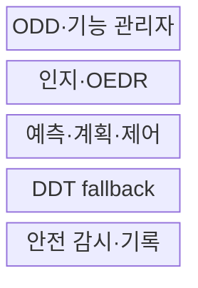
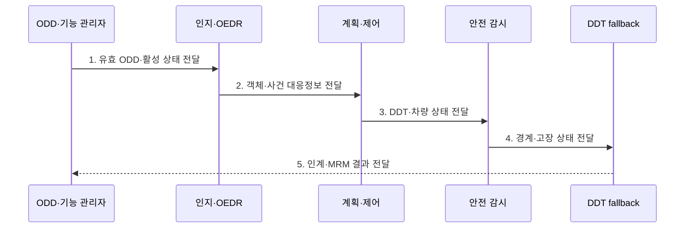

---
sidebar:
  order: 209
  label: "209. ADS 자율주행시스템 (Automated Driving System)"
  badge:
    text: "기출 · 70%"
    variant: note
title: "ADS 자율주행시스템 (Automated Driving System)"
date: "2026-07-30T11:10:21+09:00"
tags:
  - "notes-latest-tech"
weight: 209
extra:
  question_no: "209"
  source_status: "기출"
  source_history: "138회"
  priority: 70
  priority_note: "ADS 자동화 단계·안전 책임이 최근 출제됨"
---

## 미리 알고가기

- **에이디에스(Automated Driving System, ADS)**: 자동화된 주행 시스템이라는 이름으로, 특정 운행 조건에서 전체 동적 주행 과업을 수행하는 체계
- **오디디(Operational Design Domain, ODD)**: 운행 설계 영역이라는 뜻으로, 도로·날씨·속도 등 ADS가 작동하도록 설계된 조건 범위
- **디디티(Dynamic Driving Task, DDT)**: 동적 주행 과업이라는 뜻으로, 조향·가감속·주변 객체 및 사건 탐지·대응을 포함
- **최소위험기동(Minimal Risk Maneuver, MRM)**: 고장·ODD 이탈 시 위험을 낮추기 위한 제어 동작이며, 그 결과 도달한 안정 상태가 최소위험상태(MRC)
- **객체·사건 탐지·대응(Object and Event Detection and Response, OEDR)**: '오이디알'로 읽으며, 주행 중 관련 객체·사건을 인지하고 대응하는 DDT 기능
- **DDT fallback(디디티 폴백)**: ADS가 정상 DDT를 계속 수행할 수 없을 때 인계 또는 최소위험기동으로 대응하는 절차
- **SAE 자동화 수준**: 운전자와 시스템의 DDT·fallback 책임을 Level 0~5로 구분하는 분류

## Ⅰ. 개요

- 정의/개념: 정의된 ODD에서 **전체 DDT와 단계별 fallback 책임을 수행**하는 자동주행 시스템
- 배경/필요성: 운전자 지원과 자동주행의 혼동으로 발생하는 **작동 범위·환경 감시·비상 대응 주체의 책임 공백** 방지 필요

### 쉽게 이해하기 (학습용)

- 자율주행 등급은 차의 별명이 아니라 지금 켠 기능이 어느 조건에서 보고 운전하는지를 나타냄

## Ⅱ. 특징

- 조향·가감속·OEDR을 포함한 **전체 DDT 수행**
- 도로·날씨·속도 등 **명시적 ODD 기반 작동 제한**
- SAE L3 운전자·L4 이상 시스템의 **fallback 책임 구분**

### 쉽게 이해하기 (학습용)

- ODD에 따라 주행 범위를 정하고, 범위를 벗어나거나 고장 시 누가 운전할지 미리 약속함

## Ⅲ. 구조 및 구성요소

| 구성요소 | 책임 |
|:---|:---|
| ODD·기능 관리자 | 운행 조건과 **기능 진입·유지·종료 판단** |
| 인지·OEDR | 객체·사건의 **탐지·분류·대응** |
| 예측·계획·제어 | **행동·경로·조향·가감속 결정** |
| DDT fallback | 고장·ODD 이탈의 **인계·MRM 수행** |
| 안전 감시·기록 | **독립 감시·상태 증적·원격 지원** |

> 요약: 운용 영역과 고장을 감시하고 단계별 안전 대응을 완료함.

### 쉽게 이해하기 (학습용)

- 평소 주행 두뇌 옆에 고장과 운행 조건을 지켜보다 안전 대응을 수행하는 별도 두뇌가 있음

## Ⅳ. 흐름도

### 동작 원리

- **1. 유효 ODD·활성 상태 전달**: 도로·날씨·속도와 시스템 가용성 기반 기능 진입
- **2. 객체·사건 대응정보 전달**: 환경 인지·예측과 관련 객체·사건 대응 생성
- **3. DDT·차량 상태 전달**: 행동·경로·조향·가감속 실행 결과의 지속 감시
- **4. 경계·고장 상태 전달**: ODD 이탈 예상·센서·제어 고장과 대응 가능 시간 판정
- **5. 인계·MRM 결과 전달**: 자동화 수준별 운전자 인계 또는 시스템 MRM·MRC 완료

> 요약: ODD 내 DDT 수행과 경계·고장 대응을 연결

### 쉽게 이해하기 (학습용)

- 자율주행 중에도 조건을 확인하고 문제가 생기면 사람이나 시스템이 안전하게 마무리함

## Ⅴ. 종류 및 비교

| ADS 자동화 수준 | SAE L3 | SAE L4 | SAE L5 |
|:---|:---|:---|:---|
| 적용 기준 | 인계 가능한 제한 ODD | 무인 운행 가능한 제한 ODD | ODD 제한 없는 무인 운행 |
| 핵심 특징 | 운전자에게 fallback 요청 | 시스템이 fallback 수행 | 모든 조건에서 시스템 운전 |
| 한계 | 인계 지연·준비 부족 | ODD 밖 운행 불가 | 모든 환경 대응 난도 |

> 요약: L3 사람 인계와 L4·L5 시스템 대응 구분

### 쉽게 이해하기 (학습용)

- L3은 사람이 이어받고 L4 이상은 지정 구역 내에서 차가 끝까지 안전하게 처리함

## Ⅵ. 실무 고려사항 및 대책

| 고려사항 | 대책 | 효과 |
|:---|:---|:---|
| **ODD 경계** 미검증 시 조건 오판의 **무리한 기능 지속** | 진입·이탈 여유와 **보수적 가용성 판정** | ODD 이탈 시 **기능 지속** 방지 |
| **인계 책임** 미검증 시 L3 운전자의 **준비 부족·반응 지연** | 충분한 전환 요구·DMS·**MRM 보완** | L3 인계 **대응 성공률** 향상 |
| **fallback** 미검증 시 고장 시 **최소위험상태 미도달** | 독립 감시·중복 제어·**시나리오 검증** | **최소위험상태 도달률** 향상 |

### 쉽게 이해하기 (학습용)

- ODD 진입·이탈 조건과 자동화 수준별 fallback 주체를 명확히 하고 인계 실패까지 포함한 최소위험기동을 검증한다.

## Ⅶ. 결론

- **ODD·전체 DDT·fallback 주체·인계 시간·최소위험상태**로 자동주행 책임을 폐쇄하는 시스템

### 쉽게 이해하기 (학습용)

- 어디까지 달릴지 명확히 하고 문제 발생 시 약속된 주체가 안전하게 마무리함
