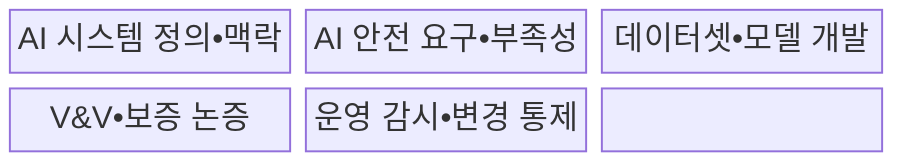
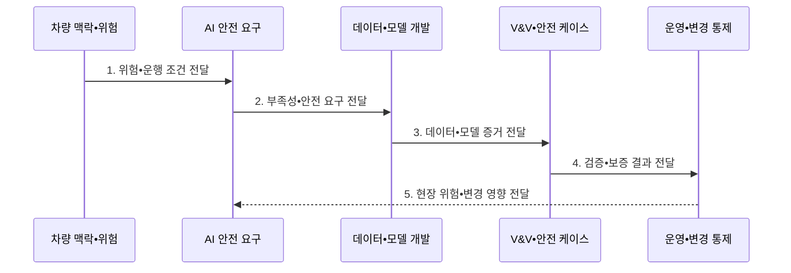

---
sidebar:
  order: 210
  label: "210. ISO/PAS 8800 인공지능 안전"
  badge:
    text: "기출 • 70%"
    variant: note
title: "ISO/PAS 8800 인공지능 안전"
date: "2026-08-03T08:48:47+09:00"
tags:
  - "notes-latest-tech"
weight: 210
extra:
  question_no: "210"
  source_status: "기출"
  source_history: "138회"
  priority: 70
  priority_note: "ISO PAS 8800 AI 안전 수명주기가 최근 출제됨"
---

## Ⅰ. 개요

핵심 용어

- **ISO/PAS 8800**: 국제표준화기구(International Organization for Standardization, ISO)의 공개 사양(Publicly Available Specification, PAS)으로, 도로 차량 인공지능(Artificial Intelligence, AI)의 출력 부족과 체계적 오류가 만드는 안전 위험을 수명주기 전반에서 관리한다.

- 정의/개념: 차량 인공지능(Artificial Intelligence, AI)의 출력 부족•오류 위험을 수명주기로 관리하는 **ISO/PAS 8800 안전 사양**
- 배경/필요성: 고장률 분석만으로는 AI의 **출력 부족•체계적 오류 위험 입증 곤란**

#### 한줄 요약

- 규칙 확인이 어려운 차량 AI에 대해 데이터부터 실제 운행까지 안전 증거를 마련하는 생애주기임

## Ⅱ. 특징

핵심 용어

- **인공지능 부족성(Artificial Intelligence Insufficiency, AI Insufficiency)**: 인공지능 요소가 안전 요구에 필요한 성능을 특정 입력이나 운행 조건에서 제공하지 못하는 상태이다.

- 입력 조건•성능 한계의 **AI 부족성•차량 위험 연결**
- 데이터•모델•검증 및 확인(Verification and Validation, V&V)•변경의 **안전 요구 추적성•보증 증거**
- 현장 위험•모델 변경 기반 **지속 감시•안전 재평가**
#### 한줄 요약

- 알려진 약점은 미리 대응책을 마련하고, 모르는 약점은 실제 운행 감시로 찾아 고치는 방식임

## Ⅲ. 구조 및 구성요소

핵심 용어

- **안전 보증 논증**: 안전하다는 주장과 이를 뒷받침하는 논거•근거•증거를 추적 가능하게 연결한 논리이다.
- **AI 시스템 정의•맥락**: 인공지능 기능•경계•운행 조건•이해관계자와 안전 관련 사용 맥락을 명확히 한 기준선이다.
- **AI 안전 요구•부족성**: 비결정성•불완전한 명세•분포 변화 등 AI 고유 한계를 분석해 도출한 안전 요구이다.
- **데이터셋•모델 개발**: 데이터 적합성•대표성•품질과 모델 학습•변경을 안전 요구에 맞춰 관리하는 수명주기 활동이다.
- **검증 및 확인(V&V)**: 정의한 맥락과 안전 요구에서 모델•시스템의 성능, 강건성, 고장 대응을 입증하는 활동이다.
- **운영 감시•변경 통제**: 배포 후 분포 변화와 이상 동작을 감시하고 데이터•모델 갱신의 안전 영향을 재평가한다.

인공지능(Artificial Intelligence, AI)의 안전 요구와 검증 및 확인(Verification and Validation, V&V) 증거를 안전 보증 논증에 연결한다.

| 구성요소 | 책임 |
|:---|:---|
| AI 시스템 정의•맥락 | **기능 경계•차량 영향•운행 조건 정의** |
| AI 안전 요구•부족성 | **성능 부족 조건과 안전 요구 연결** |
| 데이터셋•모델 개발 | **조건별 데이터 적합성•학습 변경 추적** |
| V&V•보증 논증 | 검증 증거 기반 **안전 주장 구성** |
| 운영 감시•변경 통제 | **현장 위험•모델 변경 재평가** |

#### 한줄 요약

- 안전 약속을 AI 조건으로 나눈 뒤 검증 자료를 붙이고, 출시 후에도 약속을 지키는지 확인함

## Ⅳ. 흐름도

핵심 용어

- **검증 및 확인(Verification and Validation, V&V)**: 요구사항 충족 여부와 의도한 용도•환경에서의 적합성을 시험 증거로 확인하는 활동이다.

**동작 원리**

1. **위험•운행 조건 전달**: 차량 기능•운행 맥락•안전 목표와 AI 영향 경계 정의
2. **부족성•안전 요구 전달**: 알려진•잠재 성능 부족 조건과 완화•대체 대응(Fallback) 요구 도출
3. **데이터•모델 증거 전달**: 데이터 범위•품질•학습•모델 변경의 추적 가능한 증거 생성
4. **검증•보증 결과 전달**: 조건별 성능•불확실성•완화 수단을 시험해 안전 논증 구성
5. **현장 위험•변경 영향 전달**: 운행 사건•분포 변화•모델 변경에 따른 재평가•재승인

#### 한줄 요약

- 위험 구역을 정하고 검증을 거친 뒤 출시 후 약점 발견 시 되돌리거나 다시 승인함

## Ⅴ. 종류 및 비교

핵심 용어

- **의도된 기능의 안전성(Safety of the Intended Functionality, SOTIF)**: 시스템 고장이 없어도 의도한 기능의 성능 한계로 발생하는 위험을 다루는 자동차 안전 표준이다.

국제표준화기구 공개 사양(International Organization for Standardization Publicly Available Specification, ISO/PAS) 8800은 인공지능(Artificial Intelligence, AI) 수명주기 안전 증거를 다룬다.

| 자동차 안전 기준 | ISO/PAS 8800 | ISO 26262 | ISO 21448 SOTIF |
|:---|:---|:---|:---|
| 적용 기준 | **데이터•모델•현장 변화** 통제 | **고장률•진단•안전 메커니즘** | **유발 조건•기능 한계** |
| 핵심 특징 | AI 수명주기 **안전 증거** | 전기•전자 **고장 안전** | 의도 기능의 **성능 한계** |
| 한계 | 다른 **차량 안전 표준과의 연계** | **AI 부족성 단독 포괄 불가** | AI 수명주기 **증거 부족** |

#### 한줄 요약

- 고장은 기능안전, 기능 한계는 SOTIF, AI 한계는 이 사양으로 관리함

## Ⅵ. 실무 고려사항 및 대책

핵심 용어

- **대체 대응(Fallback)**: 인공지능(Artificial Intelligence, AI) 성능 부족이나 운행 조건 이탈 시 대체 기능 또는 안전 상태로 전환해 위험을 줄이는 대응이다.

| 문제 | 대책 | 효과 |
|:---|:---|:---|
| **데이터 적합성** 미검증 시 희귀•경계 조건의 **대표성 부족** | 운행 맥락별 범위•공백 분석과 **데이터 보강** | 희귀 조건 **데이터 대표성** 향상 |
| **성능 부족** 미검증 시 불확실성•분포 변화의 **미탐지** | 조건별 임계값•독립 감시•**fallback** | 분포 변화 **조기 탐지** |
| **변경 통제** 미검증 시 재학습 후 **안전 증거 단절** | 영향 분석•회귀 검증 및 확인(Verification and Validation, V&V)•**안전 케이스 갱신** | **안전 증거 연속성** 유지 |

#### 한줄 요약

- 운행 조건별 데이터 대표성과 AI 성능 한계를 검증하고 현장 분포 변화•모델 변경을 안전 케이스에 지속 반영한다.

## Ⅶ. 결론

핵심 용어

- **안전 케이스**: 안전 주장•논거•근거를 구조화해 허용 가능한 위험 수준을 설명하는 보증 문서이다.

- **인공지능(Artificial Intelligence, AI) 안전 증거 갱신**: 출력 부족•변경 시 검증 및 확인(Verification and Validation, V&V)•안전 케이스를 갱신하고 대체 대응 적용

#### 한줄 요약

- 인공지능 안전은 운행 중에도 증거를 추적하여 허용 가능한 위험 수준임을 입증해야 함
