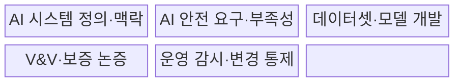
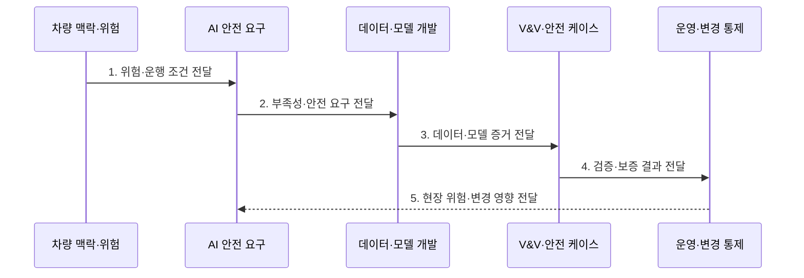

---
sidebar:
  order: 210
  label: "210. ISO/PAS 8800 AI Safety (ISO/PAS 8800)"
  badge:
    text: "기출 · 70%"
    variant: note
title: "ISO/PAS 8800 AI Safety (ISO/PAS 8800)"
date: "2026-07-30T20:20:00+09:00"
tags:
  - "notes-latest-tech"
weight: 210
extra:
  question_no: "210"
  source_status: "기출"
  source_history: "138회"
  priority: 70
  priority_note: "ISO PAS 8800 AI 안전 수명주기가 최근 출제됨"
---

## 미리 알고가기

- **아이에스오 피에이에스 8800(ISO/PAS 8800)**: 국제표준화기구의 공개 사양(Publicly Available Specification)으로, 도로 차량 AI의 안전 수명주기를 다룸
- **기능안전(ISO 26262)**: 전기·전자 시스템의 무작위·체계적 고장 위험을 다루는 자동차 안전 표준
- **소티프(Safety of the Intended Functionality, SOTIF)**: 고장이 없어도 의도 기능의 성능 한계로 발생하는 위험을 다루는 ISO 21448
- **AI 부족성(AI insufficiency)**: AI 요소가 안전 요구에 필요한 성능을 제공하지 못하는 조건
- **안전 보증 논증(assurance argument)**: 안전하다는 주장과 근거·증거를 추적 가능하게 연결한 논리
- **검증·확인(Verification and Validation, V&V)**: '브이앤브이'로 읽으며, 요구사항 충족과 의도한 용도·환경에서의 적합성을 증거로 확인하는 활동
- **안전 케이스(Safety Case)**: 안전 주장·논거·근거를 구조화해 허용 가능한 위험 수준을 설명하는 보증 문서
- **fallback(폴백)**: AI 성능 부족·고장·운행 조건 이탈 때 위험을 줄이기 위해 대체 기능이나 안전 상태로 전환하는 대응

## Ⅰ. 개요

- 정의/개념: 도로 차량 AI의 **부족성·안전 요구·데이터·모델·검증·운영 변경을 수명주기 증거로 관리**하는 안전 사양
- 배경/필요성: 전통적 고장률 분석만으로 입증하기 어려운 **학습 데이터·모델의 불확실성·성능 한계와 차량 위험**의 체계적 통제 필요

### 쉽게 이해하기 (학습용)

- 규칙 확인이 어려운 차량 AI에 대해 데이터부터 실제 운행까지 안전 증거를 마련하는 생애주기임

## Ⅱ. 특징

- **1. AI 부족성·차량 위험 연결**: 입력 조건·성능 한계의 AI 부족성·차량 위험 연결
- **2. 안전 요구 추적성·보증 증거**: 데이터·모델·V&V·변경의 안전 요구 추적성·보증 증거
- **3. 지속 감시·안전 재평가**: 현장 위험·모델 변경 기반 지속 감시·안전 재평가
### 쉽게 이해하기 (학습용)

- 알려진 약점은 미리 대응책을 마련하고, 모르는 약점은 실제 운행 감시로 찾아 고치는 방식임

## Ⅲ. 구조 및 구성요소

| 구성요소 | 책임 |
|:---|:---|
| AI 시스템 정의·맥락 | **기능 경계·차량 영향·운행 조건 정의** |
| AI 안전 요구·부족성 | **성능 부족 조건과 안전 요구 연결** |
| 데이터셋·모델 개발 | **조건별 데이터 적합성·학습 변경 추적** |
| V&V·보증 논증 | 검증 증거 기반 **안전 주장 구성** |
| 운영 감시·변경 통제 | **현장 위험·모델 변경 재평가** |

### 쉽게 이해하기 (학습용)

- 안전 약속을 AI 조건으로 나눈 뒤 검증 자료를 붙이고, 출시 후에도 약속을 지키는지 확인함

## Ⅳ. 흐름도

**동작 원리**

- **1. 위험·운행 조건 전달**: 차량 기능·운행 맥락·안전 목표와 AI 영향 경계 정의
- **2. 부족성·안전 요구 전달**: 알려진·잠재 성능 부족 조건과 완화·fallback 요구 도출
- **3. 데이터·모델 증거 전달**: 데이터 범위·품질·학습·모델 변경의 추적 가능한 증거 생성
- **4. 검증·보증 결과 전달**: 조건별 성능·불확실성·완화 수단을 시험해 안전 논증 구성
- **5. 현장 위험·변경 영향 전달**: 운행 사건·분포 변화·모델 변경에 따른 재평가·재승인

### 쉽게 이해하기 (학습용)

- 위험 구역을 정하고 검증을 거친 뒤 출시 후 약점 발견 시 되돌리거나 다시 승인함

## Ⅴ. 종류 및 비교

| 자동차 안전 기준 | ISO/PAS 8800 | ISO 26262 | ISO 21448 SOTIF |
|:---|:---|:---|:---|
| 적용 기준 | 데이터·모델·현장 변화 통제 | 고장률·진단·안전 메커니즘 | triggering condition·기능 한계 |
| 핵심 특징 | AI 수명주기 안전 증거 | 전기·전자 고장 안전 | 의도 기능의 성능 한계 |
| 한계 | 다른 차량 안전 표준과 연계 필요 | AI 부족성 단독 포괄 불가 | AI 수명주기 증거 부족 |

### 쉽게 이해하기 (학습용)

- 고장은 기능안전, 기능 한계는 SOTIF, AI 한계는 이 사양으로 관리함

## Ⅵ. 실무 고려사항 및 대책

| 고려사항 | 대책 | 효과 |
|:---|:---|:---|
| **데이터 적합성** 미검증 시 희귀·경계 조건의 **대표성 부족** | 운행 맥락별 범위·공백 분석과 **데이터 보강** | 희귀 조건 **데이터 대표성** 향상 |
| **성능 부족** 미검증 시 불확실성·분포 변화의 **미탐지** | 조건별 임계값·독립 감시·**fallback** | 분포 변화 **조기 탐지** |
| **변경 통제** 미검증 시 재학습 후 **안전 증거 단절** | 영향 분석·회귀 V&V·**안전 케이스 갱신** | **안전 증거 연속성** 유지 |

### 쉽게 이해하기 (학습용)

- 운행 조건별 데이터 대표성과 AI 성능 한계를 검증하고 현장 분포 변화·모델 변경을 안전 케이스에 지속 반영한다.

## Ⅶ. 결론

- **AI 부족성·데이터 적합성·V&V·fallback·현장 변경 증거**를 연결한 차량 AI 수명주기 안전 보증

### 쉽게 이해하기 (학습용)

- AI 안전은 운행 중에도 증거를 추적하여 위험이 없음을 입증해야 함
