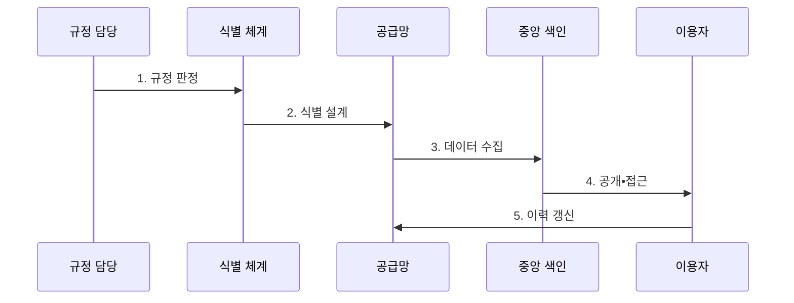

---
sidebar:
  order: 211
  label: "211. 디지털 제품 여권 (Digital Product Passport)"
  badge:
    text: "미출 • 70%"
    variant: note
title: "디지털 제품 여권 (Digital Product Passport)"
date: "2026-08-03T08:48:47+09:00"
tags:
  - "notes-latest-tech"
weight: 211
extra:
  question_no: "211"
  source_status: "미출"
  source_history: ""
  priority: 70
  priority_note: "디지털 제품 여권의 식별•권한 설계가 유력함"
---

## Ⅰ. 개요

핵심 용어

- **디지털 제품 여권(Digital Product Passport, DPP)**: 고유 식별자를 통해 제품의 원재료•제조•사용•수리•재활용 정보를 생애주기 전반에 연결하는 기록 체계이다.

- 정의/개념: 식별자로 제품의 원재료•제조•사용•재활용 정보를 연결한 **디지털 제품 여권(Digital Product Passport, DPP) 체계**
- 배경/필요성: 기업별 분산 정보로는 공급망 전체의 **제품 이력•규제 준수 검증 곤란**

#### 한줄 요약

- 정보를 열람하는 디지털 인증서이자 순환경제를 위한 데이터 플랫폼임

## Ⅱ. 특징

핵심 용어

- **분산 상호운용**: 운영자별 저장소에 있는 제품 정보를 표준 데이터 모델과 응용 프로그래밍 인터페이스(Application Programming Interface, API)로 연결해 교환하는 방식이다.

- 제품 표식과 데이터 위치를 분리하고 운영자별 저장소를 표준 API로 연결하는 **식별자•매체 분리•분산 상호운용**
- 공개•제한 정보를 이용자별로 구분하는 **역할 기반 접근**
- 재사용•수리•재활용 이력을 연결하는 **순환경제** 지원
#### 한줄 요약

- 열쇠인 빠른 응답 코드(Quick Response Code, QR Code)로 권한에 맞는 정보만 읽고 책임자가 분산 관리하는 구조임

## Ⅲ. 구조 및 구성요소

핵심 용어

- **고유 식별자**: 실제 제품과 디지털 생애주기 기록을 지속적으로 연결하는 참조 키이다.
- **데이터 운반체(Data Carrier)**: QR 코드•데이터 매트릭스•근거리 통신 등 제품에서 여권 식별자와 정보 위치를 읽는 매체이다.
- **분산 저장소•중앙 색인**: 공급망 주체가 원천 데이터를 보유하면서 공통 색인이 제품별 정보 위치를 찾게 하는 구조이다.
- **표준화된 인터페이스**: 서로 다른 시스템이 제품•소재•수리•재활용 정보를 동일한 의미와 형식으로 교환하는 계약이다.
- **접근 제어•검증 증명**: 공개•제한 정보를 역할에 따라 제공하고 발급 주체와 데이터 무결성을 검증하는 체계이다.

| 구성요소 | 책임 |
|:---|:---|
| 식별체계 | 품목별 **고유 식별자•정보 위치** 매핑 |
| 분산 저장소 | 운영자별 **생애주기 데이터** 관리 |
| 표준화된 인터페이스 | 응용 프로그래밍 인터페이스(Application Programming Interface, API) 기반 **상호운용•데이터 교환** |
| 접근 제어 | 역할별 **권한•보안 데이터** 통제 |
| 중앙 색인 | 핵심 식별자의 **등록•검색** 지원 |

#### 한줄 요약

- 제품 번호로 자료를 찾고 중앙 목록으로 검색하며 역할별 접근함

## Ⅳ. 흐름도

핵심 용어

- **검증 가능한 이력**: 발행 주체와 변경 시점•무결성을 확인할 수 있도록 연결한 제품 생애주기 기록이다.

**동작 원리**

1. **규정 판정**: 품목별 적용 대상, 필수 항목, 보존•공개 조건 확인
2. **식별 설계**: 제품 고유 식별자, 운반체와 데이터 위치 연결
3. **데이터 수집**: 공급망 주체가 출처•서명•시점을 포함한 표준 데이터 등록
4. **공개•접근**: 중앙 색인으로 데이터를 찾고 이용자 역할별 권한 집행
5. **이력 갱신**: 판매•수리•부품 교체•재활용 사건을 원제품 이력에 연결

#### 한줄 요약

- 대상 규정을 정하고 번호와 항목을 설계한 뒤, 정보를 공개하고 관리함

## Ⅴ. 종류 및 비교

핵심 용어

- **디지털 인증서**: 특정 시점의 속성이나 적합성을 발행자가 전자적으로 증명하는 문서이며, 디지털 제품 여권(Digital Product Passport, DPP)의 전체 생애주기 기록과 범위가 다르다.

빠른 응답 코드(Quick Response Code, QR Code)는 제품 식별 정보와 데이터 위치를 전달하는 매체이다.

| 판단 기준 | 디지털 제품 여권 | 데이터 매체(QR 등) | 중앙 등록 목록 |
|:---|:---|:---|:---|
| 적용 기준 | **생애주기 정보 제공** | **식별 정보 전달** | 제품 **검색•감독** |
| 핵심 특징 | 제품 **생애주기 데이터 기록** | **식별 정보 전달 매체** | 제품 목록의 **색인 정보** |
| 한계 | 공급망 전체의 **이력 품질 의존** | **복제•교체 위험** | **식별자 색인 관리** 필요 |

#### 한줄 요약

- 여권은 책, QR은 위치 안내, 목록은 도서관 안내서임

## Ⅵ. 실무 고려사항 및 대책

핵심 용어

- **역할 기반 접근**: 소비자•수리자•규제기관 등 이용자 역할에 따라 공개 정보와 제한 정보의 열람 범위를 구분한다.

| 문제 | 대책 | 효과 |
|:---|:---|:---|
| **식별자•실물 결합** 미검증 시 빠른 응답 코드(Quick Response Code, QR Code) 복제•교체로 다른 제품 정보 연결 | 위변조 방지 운반체, 일련번호 검증, 소유•수리 사건 서명 | 실물•디지털 제품 여권(Digital Product Passport, DPP) **식별 정합성** 확보 |
| **데이터 신뢰성** 미검증 시 공급망 주체의 허위•누락 자료로 추적성 약화 | 출처•책임자•시각 기록, 필수항목 검증, 표본 감사 | 데이터 **출처 신뢰성** 향상 |
| **공개 범위 충돌** 미검증 시 영업비밀•개인정보 노출 또는 수리 정보 부족 | 역할 기반 접근, 최소 공개, 목적별 상세 수준과 철회 정책 | 공개•**정보 보호** 균형 |

#### 한줄 요약

- 실물 식별자와 데이터 출처를 검증하고 이용자 역할별 공개 범위를 제한한다.

## Ⅶ. 결론

핵심 용어

- **순환경제**: 제품과 자원을 수리•재사용•재활용하여 폐기와 신규 자원 투입을 줄이는 경제 구조이다.

- **순환경제 지원 원칙**: 품목별 법령•이용자 역할에 따라 디지털 제품 여권(Digital Product Passport, DPP) 항목과 공개 범위 결정

#### 한줄 요약

- 모든 제품의 통일이 아닌 제품별 맞춤형 정보 전달 사업임
