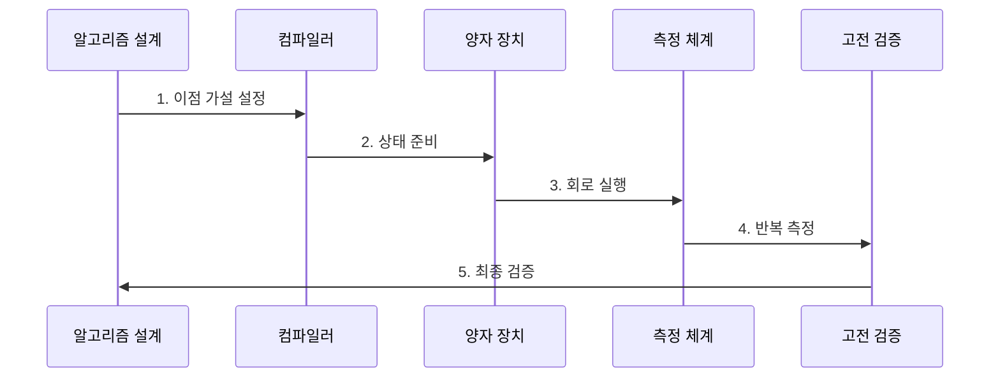

---
sidebar:
  order: 212
  label: "212. 양자컴퓨팅 (Quantum Computing)"
  badge:
    text: "기출 · 85%"
    variant: note
title: "양자컴퓨팅 (Quantum Computing)"
date: "2026-07-31T09:02:35+09:00"
tags:
  - "notes-latest-tech"
weight: 212
extra:
  question_no: "212"
  source_status: "기출"
  source_history: "126회, 129회, 135회"
  priority: 85
  priority_note: "양자컴퓨팅 원리·오류 한계가 여러 회차 반복됨"
---

## Ⅰ. 개요

핵심 용어

- **양자컴퓨팅**: 큐비트의 중첩·얽힘·간섭을 양자 게이트로 조작하고 측정하여 계산 결과를 얻는 계산 방식

- 정의/개념: 큐비트의 중첩·얽힘·간섭을 양자 게이트로 조작하고 측정하여 계산 결과를 얻는 **양자컴퓨팅**
- 배경/필요성: 일부 문제는 입력 증가에 따라 고전 알고리즘의 **계산량 급증**

#### 한줄 요약

- 가능성의 위상을 회로로 조작해 답을 찾는 통계적 계산법임

## Ⅱ. 특징

핵심 용어

- **중첩**: 큐비트가 여러 기저 상태의 확률 진폭을 동시에 표현하는 양자 상태
- **얽힘**: 여러 큐비트의 상태가 분리해 기술할 수 없는 상관관계를 이루는 양자 상태
- **간섭**: 확률 진폭을 더하거나 상쇄하여 원하는 결과의 측정 확률을 높이는 현상
- **측정**: 큐비트의 양자 상태를 고전 비트 결과로 변환하는 과정

- 여러 기저 상태의 확률 진폭을 함께 표현하는 **중첩**
- 큐비트 상관과 진폭 조절로 결과 확률을 높이는 **얽힘·간섭**
- 반복 실행으로 고전 결과 분포를 추정하는 **측정**

#### 한줄 요약

- 얽힘과 간섭으로 답을 도출할 확률을 설계하고 통계로 확인하는 방식임

## Ⅲ. 구조 및 구성요소

핵심 용어

- **양자 게이트**: 큐비트의 확률 진폭과 위상을 가역적으로 변환하는 연산

| 구성요소 | 책임 |
|:---|:---|
| 알고리즘 모델 | 문제별 **양자 알고리즘·목표 정밀도** 정의 |
| 상태 준비 | 입력을 큐비트 **진폭·위상**으로 인코딩 |
| 회로 컴파일러 | 논리 회로의 **장비 최적화·매핑** |
| 양자 연산자 | 큐비트의 **양자 게이트** 실행 |
| 고전 검증부 | 측정값 취합과 **고전 기준선 비교** |

#### 한줄 요약

- 큐비트 언어로 문제를 옮기고 실행한 뒤 고전 컴퓨터로 확인하는 구조임

## Ⅳ. 흐름도

핵심 용어

- **간섭**: 양자 상태의 진폭을 더하거나 상쇄하여 원하는 결과의 측정 확률을 높이는 현상

**동작 원리**

1. **이점 가설 설정**: 문제·입력 규모·정확도와 고전 기준선 정의
2. **상태 준비**: 큐비트를 초기화하고 입력과 초기 상태 인코딩
3. **회로 실행**: 장비 연결성에 맞게 회로를 매핑해 양자 게이트 수행
4. **반복 측정**: 회로를 여러 번 실행해 고전 비트 결과의 확률 분포 추정
5. **최종 검증**: 정확도·전체 실행시간·자원비를 고전 알고리즘과 비교

#### 한줄 요약

- 기존 컴퓨터와의 공정한 경기 규칙을 정하고 전체 과정 성능을 확인함

## Ⅴ. 종류 및 비교

핵심 용어

- **잡음 중간 규모 양자(Noisy Intermediate-Scale Quantum, NISQ)**: 오류가 있고 큐비트 수와 회로 깊이가 제한된 중간 규모 양자 장치

| 판단 기준 | 고전 컴퓨팅 | 잡음 중간 규모 양자(NISQ) 컴퓨팅 | 오류정정 양자컴퓨팅 |
|:---|:---|:---|:---|
| 적용 기준 | **범용·안정적 계산** | **짧은 회로 실험** | **긴 양자 알고리즘** |
| 핵심 특징 | **비트 기반 논리** | **노이지 큐비트·얕은 회로** | **논리 큐비트·오류 정정** |
| 한계 | 특정 문제의 **계산량 급증** | **노이즈·규모·정확도 제약** | 막대한 **물리 큐비트** 필요 |

#### 한줄 요약

- 현재는 짧은 회로를 실험 중이며, 긴 알고리즘은 많은 자원이 필요함

## Ⅵ. 실무 고려사항 및 대책

핵심 용어

- **디코히런스**: 환경과의 상호작용으로 큐비트의 중첩과 위상 정보가 손실되는 현상

| 문제 | 대책 | 효과 |
|:---|:---|:---|
| **불공정 기준선** 미검증 시 약한 고전 알고리즘과 비교해 양자 이점 과장 | 최신 고전 알고리즘과 정확도·전체시간 동일 조건 비교 | 양자 이점 **비교 공정성** 확보 |
| **노이즈·디코히런스·샷 비용** 미검증 시 회로 깊이와 반복 측정 증가로 신뢰성 저하 | 회로 축약, 오류 완화, 신뢰구간과 샷 예산 명시 | 측정 **통계 신뢰성** 향상 |
| **입출력 병목** 미검증 시 인코딩·후처리 비용이 계산 이점 상쇄 | 전체 파이프라인 계측과 양자 적합 하위 문제 분리 | 종단 간 **계산 이득** 검증 |

#### 한줄 요약

- 기준선·노이즈·입출력 비용을 함께 검증해 실제 계산 이득을 확인함

## Ⅶ. 결론

핵심 용어

- **양자 우위**: 특정 문제에서 양자 계산이 실용적으로 가능한 최선의 고전 계산보다 우수한 성능을 보이는 상태

- 전체 실행시간과 자원비에서 **양자 우위가 검증된 문제에만 양자컴퓨팅 적용**

#### 한줄 요약

- 큐비트 수보다는 실제 문제 해결의 전체 비용 효율성을 확인해야 함
