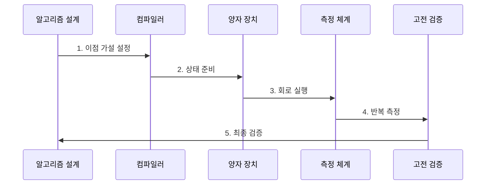

---
sidebar:
  order: 212
  label: "212. 양자컴퓨팅 (Quantum Computing)"
  badge:
    text: "기출 · 85%"
    variant: note
title: "양자컴퓨팅 (Quantum Computing)"
date: "2026-07-30T20:20:00+09:00"
tags:
  - "notes-latest-tech"
weight: 212
extra:
  question_no: "212"
  source_status: "기출"
  source_history: "126회, 129회, 135회"
  priority: 85
  priority_note: "양자컴퓨팅 원리·오류 한계가 여러 회차 반복됨"
---

## 미리 알고가기

- **큐비트(qubit)**: quantum bit를 줄인 이름으로, 중첩 가능한 양자 정보의 기본 단위
- **상태 표기**: $|\psi\rangle=\alpha|0\rangle+\beta|1\rangle$에서 $|\psi\rangle$는 상태, $\alpha,\beta$는 측정 확률을 정하는 복소수 진폭이며 $|\alpha|^2+|\beta|^2=1$
- **니스크(Noisy Intermediate-Scale Quantum, NISQ)**: 오류가 있는 중간 규모 양자 장치를 뜻하며, 현재 장비의 제한된 큐비트·회로 깊이를 나타내는 용어

## Ⅰ. 개요

- 정의/개념: 큐비트·양자 게이트·측정으로 수행하는 계산
- 배경/필요성: 고전 컴퓨터는 분자 상태 모사·정수 인수분해 등 일부 문제에서 입력 규모가 커질수록 계산량이 급격히 증가한다.

### 쉽게 이해하기 (학습용)

- 가능성의 위상을 회로로 조작해 답을 찾는 통계적 계산법임

## Ⅱ. 특징

- **1. 중첩**: 여러 기저 상태의 확률 진폭을 하나의 양자 상태로 표현한다.
- **2. 얽힘·간섭**: 큐비트 상관관계와 진폭 조절로 원하는 결과 확률을 높인다.
- **3. 측정**: 상태를 고전값으로 변환하므로 회로를 반복 실행해 분포를 추정한다.
### 쉽게 이해하기 (학습용)

- 얽힘과 간섭으로 답을 도출할 확률을 설계하고 통계로 확인하는 방식임

## Ⅲ. 구조 및 구성요소

| 구성요소 | 책임 |
|:---|:---|
| 알고리즘 모델 | 문제 특성에 맞는 양자 알고리즘과 목표 정밀도 정의 |
| 상태 준비 | 입력 데이터를 큐비트 진폭과 위상으로 인코딩 |
| 회로 컴파일러 | 논리적 회로를 장비 사양에 맞게 최적화 및 매핑 |
| 양자 연산자 | 큐비트와 제어 시스템을 통한 실제 게이트 실행 |
| 고전 검증부 | 측정값 취합 및 고전 컴퓨터 연동 후 결과 도출 |

### 쉽게 이해하기 (학습용)

- 큐비트 언어로 문제를 옮기고 실행한 뒤 고전 컴퓨터로 확인하는 구조임

## Ⅳ. 흐름도

**동작 원리**

- **1. 이점 가설 설정**: 문제·입력 규모·정확도와 고전 기준선 정의
- **2. 상태 준비**: 큐비트를 초기화하고 입력과 초기 상태 인코딩
- **3. 회로 실행**: 장비 연결성에 맞게 회로를 매핑해 양자 게이트 수행
- **4. 반복 측정**: 회로를 여러 번 실행해 고전 비트 결과의 확률 분포 추정
- **5. 최종 검증**: 정확도·전체 실행시간·자원비를 고전 알고리즘과 비교

### 쉽게 이해하기 (학습용)

- 기존 컴퓨터와의 공정한 경기 규칙을 정하고 전체 과정 성능을 확인함

## Ⅴ. 종류 및 비교

| 판단 기준 | 고전 컴퓨팅 | NISQ 양자컴퓨팅 | 오류정정 양자컴퓨팅 |
|:---|:---|:---|:---|
| 적용 기준 | 범용·안정적 계산 | 짧은 회로 실험 | 긴 양자 알고리즘 |
| 핵심 특징 | 비트 기반 논리 | 노이지 큐비트·얕은 회로 | 논리 큐비트·오류 정정 |
| 한계 | 특정 문제의 계산량 급증 | 노이즈·규모·정확도 제약 | 막대한 물리 큐비트 필요 |

### 쉽게 이해하기 (학습용)

- 현재는 짧은 회로를 실험 중이며, 긴 알고리즘은 많은 자원이 필요함

## Ⅵ. 실무 고려사항 및 대책

| 고려사항 | 대책 | 효과 |
|:---|:---|:---|
| **불공정 기준선** 미검증 시 약한 고전 알고리즘과 비교해 양자 이점 과장 | 최신 고전 알고리즘과 정확도·전체시간 동일 조건 비교 | 양자 이점 **비교 공정성** 확보 |
| **노이즈·샷 비용** 미검증 시 회로 깊이와 반복 측정 증가로 신뢰성 저하 | 회로 축약, 오류 완화, 신뢰구간과 샷 예산 명시 | 측정 **통계 신뢰성** 향상 |
| **입출력 병목** 미검증 시 인코딩·후처리 비용이 계산 이점 상쇄 | 전체 파이프라인 계측과 양자 적합 하위 문제 분리 | 종단 간 **계산 이득** 검증 |

### 쉽게 이해하기 (학습용)

- 핵심 운영 위험마다 실행 가능한 대책과 검증 효과를 함께 확인한다.

## Ⅶ. 결론

- 큐비트 수 중심의 과장된 기대를 피하기 위해 문제 구조·정확도·오류 보정·전체 실행시간·고전 기준선을 검토하여, 검증된 계산 이득이 있는 문제에만 양자컴퓨팅을 적용해야 한다.

### 쉽게 이해하기 (학습용)

- 큐비트 수보다는 실제 문제 해결의 전체 비용 효율성을 확인해야 함
