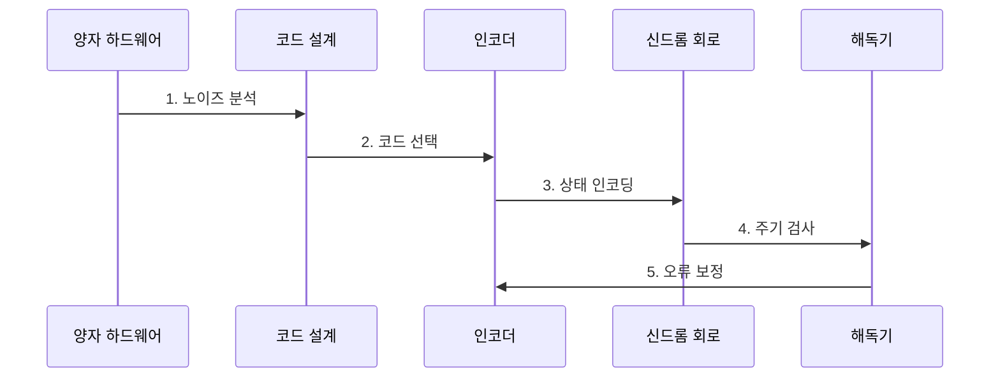

---
sidebar:
  order: 213
  label: "213. 양자 오류 정정 (Quantum Error Correction)"
  badge:
    text: "기출 · 70%"
    variant: note
title: "양자 오류 정정 (Quantum Error Correction)"
date: "2026-07-30T11:10:21+09:00"
tags:
  - "notes-latest-tech"
weight: 213
extra:
  question_no: "213"
  source_status: "기출"
  source_history: "138회"
  priority: 70
  priority_note: "양자 오류 정정의 신드롬·복구가 138회 출제됨"
---

## 미리 알고 가기

- **양자 오류 정정(QEC)**: 다수 물리 큐비트에 논리 정보를 인코딩해 오류를 검출·정정하는 기술
- **코드 거리($d$)**: 서로 다른 논리 상태를 잇는 최소 물리 오류 수이며, $t=\lfloor(d-1)/2\rfloor$에서 $t$는 정정 가능한 오류 수
- **신드롬(syndrome)**: 논리 상태를 직접 읽지 않고 안정자 측정으로 얻은 오류 징후

## Ⅰ. 개요

- 정의/개념: 논리 정보를 다수 물리 큐비트로 보호하는 기술
- 기존 한계: 물리 큐비트는 잡음에 취약하고 임의 상태를 복제할 수 없어 게이트·측정 오류가 누적되면 긴 양자 계산이 붕괴한다.

### 쉽게 이해하기 (학습용)

- 원문을 직접 보지 않고 오류의 흔적만 찾아 고치는 보호 기술임

## Ⅱ. 특징

- **논리 인코딩**: 정보를 여러 물리 큐비트의 공동 상태에 분산해 보호한다.
- **신드롬 해독**: 논리 정보를 측정하지 않고 오류 위치·유형을 추정한다.
- **임계값 정리**: 물리 오류율이 임계값보다 낮으면 코드 거리 증가로 논리 오류를 억제한다.

### 쉽게 이해하기 (학습용)

- 상태 보존을 위한 검사와 추정을 짧은 주기로 계속 반복하는 구조임

## Ⅲ. 구조 및 구성요소

| 구성요소 | 책임 |
|:---|:---|
| 물리 큐비트 | 데이터 유지 큐비트와 측정용 검사 큐비트 |
| 코드 설계 | 서피스 코드 등 논리 정보 배치 기법 |
| 신드롬 회로 | 오류 정보 추출을 위한 주기적인 상태 검사 |
| 해독 엔진 | 수집된 증상 기반 오류 경로 추정 및 적용 |
| 연산 레이어 | 보호된 상태에서 논리 연산을 수행함 |

> 요약: 정보 인코딩 후 반복 검사·추정으로 오류 정정

### 쉽게 이해하기 (학습용)

- 정보를 분산하고 장부 기록을 갱신하며 연산을 지속하는 구조임

## Ⅳ. 흐름도

### 동작 원리

1. **노이즈 분석**: 장비의 게이트·측정·상관 오류와 목표 논리 오류율 분석
2. **코드 선택**: 연결성·오류 편향·자원 예산에 맞는 코드와 거리 결정
3. **상태 인코딩**: 논리 정보를 다수 물리 큐비트의 코드 공간에 매핑
4. **주기 검사**: 논리 상태를 직접 읽지 않고 안정자 신드롬을 반복 측정
5. **오류 보정**: 해독기가 오류 경로를 추정해 물리 보정 또는 프레임 갱신

> 요약: 상태 인코딩 후 검사·보정을 반복

### 쉽게 이해하기 (학습용)

- 고장 습관을 분석하여 보호 구조를 정하고 계속 검사하며 보정함

## Ⅴ. 양자 오류 대응 방식 비교

| 판단 기준 | 오류 정정(QEC) | 오류 완화(Mitigation) | 오류 억제(Suppression) |
|:---|:---|:---|:---|
| 적용 기준 | 긴 내결함 양자 계산 | NISQ 결과 정확도 개선 | 모든 양자 장치의 오류 감소 |
| 핵심 특징 | 인코딩·신드롬으로 오류 정정 | 결과 통계로 오차 편향 감소 | 제어·장비로 오류 발생 감소 |
| 한계 | 대규모 큐비트·해독 자원 | 긴 계산 신뢰성 보장 불가 | 잔여 오류 누적 방지 불가 |

> 요약: 오류 억제·완화·정정의 개입 시점 구분

### 쉽게 이해하기 (학습용)

- 정비와 통계적 보정, 구조적 정정은 목적과 비용이 확연히 다름

## Ⅵ. 실무 고려사항 및 대책

| 고려사항 | 대책 | 효과 |
|:---|:---|:---|
| **임계값 미달 실패** 미검증 시 물리 오류율이 높아 거리 증가에도 논리 오류 증가 | 장비별 임계값 실험과 오류 억제 후 코드 확장 | 거리 증가의 **논리 오류 억제** 확인 |
| **상관 오류** 미검증 시 독립 오류 가정이 깨져 해독 정확도 저하 | 상관 노이즈 특성화와 편향·상관 인지 해독기 적용 | 상관 노이즈 **해독 정확도** 향상 |
| **해독 지연** 미검증 시 보정 결정이 측정 주기를 따라가지 못함 | 실시간 처리량 예산, 병렬 해독, 지연 시 안전한 프레임 관리 | 주기 내 **보정 처리율** 확보 |

## Ⅶ. 결론

- 물리 큐비트 오류가 유용한 연산을 무너뜨리는 것을 막기 위해 임계값·논리 오류율·코드 거리·상관 오류·해독 처리량·자원 예산을 검토하여, 목표 실패율에 맞는 QEC를 선택해야 한다.

### 쉽게 이해하기 (학습용)

- 보호망을 키우는 것뿐 아니라 해독 속도와 정확도도 중요함
