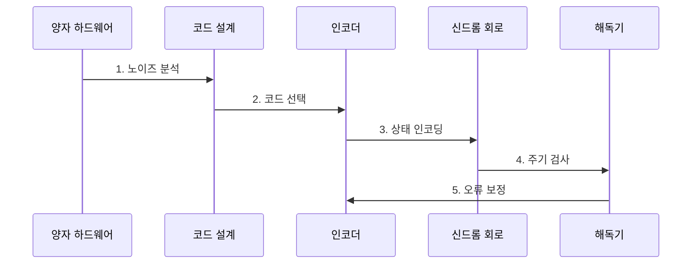

---
sidebar:
  order: 213
  label: "213. 양자 오류 정정 (Quantum Error Correction)"
  badge:
    text: "기출 • 70%"
    variant: note
title: "양자 오류 정정 (Quantum Error Correction)"
date: "2026-08-03T08:48:47+09:00"
tags:
  - "notes-latest-tech"
weight: 213
extra:
  question_no: "213"
  source_status: "기출"
  source_history: "138회"
  priority: 70
  priority_note: "양자 오류 정정의 신드롬•복구가 138회 출제됨"
---

## Ⅰ. 개요

핵심 용어

- **양자 오류 정정(Quantum Error Correction, QEC)**: 논리 정보를 여러 물리 큐비트의 공동 상태에 인코딩하여 양자 오류를 검출•정정하는 기술이다.

- 정의/개념: **양자 오류 정정(Quantum Error Correction, QEC)** 은 논리 정보를 다수 물리 큐비트에 인코딩해 오류를 검출•정정하는 기술
- 배경/필요성: 물리 큐비트의 게이트•측정 오류 누적은 **긴 양자 계산 붕괴** 초래

#### 한줄 요약

- 논리 상태를 직접 읽지 않고 오류 신드롬만 측정해 보정한다.

## Ⅱ. 특징

핵심 용어

- **논리 인코딩**: 하나의 양자 정보를 여러 물리 큐비트의 코드 공간에 분산해 보호하는 방식이다.

- 정보를 여러 물리 큐비트의 공동 상태로 보호하는 **논리 인코딩**
- 논리 정보를 읽지 않고 오류 위치•유형을 추정하는 **신드롬 해독**
- 임계값 아래에서 코드 거리로 논리 오류를 억제하는 **임계값 정리**
#### 한줄 요약

- 상태 보존을 위한 신드롬 측정과 오류 추정을 짧은 주기로 반복한다.

## Ⅲ. 구조 및 구성요소

핵심 용어

- **신드롬**: 논리 상태를 직접 측정하지 않고 안정자 측정으로 얻는 오류의 위치•유형에 관한 징후다.
- **물리•논리 큐비트**: 여러 잡음 많은 물리 큐비트에 하나의 논리 상태를 부호화해 오류로부터 보호하는 관계이다.
- **오류 정정 코드**: 허용된 코드 공간과 검출 가능한 오류 집합을 정의하는 부호화 규칙이다.
- **신드롬 추출 회로**: 논리 정보를 직접 읽지 않고 보조 큐비트 측정으로 오류 징후를 반복 수집한다.
- **해독 엔진•복구**: 시간에 따른 신드롬을 바탕으로 가장 가능성 높은 오류를 추론하고 보정 연산을 결정한다.

| 구성요소 | 책임 |
|:---|:---|
| 물리 큐비트 | **데이터•검사 큐비트** |
| 코드 설계 | 논리 정보의 **코드 거리•배치** 결정 |
| 신드롬 회로 | 오류 정보의 **주기적 안정자 측정** |
| 해독 엔진 | 신드롬 기반 **오류 경로 추정** |
| 연산 레이어 | 보호 상태의 **논리 연산** 수행 |

#### 한줄 요약

- 논리 정보를 분산하고 신드롬을 해독해 보호된 연산을 지속한다.

## Ⅳ. 흐름도

핵심 용어

- **신드롬 해독**: 반복 측정 결과로부터 가장 가능성 높은 물리 오류를 추정하고 복구 연산을 결정하는 과정이다.

**동작 원리**

- **1. 노이즈 분석**: 장비의 게이트•측정•상관 오류와 목표 논리 오류율 분석
- **2. 코드 선택**: 연결성•오류 편향•자원 예산에 맞는 코드와 거리 결정
- **3. 상태 인코딩**: 논리 정보를 다수 물리 큐비트의 코드 공간에 매핑
- **4. 주기 검사**: 논리 상태를 직접 읽지 않고 안정자 신드롬을 반복 측정
- **5. 오류 보정**: 해독기가 오류 경로를 추정해 물리 보정 또는 프레임 갱신

#### 한줄 요약

- 장비의 오류 특성에 맞는 코드를 선택하고 신드롬을 반복 측정해 보정한다.

## Ⅴ. 종류 및 비교

핵심 용어

- **코드 거리**: 서로 다른 논리 상태를 잇는 최소 물리 오류 수로, 정정 가능한 오류 수를 결정한다.

| 판단 기준 | 양자 오류 정정(Quantum Error Correction, QEC) | 오류 완화(Mitigation) | 오류 억제(Suppression) |
|:---|:---|:---|:---|
| 적용 기준 | 긴 **내결함 양자 계산** | **잡음이 있는 중간 규모 양자(Noisy Intermediate-Scale Quantum, NISQ) 결과 정확도** 개선 | 장치의 **오류 발생 감소** |
| 핵심 특징 | **인코딩•신드롬 오류 정정** | 결과 통계의 **오차 편향 감소** | 제어•장비의 **오류 억제** |
| 한계 | 대규모 **큐비트•해독 자원** | 긴 계산의 **신뢰성 보장 불가** | **잔여 오류 누적** 방지 불가 |

#### 한줄 요약

- 오류 억제•완화•정정은 대상과 신뢰성 수준 및 자원 비용이 다르다.

## Ⅵ. 실무 고려사항 및 대책

핵심 용어

- **오류 임계값**: 물리 오류율이 그보다 낮을 때 코드 규모를 늘려 논리 오류율을 계속 낮출 수 있는 경계다.

| 문제 | 대책 | 효과 |
|:---|:---|:---|
| **임계값 미달 실패** 미검증 시 물리 오류율이 높아 거리 증가에도 논리 오류 증가 | 장비별 임계값 실험과 오류 억제 후 코드 확장 | 거리 증가의 **논리 오류 억제** 확인 |
| **상관 오류** 미검증 시 독립 오류 가정이 깨져 해독 정확도 저하 | 상관 노이즈 특성화와 편향•상관 인지 해독기 적용 | 상관 노이즈 **해독 정확도** 향상 |
| **해독 지연** 미검증 시 보정 결정이 측정 주기를 따라가지 못함 | 실시간 처리량 예산, 병렬 해독, 지연 시 안전한 프레임 관리 | 주기 내 **보정 처리율** 확보 |

#### 한줄 요약

- 핵심 운영 위험마다 실행 가능한 대책과 검증 효과를 함께 확인한다.

## Ⅶ. 결론

핵심 용어

- **논리 오류율**: 오류 정정 이후에도 오류가 논리 상태나 논리 연산을 잘못 바꾸는 확률이다.

- 목표 논리 오류율에 맞춰 **코드 거리** 를 정하고 **실시간 해독기** 배치

#### 한줄 요약

- 코드 거리뿐 아니라 실시간 해독기의 처리 속도와 정확도도 중요하다.
