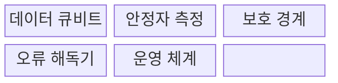
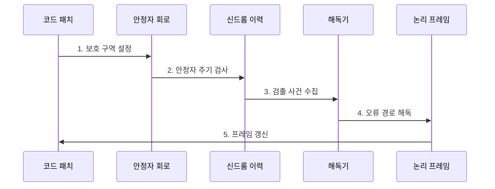

---
sidebar:
  order: 214
  label: "214. 표면 코드 (Surface Code)"
  badge:
    text: "기출 · 70%"
    variant: note
title: "표면 코드 (Surface Code)"
date: "2026-07-31T09:03:31+09:00"
tags:
  - "notes-latest-tech"
weight: 214
extra:
  question_no: "214"
  source_status: "기출"
  source_history: "138회"
  priority: 70
  priority_note: "표면 코드의 안정자·논리 오류가 138회 출제됨"
---

## 미리 알고가기

- **서피스 코드(surface code)**: 표면에 놓인 2차원 격자 형태에서 이름 붙은 양자 오류 정정 코드로, 이웃 큐비트의 안정자를 반복 측정
- **안정자(stabilizer)**: 논리 상태를 바꾸지 않고 오류 징후를 드러내는 공동 측정 연산자
- **코드 패치(code patch)**: 하나 이상의 논리 큐비트를 표현하도록 경계를 갖춘 격자 영역

## Ⅰ. 개요

- 정의/개념: **표면 코드**는 2차원 격자의 이웃 안정자를 측정하는 양자 오류 정정 코드
- 배경/필요성: 비국소 오류 정정 코드는 제한된 큐비트 연결성에서 **구현 곤란**

### 쉽게 이해하기 (학습용)

- 격자 이웃 간의 관계를 계속 검사하여 오류의 흔적을 찾는 보호망임

## Ⅱ. 특징

- 비트·위상 반전 신드롬을 추출하는 **X·Z 안정자**
- 측정 주기 변화를 연결해 오류를 추정하는 **시공간 해독**
- 임계값 아래에서 논리 오류를 낮추는 **코드 거리 확장**
### 쉽게 이해하기 (학습용)

- 보호 영역을 넓힐수록 고장은 줄어들지만 운영 자원이 많이 필요함

## Ⅲ. 구조 및 구성요소

| 구성요소 | 책임 |
|:---|:---|
| 데이터 큐비트 | 논리 정보의 **격자형 배치** |
| 안정자 측정 | 오류 정보를 추출하는 **검사 큐비트** |
| 보호 경계 | 논리 연산 기준인 **격자 경계** |
| 오류 해독기 | 신드롬 기반 **오류 경로 추정** |
| 운영 체계 | **논리 연산·오류 정정** 관리 |

### 쉽게 이해하기 (학습용)

- 격자 칸을 계속 검사하고 해독하여 상태를 안정적으로 유지함

## Ⅳ. 흐름도

**동작 원리**

- **1. 보호 구역 설정**: 논리 큐비트의 경계 유형과 코드 거리 결정
- **2. 안정자 주기 검사**: 이웃 데이터·검사 큐비트로 X·Z 안정자 반복 측정
- **3. 검출 사건 수집**: 연속 측정값의 변화를 시공간 좌표로 기록
- **4. 오류 경로 해독**: 검출 사건을 설명할 가능성이 높은 데이터·측정 오류 추정
- **5. 프레임 갱신**: 실제 게이트 대신 보정 장부를 갱신하며 논리 상태 유지

### 쉽게 이해하기 (학습용)

- 보호 구역을 정하고 경보를 수집하여 지도를 만든 뒤 해독함

## Ⅴ. 종류 및 비교

| 판단 기준 | 반복 코드 | 표면 코드 | 컬러 코드 |
|:---|:---|:---|:---|
| 적용 기준 | **낮은 복잡도** 검사 | **국소 상호작용** 기반 정정 | 복잡한 검사 대비 **연산 이점** |
| 핵심 특징 | 한 오류 유형의 **반복 보호** | **2차원 안정자 격자** | **3색 격자 안정자** |
| 한계 | **범용 오류 정정 불가** | 높은 **큐비트·해독 비용** | 복잡한 **검사·해독** |

### 쉽게 이해하기 (학습용)

- 구조마다 목적과 복잡도가 다르며 표면 코드는 가장 범용적임

## Ⅵ. 실무 고려사항 및 대책

| 고려사항 | 대책 | 효과 |
|:---|:---|:---|
| **코드 거리 과소** 미검증 시 목표 계산 깊이 전에 논리 오류 발생 | 물리 오류율·목표 실패율로 거리 산정 후 거리별 억제 실험 | **논리 오류 예산** 충족 |
| **누설·상관 오류** 미검증 시 표준 해독 모델 밖 오류가 패치로 확산 | 누설 제거 주기, 상관 노이즈 모델, 맞춤형 해독 적용 | 오류 **패치 확산** 억제 |
| **복호 처리량** 미검증 시 시공간 신드롬이 쌓여 실시간 제어 지연 | 지역·병렬 해독과 하드웨어 가속, 주기 내 지연 예산 검증 | **실시간 복호율** 확보 |

### 쉽게 이해하기 (학습용)

- 핵심 운영 위험마다 실행 가능한 대책과 검증 효과를 함께 확인한다.

## Ⅶ. 결론

- 임계값 아래에서 **코드 거리**를 확장하고 **실시간 해독** 가능한 표면 코드 적용

### 쉽게 이해하기 (학습용)

- 격자 크기뿐만 아니라 해독 속도와 보호된 연산이 조화를 이뤄야 함
