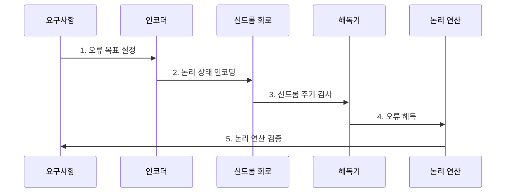

---
sidebar:
  order: 215
  label: "215. 논리 큐비트 (Logical Qubit)"
  badge:
    text: "기출 · 70%"
    variant: note
title: "논리 큐비트 (Logical Qubit)"
date: "2026-07-30T20:20:00+09:00"
tags:
  - "notes-latest-tech"
weight: 215
extra:
  question_no: "215"
  source_status: "기출"
  source_history: "138회"
  priority: 70
  priority_note: "논리 큐비트의 오류 억제·자원비가 138회 출제됨"
---

## 미리 알고가기

- **논리 큐비트(logical qubit)**: 오류 정정 코드의 코드 공간에 인코딩되어 하나의 정보 단위처럼 동작하는 보호된 큐비트
- **물리 큐비트(physical qubit)**: 실제 장치에서 상태·게이트·측정을 구현하며 논리 큐비트 구성에 사용되는 큐비트
- **논리 오류율(logical error rate)**: 오류 정정을 통과해 논리 상태나 연산을 잘못 바꾸는 확률

## Ⅰ. 개요

- 정의/개념: 오류 정정 코드에 인코딩된 양자 정보 단위
- 배경/필요성: 개별 물리 큐비트의 잡음과 오류가 누적되면 긴 양자 회로의 계산 결과를 신뢰하기 어렵다.

### 쉽게 이해하기 (학습용)

- 여러 큐비트가 만드는 특별한 상태 공간으로 정보를 보호하는 단위임

## Ⅱ. 특징

- **1. 코드 공간**: 논리 정보를 다수 물리 큐비트의 공동 상태에 분산한다.
- **2. 반복 오류 정정**: 신드롬 측정·해독으로 계산 중 오류를 계속 보정한다.
- **3. 보호된 연산**: 논리 게이트가 오류 확산을 제한하며 코드 공간에서 계산한다.
### 쉽게 이해하기 (학습용)

- 정보를 직접 묻지 않고 오류만 감시하여 상태를 보호함

## Ⅲ. 구조 및 구성요소

| 구성요소 | 책임 |
|:---|:---|
| 물리 큐비트 | 인코딩에 사용되는 데이터와 측정용 큐비트 |
| 코드 공간 | 오류 정정 코드를 통해 보호되는 논리 상태 |
| 신드롬 추출 | 정보 누설 없이 오류 증상만 반복 확인 |
| 해독 엔진 | 증상 기반 오류 추정 및 프레임 갱신 |
| 연산 레이어 | 보호 상태 유지 및 논리 연산 수행 |

### 쉽게 이해하기 (학습용)

- 정보를 보호 상자에 넣고 지속 감시하며 오류를 보정함

## Ⅳ. 흐름도

**동작 원리**

- **1. 오류 목표 설정**: 알고리즘 깊이와 허용 실패율에서 논리 오류율·자원 목표 도출
- **2. 논리 상태 인코딩**: 다수 물리 데이터·검사 큐비트의 코드 공간에 정보 매핑
- **3. 신드롬 주기 검사**: 논리 정보를 노출하지 않고 오류 징후 반복 측정
- **4. 오류 해독**: 측정 이력에서 오류를 추정해 보정 프레임에 반영
- **5. 논리 연산 검증**: 보호된 게이트의 오류율·자원·해독 지연이 목표를 만족하는지 확인

### 쉽게 이해하기 (학습용)

- 보호 상자를 만들고 계산 내내 검사와 해독을 반복함

## Ⅴ. 종류 및 비교

| 판단 기준 | 물리 큐비트 | 검출 가능한 큐비트 | 논리 큐비트 |
|:---|:---|:---|:---|
| 적용 기준 | 사전 억제 위주 | 오류 감지 시 연산 취소 | 실시간 정정 및 연산 지속 |
| 핵심 특징 | 장치의 단일 큐비트 | 오류 검출 후 결과 선별 | 코드 공간에서 오류 정정 |
| 한계 | 하드웨어 노이즈 직접 영향 | 높은 결과 폐기율 | 큰 물리 자원·게이트 비용 |

### 쉽게 이해하기 (학습용)

- 단순히 오류를 감지하는 단계를 넘어 지속적인 정정 보호가 필요함

## Ⅵ. 실무 고려사항 및 대책

| 고려사항 | 대책 | 효과 |
|:---|:---|:---|
| **논리 오류 억제 미달** 미검증 시 물리 자원은 늘지만 정보 보존 이득 없음 | 거리별 물리·논리 오류율을 동일 주기에서 비교 | 자원 대비 **논리 오류 감소** 확인 |
| **자원 오버헤드** 미검증 시 데이터·검사 큐비트와 논리 게이트 비용 급증 | 목표 알고리즘에서 큐비트·주기·공간시간 비용 공동 산정 | **공간시간 예측성** 향상 |
| **해독·제어 지연** 미검증 시 보정 정보가 늦어 논리 연산 일정 붕괴 | 실시간 해독 처리량 시험과 제어 경로 병렬화 | 논리 연산 **일정 준수율** 향상 |

### 쉽게 이해하기 (학습용)

- 핵심 운영 위험마다 실행 가능한 대책과 검증 효과를 함께 확인한다.

## Ⅶ. 결론

- 취약한 물리 큐비트로 신뢰 가능한 연산을 수행하기 위해 논리 오류율·보호 자원·복호 지연·논리 게이트 비용을 검토하여, 실제 오류 감소가 입증된 규모의 논리 큐비트를 구성해야 한다.

### 쉽게 이해하기 (학습용)

- 여러 큐비트의 이름보다 실질적인 오류 감소와 연산 가능성이 중요함
