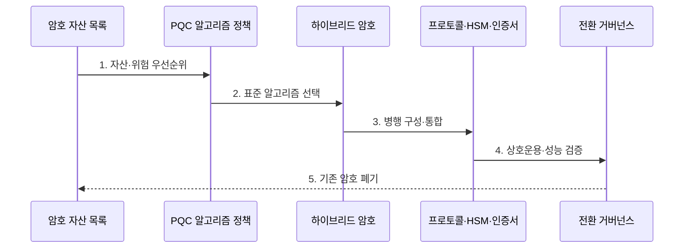

---
sidebar:
  order: 216
  label: "216. 양자내성암호 (Post-Quantum Cryptography)"
  badge:
    text: "기출 · 85%"
    variant: note
title: "양자내성암호 (Post-Quantum Cryptography, PQC)"
date: "2026-07-31T12:11:01+09:00"
tags:
  - "notes-latest-tech"
weight: 216
extra:
  question_no: "216"
  source_status: "기출"
  source_history: "126회, 129회, 135회"
  priority: 85
  priority_note: "양자내성암호 전환·알고리즘이 지속 반복됨"
---

## Ⅰ. 개요

핵심 용어

**PQC**는 양자컴퓨터의 공격에도 안전하도록 설계하면서 고전 컴퓨터와 통신망에서 실행하는 공개키 암호 체계다.

- 정의/개념: **PQC**는 양자 공격에 안전하도록 설계한 고전 컴퓨터용 공개키 암호
- 배경/필요성: RSA·ECC는 쇼어 알고리즘으로 **선취 후 복호화 위험** 노출

#### 한줄 요약

- 양자용 새 암호로 기존 시스템의 공개키 방식을 교체함

## Ⅱ. 특징

핵심 용어

**ML-KEM**은 모듈 격자 문제를 기반으로 공유 비밀을 캡슐화·복원하는 NIST 표준 양자내성 키 설정 방식이다.

- 키 설정용 **ML-KEM**과 서명용 **ML-DSA·SLH-DSA**
- 기존 공개키 암호와 다른 **큰 키·서명·연산 특성**
- 자산 목록·하이브리드 운용·암호 민첩성 기반 **점진적 전환**
#### 한줄 요약

- 시스템 전체의 호환성과 배포 절차까지 함께 검증해야 함

## Ⅲ. 구조 및 구성요소

핵심 용어

**KEM**은 공유 비밀키를 직접 전송하지 않고 공개키로 캡슐화하고 개인키로 복원하는 키 설정 방식이다.

| 구성요소 | 책임 |
|:---|:---|
| Crypto Inventory | **암호 자산·라이브러리·HSM** 식별 |
| Algorithm Profile | **표준 알고리즘·파라미터** 선택 |
| Hybrid 운영 | 기존 암호 병행과 **downgrade 방지** |
| Governance | **상호운용성·성능·수명주기** 관리 |

#### 한줄 요약

- 중요 자료부터 새 자물쇠를 맞추고 단계적으로 교체함

## Ⅳ. 흐름도

핵심 용어

**하이브리드 전환**은 기존 암호와 양자내성암호를 함께 사용하여 이행 중 호환성과 보안을 유지하는 방식이다.

**동작 원리**

- **1. 자산·위험 우선순위**: 데이터 수명·노출도·암호 위치 평가
- **2. 표준 알고리즘 선택**: 용도·파라미터·구현 적합성 결정
- **3. 병행 구성·통합**: 기존 암호와 PQC KEM·서명 결합
- **4. 상호운용·성능 검증**: 프로토콜·HSM·인증서 크기와 지연 시험
- **5. 기존 암호 폐기**: 단계 배포 후 downgrade 경로 제거

#### 한줄 요약

- 중요 보안 자산부터 문제없는 것을 확인하고 옛 방식 폐기함

## Ⅴ. 종류 및 비교

핵심 용어

**ML-DSA**는 모듈 격자 문제를 기반으로 메시지의 출처와 무결성을 증명하는 NIST 표준 양자내성 전자서명 방식이다.

| 판단 기준 | Classical PK | PQC | QKD |
|:---|:---|:---|:---|
| 적용 기준 | 기존 **키 설정·전자서명** | 양자내성 **키 설정·전자서명** | 전용망 **대칭키 분배** |
| 핵심 특징 | **인수분해·이산로그 난제** | **격자·해시 난제** | **양자 측정 교란** 기반 |
| 한계 | 대규모 **양자 공격 취약** | **큰 키·서명·전환 호환성** | **전용 광장비·거리 제약** |

#### 한줄 요약

- PQC는 수학 알고리즘 교체, QKD는 전용 통신 장비 도입임

## Ⅵ. 실무 고려사항 및 대책

핵심 용어

**암호 민첩성**은 알고리즘·키·라이브러리를 서비스 중단과 대규모 재설계 없이 교체할 수 있는 능력이다.

| 문제 | 대책 | 효과 |
|:---|:---|:---|
| 긴 데이터 수명의 **선취 후 해독** 위험 | **암호 자산 목록·우선순위 전환** | **장기 기밀성** 보호 |
| **큰 키·서명**으로 프로토콜 초과 | **MTU·인증서·HSM 성능 시험** | **운영 호환성** 확보 |
| 하이브리드 **downgrade** | **조합 협상 고정·로그·폐기 기준** | 전환기 **보안 약화 방지** |

#### 한줄 요약

- 금융 게이트웨이는 표준 PQC KEM을 기존 키 합의와 병행해 단말 호환성·핸드셰이크 크기·지연·실패 복구를 검증한 뒤 단계 배포한다.

## Ⅶ. 결론

핵심 용어

**HNDL**은 현재 수집한 암호문을 보관했다가 미래의 양자컴퓨터로 복호화하려는 선취 위협이다.

- 비밀 유지기간이 긴 자산부터 **ML-KEM·ML-DSA**로 **단계 전환**

#### 한줄 요약

- 안전한 시스템을 위해 표준 방식을 선택하고 전체 체계 검증이 필수임
