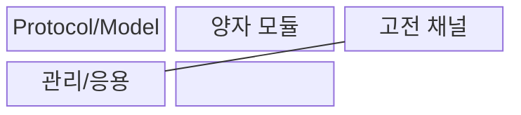
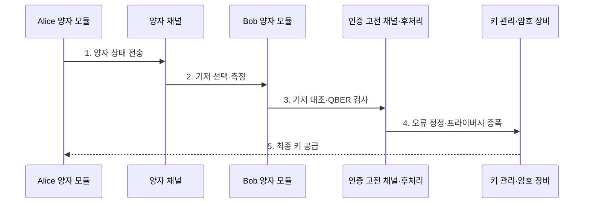

---
sidebar:
  order: 217
  label: "217. QKD 양자키분배 (Quantum Key Distribution)"
  badge:
    text: "기출 · 50%"
    variant: note
title: "양자키분배 (Quantum Key Distribution, QKD)"
date: "2026-07-31T09:05:11+09:00"
tags:
  - "notes-latest-tech"
weight: 217
extra:
  question_no: "217"
  source_status: "기출"
  source_history: "126회"
  priority: 50
  priority_note: "양자 키 분배의 채널·키 관리 비교가 유효함"
---

## Ⅰ. 개요

핵심 용어

**QKD**는 양자 상태를 전송하고 측정 교란을 검사하여 도청 가능성을 탐지하면서 대칭키 재료를 분배하는 기술이다.

- 정의/개념: **QKD**는 양자 상태의 측정 교란으로 도청을 탐지하며 대칭키를 분배하는 기술
- 배경/필요성: 기존 키 교환은 통신 중 **도청 여부 직접 확인 불가**

### 쉽게 이해하기 (학습용)

- 빛 신호로 키 재료를 보내고 오류를 측정해 비밀키를 정제함

## Ⅱ. 특징

핵심 용어

**이중 채널**은 양자 상태를 보내는 양자 채널과 신원 확인·키 정제를 수행하는 인증된 고전 채널을 함께 사용한다.

- 양자 상태 전송과 인증·후처리를 분리한 **이중 채널**
- QBER 임계값 초과 시 세션을 폐기하는 **도청 탐지**
- 기저 선별·오류 정정·프라이버시 증폭 기반 **키 정제**
### 쉽게 이해하기 (학습용)

- 상대를 인증하고 통신 오류율을 검사하여 비밀키를 압축함

## Ⅲ. 구조 및 구성요소

핵심 용어

**QBER**은 수신한 양자 비트 중 오류의 비율로, 잡음과 도청 수준 및 세션 폐기 여부를 판단하는 지표다.

| 구성요소 | 책임 |
|:---|:---|
| Protocol/Model | **QKD 프로토콜·보안 파라미터** 정의 |
| 양자 모듈 | **광원·채널·측정기** 구성 |
| 고전 채널 | 인증 기반 **후처리 통신** |
| 관리/응용 | 최종 키의 **저장·암호 장비 전달** |

### 쉽게 이해하기 (학습용)

- 빛 신호로 키 재료를 만들고 안전하게 암호 장비에 전달함

## Ⅳ. 흐름도

핵심 용어

**프라이버시 증폭**은 공격자에게 노출되었을 가능성이 있는 정보를 줄이도록 정정된 키를 더 짧은 비밀키로 압축한다.

**동작 원리**

- **1. 양자 상태 전송**: Alice가 무작위 기저의 양자 신호 생성
- **2. 기저 선택·측정**: Bob이 무작위 기저로 신호 측정
- **3. 기저 대조·QBER 검사**: 인증 채널에서 일치 비트와 오류율 확인
- **4. 오류 정정·프라이버시 증폭**: 정보 누출을 제거해 키 정제
- **5. 최종 키 공급**: 확인된 키를 암호 장비에 전달

### 쉽게 이해하기 (학습용)

- 빛 신호 오류가 낮을 때만 키를 압축하여 안전한 키를 만듦

## Ⅴ. 종류 및 비교

핵심 용어

**BB84**는 서로 다른 두 기저로 양자 상태를 준비·측정하고 일치한 기저의 비트로 키를 만드는 QKD 프로토콜이다.

| 판단 기준 | QKD | PQC KEM | 공개키 교환 |
|:---|:---|:---|:---|
| 적용 기준 | **전용 광인프라** 구간 | **기존 디지털망** 활용 | 기존 **공개키 인프라** 활용 |
| 핵심 특징 | 양자 교란 기반 **도청 탐지** | 양자내성 난제 기반 **KEM** | **인수분해·이산로그** 기반 |
| 한계 | **거리·키율·전용 장비** 제약 | **큰 키·캡슐·전환 부담** | **양자 알고리즘 취약성** |

### 쉽게 이해하기 (학습용)

- 전용 광선로 기술, 새 수학 문제 기술, 기존 공개키 기술임

## Ⅵ. 실무 고려사항 및 대책

핵심 용어

**고전 채널 인증**은 중간자 공격을 막기 위해 QKD 후처리 메시지의 송신자와 무결성을 검증하는 절차다.

| 문제 | 대책 | 효과 |
|:---|:---|:---|
| 거리·손실의 **키 생성률 저하** | 링크 예산·중계 구조·키 버퍼 | 암호 장비의 **키 공급 안정화** |
| 장비 **측면 채널·구현 결함** | 장비 인증·탐지기 감시·패치 | 구현 보안의 **간극 축소** |
| 고전 채널의 **인증 부재** | 사전 공유키·PQC 인증 결합 | **중간자 공격 방지** |

### 쉽게 이해하기 (학습용)

- 두 데이터센터의 전용 광선로에서 QKD 키를 생성하고 QBER와 키 생성률을 확인한 뒤 실제 데이터 암호 장비의 대칭키로 공급한다.

## Ⅶ. 결론

핵심 용어

**키 정제**는 기저 선별·오류 정정·프라이버시 증폭을 거쳐 공유 비밀키를 생성하는 후처리 과정이다.

- 거리·QBER·키율을 충족하는 **고가치 전용 구간**에만 **QKD** 적용

### 쉽게 이해하기 (학습용)

- 양자 장비 장착 여부보다 키 분배의 전 과정을 엄격히 관리함
