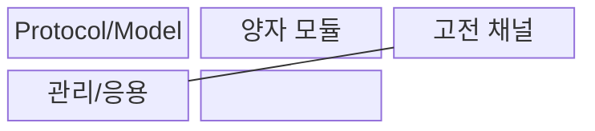
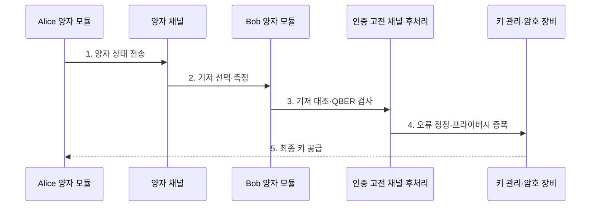

---
sidebar:
  order: 217
  label: "217. QKD 양자키분배 (Quantum Key Distribution)"
  badge:
    text: "기출 · 50%"
    variant: note
title: "양자키분배 (Quantum Key Distribution, QKD)"
date: "2026-07-30T20:20:00+09:00"
tags:
  - "notes-latest-tech"
weight: 217
extra:
  question_no: "217"
  source_status: "기출"
  source_history: "126회"
  priority: 50
  priority_note: "양자 키 분배의 채널·키 관리 비교가 유효함"
---

## 미리 알고가기

- **큐케이디(Quantum Key Distribution, QKD)**: 양자 상태의 측정 교란을 이용해 도청 가능성을 탐지하며 대칭키 재료를 분배하는 기술
- **큐버(Quantum Bit Error Rate, QBER)**: 수신한 양자 비트 중 오류 비율로, 잡음·도청 수준과 세션 폐기 여부를 판단
- **프라이버시 증폭(privacy amplification)**: 노출 가능성이 있는 정보를 줄이도록 정정된 키를 더 짧은 비밀키로 압축

## Ⅰ. 개요

- 정의/개념: 양자 상태로 대칭키 재료를 분배하는 기술
- 배경/필요성: 계산 난이도에 의존하는 기존 키 교환은 계산 능력의 발전에 취약하며 통신 과정의 도청 여부를 직접 확인하기 어렵다.

### 쉽게 이해하기 (학습용)

- 빛 신호로 키 재료를 보내고 오류를 측정해 비밀키를 정제함

## Ⅱ. 특징

- **1. 이중 채널**: 양자 상태 전송과 상대 인증·후처리를 위한 고전 채널을 함께 사용한다.
- **2. 도청 탐지**: QBER가 임계값을 넘으면 안전한 키 생성이 불가능해 세션을 폐기한다.
- **3. 키 정제**: 기저 선별·오류 정정·프라이버시 증폭으로 최종 비밀키를 만든다.
### 쉽게 이해하기 (학습용)

- 상대를 인증하고 통신 오류율을 검사하여 비밀키를 압축함

## Ⅲ. 구조 및 구성요소

| 구성요소 | 책임 |
|:---|:---|
| Protocol/Model | QKD 프로토콜 및 보안 파라미터 정의 |
| 양자 모듈 | 광원, 채널, 측정기 등 양자 인프라 |
| 고전 채널 | 인증 기반의 고전 암호 통신 채널 |
| 관리/응용 | 최종 키 저장 및 암호화 장비 전달 |

### 쉽게 이해하기 (학습용)

- 빛 신호로 키 재료를 만들고 안전하게 암호 장비에 전달함

## Ⅳ. 흐름도

**동작 원리**

- **1. 양자 상태 전송**: Alice가 무작위 기저의 양자 신호 생성
- **2. 기저 선택·측정**: Bob이 무작위 기저로 신호 측정
- **3. 기저 대조·QBER 검사**: 인증 채널에서 일치 비트와 오류율 확인
- **4. 오류 정정·프라이버시 증폭**: 정보 누출을 제거해 키 정제
- **5. 최종 키 공급**: 확인된 키를 암호 장비에 전달

### 쉽게 이해하기 (학습용)

- 빛 신호 오류가 낮을 때만 키를 압축하여 안전한 키를 만듦

## Ⅴ. 종류 및 비교

| 판단 기준 | QKD | PQC KEM | 공개키 교환 |
|:---|:---|:---|:---|
| 적용 기준 | 전용 광인프라 필요 | 기존 디지털망 활용 | 기존 디지털망 활용 |
| 핵심 특징 | 양자 교란으로 도청 탐지 | 양자내성 난제 기반 KEM | 인수분해·이산로그 기반 |
| 한계 | 거리·키율·전용 장비 제약 | 큰 키·캡슐·전환 부담 | 양자 알고리즘에 취약 |

### 쉽게 이해하기 (학습용)

- 전용 광선로 기술, 새 수학 문제 기술, 기존 공개키 기술임

## Ⅵ. 실무 고려사항 및 대책

| 고려사항 | 대책 | 효과 |
|:---|:---|:---|
| 거리·손실로 키 생성률 저하 | 링크 예산·중계 구조·키 버퍼 | 암호 장비 키 공급 안정화 |
| 장비 측면 채널·구현 결함 | 장비 인증·탐지기 감시·패치 | 이론과 구현 보안 간극 축소 |
| 고전 채널 인증 부재 | 사전 공유키·PQC 인증 결합 | 중간자 공격 방지 |

### 쉽게 이해하기 (학습용)

- 두 데이터센터의 전용 광선로에서 QKD 키를 생성하고 QBER와 키 생성률을 확인한 뒤 실제 데이터 암호 장비의 대칭키로 공급한다.

## Ⅶ. 결론

- 키 분배 과정의 도청을 탐지하기 위해 거리·QBER·키 생성률·고전 인증 채널·장비 신뢰·비용을 검토하여, 조건을 충족하는 고가치 전용 구간에 QKD를 적용해야 한다.

### 쉽게 이해하기 (학습용)

- 양자 장비 장착 여부보다 키 분배의 전 과정을 엄격히 관리함
