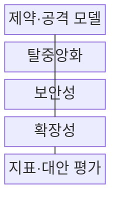
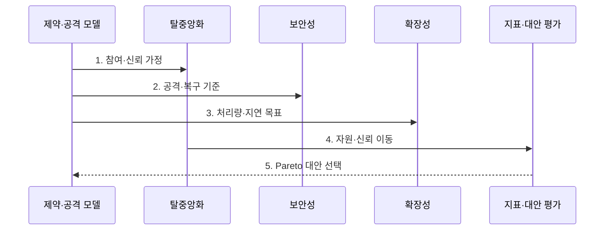

---
sidebar:
  order: 218
  label: "218. Blockchain Trilemma 블록체인 트릴레마 (Blockchain Trilemma)"
  badge:
    text: "기출 · 50%"
    variant: note
title: "블록체인 트릴레마 (Blockchain Trilemma)"
date: "2026-07-27T23:59:59+09:00"
tags:
  - "notes-latest-tech"
weight: 218
extra:
  question_no: "218"
  source_status: "기출"
  source_history: "125회"
  priority: 50
  priority_note: "블록체인 트릴레마 비교는 과거 흐름 중심임"
---

## 미리 알고가기

- **블록체인 트릴레마(blockchain trilemma)**: 세 가지 선택의 딜레마라는 뜻으로, 탈중앙화·보안성·확장성을 동시에 극대화하기 어려운 상충 관계
- **레이어 1(Layer 1, L1)**: 합의·정산을 직접 수행하는 기본 블록체인이며, 레이어 2(L2)는 거래를 외부 처리한 뒤 결과를 L1에 정산
- **샤딩(sharding)**: 장부·처리 대상을 여러 조각으로 나눠 병렬 처리하는 확장 방식

## Ⅰ. 개요

- 정의/개념: 탈중앙화·보안·확장성 간 구조적 상충
- 기존 한계: 블록체인의 처리량을 높이면 검증 장비가 고사양화돼 검증자가 집중되거나 합의 구조의 공격면이 커질 수 있다.

### 쉽게 이해하기 (학습용)

- 세 목표를 동시에 높이려면 통신·저장 비용이 증가하므로 균형점을 찾아야 함

## Ⅱ. 특징

- **탈중앙화**: 검증자 수·다양성·집중도로 참여와 통제 분산을 평가한다.
- **보안성**: 공격 비용·합의 안전성·장애 복구력으로 장부 신뢰를 평가한다.
- **확장성**: 처리량·확정 지연·수수료를 높이되 새 신뢰 가정을 확인한다.

### 쉽게 이해하기 (학습용)

- 속도 향상이 검증 장비 비용이나 신뢰 구조에 미치는 영향을 살펴야 함

## Ⅲ. 구조 및 구성요소

| 구성요소 | 책임 |
|:---|:---|
| 제약 모델 | 성능·공격 모델 및 신뢰 범위 정의 |
| 탈중앙화 | 검증자 참여 지표 및 노드 다양성 |
| 보안성 | 비잔틴 장애 허용 및 경제적 보상 관리 |
| 확장성 | 트랜잭션 처리 효율 및 저장 비용 관리 |

> 요약: 자원과 신뢰 제약 속에서 세 목표가 상호 긴장하는 관계임

### 쉽게 이해하기 (학습용)

- 목표 성능을 정하고 기술을 선택할 때 검증 조건과 신뢰 비용을 확인함

## Ⅳ. 흐름도

### 동작 원리

1. **참여·신뢰 가정**: 검증자 수·집중도·진입 장벽 정의
2. **공격·복구 기준**: 비잔틴 장애와 경제적 공격 모델 설정
3. **처리량·지연 목표**: 부하·확정 시간·저장 비용 목표 수립
4. **자원·신뢰 이동**: 확장 기법이 검증·운영 책임을 옮기는 위치 추적
5. **Pareto 대안 선택**: 공격·과부하 시험으로 비지배 설계 선택

> 요약: 부하·공격 모델로 자원·신뢰 이동을 평가

### 쉽게 이해하기 (학습용)

- 세 목표를 지표화하고 각 설계안이 비용과 신뢰를 어디로 옮기는지 확인함

## Ⅴ. 블록체인 확장 방식 비교

| 판단 기준 | L1 확장 | L2 롤업 | 모듈형/샤딩 |
|:---|:---|:---|:---|
| 적용 기준 | 노드 자원 및 포크 부담 | 시퀀서 및 브리지 의존성 | 공유 보안 및 인터페이스 위험 |
| 핵심 특징 | 기본 계층 용량 확대 | 외부 처리 후 L1 정산 | 데이터·실행 작업 분할 |
| 한계 | 검증 장비 고사양화 | 시퀀서·브리지 의존 | 교차 샤드·공유 보안 복잡 |

> 요약: 다양한 설계안은 성능 비용을 다른 주체와 계층에 분산함

### 쉽게 이해하기 (학습용)

- 계층별로 처리와 검증을 분리해 비용과 신뢰를 재배치함

## Ⅵ. 실무 고려사항 및 대책

| 고려사항 | 대책 | 효과 |
|:---|:---|:---|
| 처리량 향상 뒤 검증 중앙화 | 노드 비용·검증자 집중도 측정 | 탈중앙성 저하 가시화 |
| L2 시퀀서 장애·검열 | 강제 포함·다중 시퀀서·탈출 경로 | 가용성과 검열 저항 확보 |
| 평균 성능만으로 설계 선택 | 공격·과부하·데이터 가용성 시험 | 실제 보안 비용 반영 |

### 쉽게 이해하기 (학습용)

- 처리량만 보지 않고 시퀀서 장애·검열 가능성, L1 검증 완료시간, 데이터 가용성과 브리지 손실 위험을 함께 측정한다.

## Ⅶ. 결론

- 탈중앙성·보안성·확장성의 동시 최적화 한계를 다루기 위해 처리량·검증자 집중도·데이터 가용성·최종성·브리지 위험을 검토하여, 허용 가능한 신뢰 가정의 확장 구조를 선택해야 한다.

### 쉽게 이해하기 (학습용)

- 성능 향상이 어느 부분의 비용과 보안 위험을 키웠는지 숫자로 확인해야 함
