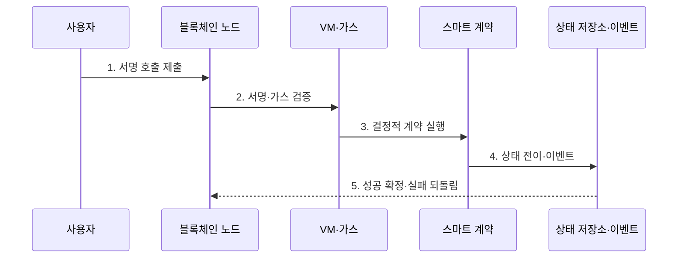

---
sidebar:
  order: 219
  label: "219. Smart Contract 스마트 계약 (Smart Contract)"
  badge:
    text: "기출 · 70%"
    variant: note
title: "스마트 계약 (Smart Contract)"
date: "2026-07-30T20:20:00+09:00"
tags:
  - "notes-latest-tech"
weight: 219
extra:
  question_no: "219"
  source_status: "기출"
  source_history: "138회"
  priority: 70
  priority_note: "스마트 계약의 실행·취약점 설계가 최근 출제됨"
---

## 미리 알고가기

- **스마트 계약(smart contract)**: 합의한 조건을 코드로 자동 집행한다는 이름으로, 블록체인 가상머신에서 결정적으로 상태를 바꾸는 프로그램
- **가스(gas)**: 연산·저장 사용량을 비용 단위로 측정해 무한 실행과 자원 남용을 제한
- **오라클(oracle)**: 블록체인 밖의 가격·날씨·검수 결과를 계약에 전달하는 주체·체계

## Ⅰ. 개요

- 정의/개념: 블록체인에서 결정적 상태 전이를 수행하는 코드
- 배경/필요성: 여러 조직이 공유하는 거래를 중앙 운영자와 수작업 정산에 의존하면 규칙의 임의 변경과 처리 지연·분쟁이 발생할 수 있다.

### 쉽게 이해하기 (학습용)

- 서명된 요청을 받아 지정된 규칙으로 자판기처럼 결과를 도출함

## Ⅱ. 특징

- **1. 결정적 실행**: 모든 검증 노드가 같은 입력으로 같은 상태 전이를 계산한다.
- **2. 가스 제한**: 연산·저장 비용을 부과해 무한 실행과 자원 남용을 막는다.
- **3. 외부 신뢰 경계**: 오라클·관리 키·업그레이드 권한이 코드 밖 위험을 만든다.
### 쉽게 이해하기 (학습용)

- 코드 수정이 어렵고, 외부 정보는 전달자를 신뢰해야 하는 특성이 있음

## Ⅲ. 구조 및 구성요소

| 구성요소 | 책임 |
|:---|:---|
| 명세/코드 | 계약 로직 및 상태 변수 구현 |
| VM/가스 | 결정적 실행 환경 및 자원 제한 |
| 접근/외부 | reentrancy 제어 및 외부 호출 관리 |
| 거버넌스 | 업그레이드 정책 및 배포 관리 |

### 쉽게 이해하기 (학습용)

- 사용자가 요청하면 규칙대로 계산하고 결과 장부를 업데이트함

## Ⅳ. 흐름도

**동작 원리**

- **1. 서명 호출 제출**: 함수·인자·가스 한도를 트랜잭션으로 전송
- **2. 서명·가스 검증**: 호출 권한·nonce·실행 자원 확인
- **3. 결정적 계약 실행**: 모든 검증자가 같은 문맥에서 코드 수행
- **4. 상태 전이·이벤트**: 성공 결과와 외부 관측 이벤트 생성
- **5. 성공 확정·실패 되돌림**: 합의 후 반영하거나 상태 변경 취소

### 쉽게 이해하기 (학습용)

- 검증자가 동일 규칙으로 결과를 확인한 뒤, 성공 시만 장부를 수정함

## Ⅴ. 종류 및 비교

| 판단 기준 | 법률 계약 | 스마트 계약 | 중앙 업무 시스템 |
|:---|:---|:---|:---|
| 적용 기준 | 신원·증거 신뢰 | consensus 기반 | 조직 통제 신뢰 |
| 핵심 특징 | 법률 해석·기관 집행 | 코드 기반 자동 집행 | 중앙 운영자 처리 |
| 한계 | 해석·분쟁 해결 비용 | 코드·오라클·키 위험 | 운영자 종속·임의 변경 |

### 쉽게 이해하기 (학습용)

- 법률은 전체를, 스마트 계약은 자동 집행을, 중앙은 회사가 담당함

## Ⅵ. 실무 고려사항 및 대책

| 고려사항 | 대책 | 효과 |
|:---|:---|:---|
| 외부 호출 재진입 | Checks-Effects-Interactions·잠금 | 중복 인출 방지 |
| 오라클 가격 조작·지연 | 다중 소스·편차·신선도 검증 | 담보 청산 오판 감소 |
| 업그레이드 관리 키 탈취 | 다중서명·시간 지연·권한 분리 | 계약 장악 위험 완화 |

### 쉽게 이해하기 (학습용)

- 대출 계약은 다중 가격 오라클의 신선도와 편차를 확인하고 상태를 먼저 갱신한 뒤 외부 전송해 재진입에 의한 중복 출금을 막는다.

## Ⅶ. 결론

- 변경 불가능한 자동 집행의 오류 피해를 줄이기 위해 오라클 신뢰·재진입·권한 키·업그레이드·중단 가능성을 검토하여, 검증하고 복구할 수 있는 범위만 스마트 계약으로 집행해야 한다.

### 쉽게 이해하기 (학습용)

- 자동 실행을 넘어 외부 정보와 관리 권한을 함께 설계해야 함
