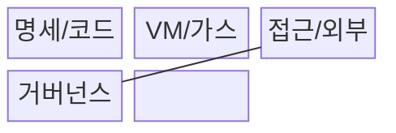
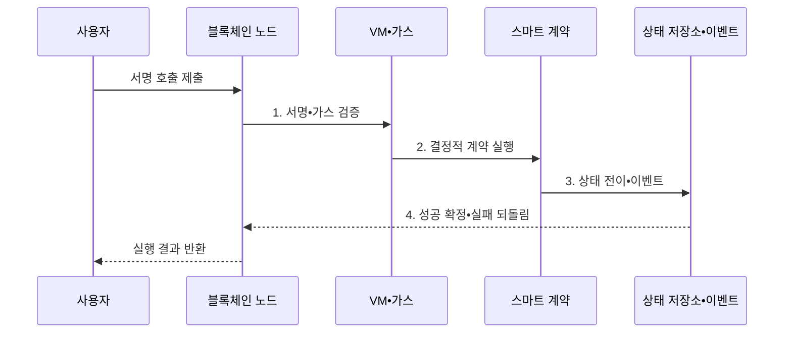

---
sidebar:
  order: 219
  label: "219. 스마트 계약 (Smart Contract)"
  badge:
    text: "기출 • 70%"
    variant: note
title: "스마트 계약 (Smart Contract)"
date: "2026-08-03T08:48:47+09:00"
tags:
  - "notes-latest-tech"
weight: 219
extra:
  question_no: "219"
  source_status: "기출"
  source_history: "138회"
  priority: 70
  priority_note: "스마트 계약의 실행•취약점 설계가 최근 출제됨"
---

## Ⅰ. 개요

핵심 용어

- **스마트 계약(Smart Contract)**: 블록체인 가상머신에서 합의된 코드에 따라 결정적으로 상태 전이를 수행하는 프로그램이다.

- 정의/개념: **스마트 계약(Smart Contract)** 은 블록체인 가상머신에서 결정적 상태 전이를 수행하는 프로그램
- 배경/필요성: 중앙 운영자•수작업 정산은 **규칙 임의 변경•처리 지연** 초래

#### 한줄 요약

- 서명된 요청을 합의된 코드로 실행해 결정적으로 장부 상태를 바꾼다.

## Ⅱ. 특징

핵심 용어

- **결정적 실행**: 모든 검증 노드가 같은 입력과 상태에서 같은 연산 결과와 다음 상태를 계산하는 성질이다.

- 모든 검증 노드가 같은 상태 전이를 계산하는 **결정적 실행**
- 연산•저장 비용으로 자원 남용을 막는 **가스 제한**
- 오라클•관리 키•업그레이드 권한의 **외부 신뢰 경계**
#### 한줄 요약

- 코드 변경과 외부 정보 전달에는 별도의 신뢰•권한 통제가 필요하다.

## Ⅲ. 구조 및 구성요소

핵심 용어

- **블록체인 가상머신**: 합의 규칙에 따라 스마트 계약 바이트코드를 실행하고 장부 상태를 갱신하는 실행 환경이다.
- **명세•계약 코드**: 당사자의 상태 전이 규칙과 조건•권한•예외 처리를 결정적으로 표현한 프로그램이다.
- **트랜잭션•상태**: 사용자가 서명해 호출한 입력과 모든 노드가 합의로 공유하는 계약의 영속 데이터이다.
- **가스(Gas)**: 실행 명령과 저장소 사용에 비용을 부과해 무한 실행과 자원 남용을 제한하는 계량 단위이다.
- **오라클(Oracle)**: 블록체인 밖의 가격•사건•센서 정보를 계약이 검증 가능한 형태로 참조하게 하는 연결 계층이다.

**가상머신(Virtual Machine, VM)** 은 계약 코드를 결정적으로 실행하고 가스로 자원 사용량을 제한한다.

| 구성요소 | 책임 |
|:---|:---|
| 명세/코드 | 계약 로직과 **상태 변수** 구현 |
| VM/가스 | **결정적 실행•자원 제한** |
| 접근/외부 | **재진입 제어•외부 호출** 관리 |
| 거버넌스 | **업그레이드 정책•배포** 관리 |

#### 한줄 요약

- 가상머신이 계약을 결정적으로 실행하고 성공한 상태 전이만 장부에 반영한다.

## Ⅳ. 흐름도

핵심 용어

- **트랜잭션**: 서명된 계약 호출과 입력을 블록체인에 제출하여 검증된 상태 변경을 요청하는 메시지다.

**동작 원리**

1. **서명•가스 검증**: 호출 권한•nonce•실행 자원 확인
2. **결정적 계약 실행**: 모든 검증자가 **가상머신(Virtual Machine, VM)** 의 같은 문맥에서 코드 수행
3. **상태 전이•이벤트**: 성공 결과와 외부 관측 이벤트 생성
4. **성공 확정•실패 되돌림**: 합의 후 반영하거나 상태 변경 취소

#### 한줄 요약

- 검증자가 같은 규칙으로 결과를 확인하고 성공한 상태 변경만 장부에 반영한다.

## Ⅴ. 종류 및 비교

핵심 용어

- **업그레이드 가능 계약**: 프록시나 관리 절차를 통해 상태를 유지하면서 실행 로직을 교체할 수 있는 계약 구조다.

| 판단 기준 | 법률 계약 | 스마트 계약 | 중앙 업무 시스템 |
|:---|:---|:---|:---|
| 적용 기준 | **신원•증거 신뢰** | **합의 기반 실행** | **조직 통제 신뢰** |
| 핵심 특징 | **법률 해석•기관 집행** | 코드 기반 **자동 집행** | **중앙 운영자 처리** |
| 한계 | **해석•분쟁 해결 비용** | **코드•오라클•키 위험** | **운영자 종속•임의 변경** |

#### 한줄 요약

- 법률 계약•스마트 계약•중앙 시스템은 집행 주체와 신뢰 기준이 다르다.

## Ⅵ. 실무 고려사항 및 대책

핵심 용어

- **오라클**: 블록체인 밖의 가격•날씨•검수 결과를 스마트 계약이 사용할 수 있도록 전달하는 주체 또는 체계다.

| 문제 | 대책 | 효과 |
|:---|:---|:---|
| 외부 호출의 **재진입** | Checks-Effects-Interactions•잠금 | **중복 인출 방지** |
| 오라클의 **가격 조작•지연** | 다중 소스•편차•신선도 검증 | 담보 청산의 **오판 감소** |
| **업그레이드 관리 키 탈취** | 다중서명•시간 지연•권한 분리 | 계약 **장악 위험 완화** |

#### 한줄 요약

- 대출 계약은 다중 가격 오라클의 신선도와 편차를 확인하고 상태를 먼저 갱신한 뒤 외부 전송해 재진입에 의한 중복 출금을 막는다.

## Ⅶ. 결론

핵심 용어

- **가스**: 연산•저장 사용량을 비용 단위로 측정하여 무한 실행과 자원 남용을 제한하는 메커니즘이다.

- 오라클•권한 위험을 통제하고 복구 가능한 범위만 **스마트 계약**으로 집행

#### 한줄 요약

- 자동 실행뿐 아니라 외부 정보와 업그레이드 권한도 함께 통제해야 한다.
