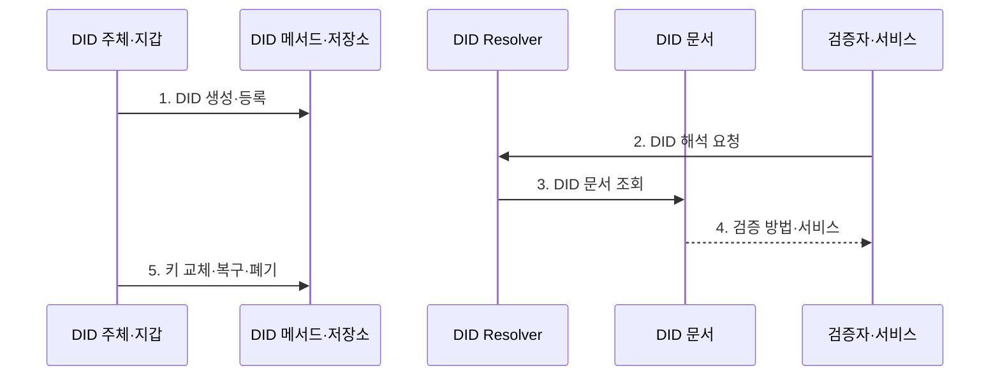

---
sidebar:
  order: 220
  label: "220. DID 분산신원 (Decentralized Identifier)"
  badge:
    text: "기출 · 50%"
    variant: note
title: "분산 식별자 (Decentralized Identifier, DID)"
date: "2026-07-30T20:20:00+09:00"
tags:
  - "notes-latest-tech"
weight: 220
extra:
  question_no: "220"
  source_status: "기출"
  source_history: "132회"
  priority: 50
  priority_note: "분산 식별자의 해석·키 수명주기가 기출됨"
---

## 미리 알고가기

- **디아이디(Decentralized Identifier, DID)**: 분산 식별자라는 뜻으로, 중앙 등록기관에 종속되지 않고 주체가 제어하는 URI 형태의 식별자
- **DID 문서(DID document)**: DID를 해석해 얻는 검증 방법·서비스 접점·제어 관계 정보
- **DID 메서드(DID method)**: `did:method:id`의 `method`에 해당하며 생성·해석·갱신·폐기 규칙을 정의
- **브이시(Verifiable Credential, VC)**: 발급자가 서명한 자격증명으로, DID는 식별자일 뿐 자격을 자동 증명하지 않음

## Ⅰ. 개요

- 정의/개념: 중앙 등록자 없이 제어 가능한 분산 식별자
- 배경/필요성: 중앙 플랫폼이 발급한 식별자는 계정 폐쇄나 서비스 종료 시 사용자가 식별자와 인증 관계를 다른 서비스로 이전하기 어렵다.

### 쉽게 이해하기 (학습용)

- 나만의 분산 주소를 만들고 열쇠와 연락 경로를 스스로 관리함

## Ⅱ. 특징

- **1. 메서드 규칙**: DID의 생성·해석·갱신·폐기 절차를 정한다.
- **2. 문서 해석**: 식별자를 검증 키·서비스 접점·제어 관계에 연결한다.
- **3. 제어권 수명주기**: 키 회전·복구·폐기로 탈취와 분실 위험을 관리한다.
### 쉽게 이해하기 (학습용)

- 주소를 찾아도 신뢰 자격은 별도의 추가 확인이 필요함

## Ⅲ. 구조 및 구성요소

| 구성요소 | 책임 |
|:---|:---|
| DID 주체 | 식별 대상 및 통제자 모델 |
| 식별 규칙 | 메서드 및 등록소 관리 규칙 |
| 문서/관계 | 검증 관계 및 서비스 정보 관리 |
| 생애 주기 | 열쇠 교체, 복구 및 폐기 관리 |

### 쉽게 이해하기 (학습용)

- 관리 권한을 가진 주체가 주소의 정보와 열쇠를 관리함

## Ⅳ. 흐름도

**동작 원리**

- **1. DID 생성·등록**: 메서드 규칙에 따라 식별자와 초기 키 등록
- **2. DID 해석 요청**: 검증자가 DID URL을 Resolver에 전달
- **3. DID 문서 조회**: 메서드 저장소에서 최신 상태 확인
- **4. 검증 방법·서비스**: 공개키 관계로 서명·용도·서비스 검증
- **5. 키 교체·복구·폐기**: 통제 권한으로 문서 생애주기 변경

### 쉽게 이해하기 (학습용)

- 주소록 관리 규칙으로 정보를 교체하거나 폐기함

## Ⅴ. 종류 및 비교

| 판단 기준 | DID | DID 문서 | VC 자격 |
|:---|:---|:---|:---|
| 적용 기준 | 메서드별 규칙 | 통제권 관리 | 발급자 증명 관리 |
| 핵심 특징 | 주체 식별 URI | 검증 키·서비스 정보 | 서명된 자격 주장 |
| 한계 | 메서드 상호운용성 | 키 회전·복구 복잡성 | 발급자 신뢰·상태 확인 |

### 쉽게 이해하기 (학습용)

- 주소, 열쇠 정보, 자격 증명은 서로 다른 물건임

## Ⅵ. 실무 고려사항 및 대책

| 고려사항 | 대책 | 효과 |
|:---|:---|:---|
| 개인키 분실·탈취 | 다중 복구키·회전·폐기 절차 | 식별자 통제권 복구 |
| DID 문서 조회의 개인정보 노출 | 최소 서비스 정보·상관 방지 식별자 | 추적 가능성 감소 |
| 메서드별 해석·폐기 의미 차이 | 지원 메서드 정책·상호운용 시험 | 검증 결과 일관성 확보 |

### 쉽게 이해하기 (학습용)

- 채용 시스템은 대학 DID 문서에서 자격 주장용 공개키와 현재 제어 상태를 확인한 뒤 대학이 발급한 학위 VC의 서명을 검증한다.

## Ⅶ. 결론

- 중앙 식별자 제공자 없이 공개키 제어권을 확인하기 위해 DID 메서드·해석 신뢰·키 용도·회전·복구를 검토하여, 수명주기 관리가 가능한 분산 식별에 DID를 활용해야 한다.

### 쉽게 이해하기 (학습용)

- 주소로 열쇠를 찾고 통제권을 확인하는 기반으로 증명은 따로 설계함
