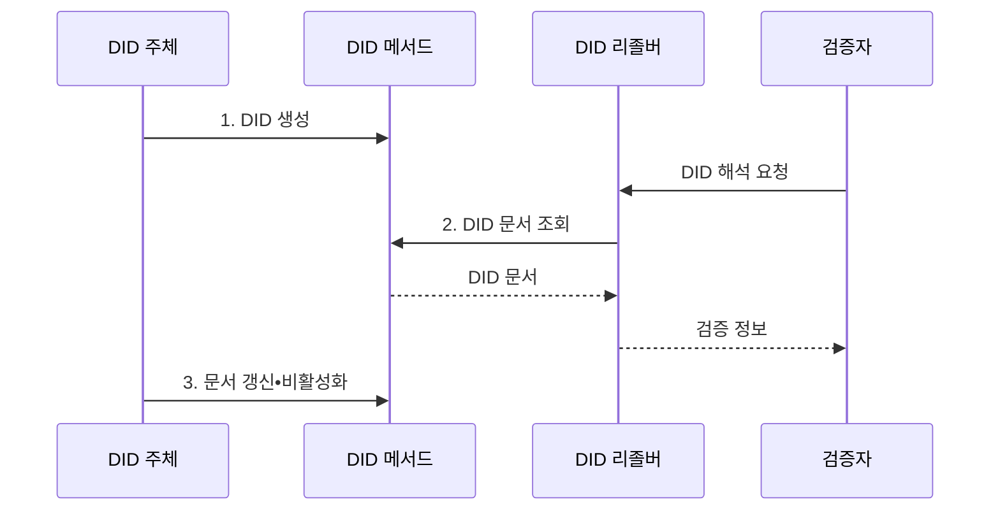

---
sidebar:
  order: 220
  label: "220. 분산 식별자 (Decentralized Identifier)"
  badge:
    text: "기출 • 50%"
    variant: note
title: "분산 식별자(Decentralized Identifier, DID)"
date: "2026-08-04T16:40:00+09:00"
tags:
  - "notes-latest-tech"
weight: 220
extra:
  question_no: "220"
  source_status: "기출"
  source_history: "132회"
  priority: 50
  priority_note: "분산 식별자의 해석•검증•수명주기가 기출"
---

## Ⅰ. 개요

핵심 용어

- **분산 식별자(Decentralized Identifier, DID)**: 중앙 등록기관에 종속되지 않고 식별 주체가 검증 수단과 수명주기를 제어하는 URI 형태의 식별자다.
- **통합 자원 식별자(Uniform Resource Identifier, URI)**: 인터넷 자원을 고유하게 식별하는 표준 문자열 형식이다.

- 정의/개념: **DID** 는 중앙 등록기관 없이 주체가 검증 수단과 수명주기를 제어하는 **URI 형태 식별자**
- 배경/필요성: 중앙 계정 종속으로 서비스 간 **신원 관계 이전 곤란**

#### 한줄 요약

- 기관이 발급한 계정 대신 주체가 식별자와 검증 수단을 직접 관리한다.

## Ⅱ. 특징

핵심 용어

- **탈중앙 제어**: 중앙 등록기관 대신 식별 주체가 키와 갱신 권한을 통해 식별자의 상태를 통제하는 방식이다.

- 중앙 등록기관 없이 주체의 공개키로 제어권과 서명을 확인하는 **탈중앙 제어•암호학적 검증**
- **DID 메서드**: 기반 시스템별 생명주기 규칙 정의
- **DID 문서**: 검증 방법과 서비스 엔드포인트 제공

#### 한줄 요약

- DID는 주소이고 DID 문서는 주소의 공개키와 연락 경로를 알려 주는 안내서다.

## Ⅲ. 구조 및 구성요소

핵심 용어

- **분산 식별자 문서(DID Document)**: 분산 식별자를 해석하여 얻는 검증 방법•서비스 엔드포인트•제어 관계 정보다.
- **DID 주체**: DID가 식별하는 사람•조직•장치•데이터 대상이다.
- **DID 제어자**: DID 문서의 키•서비스 정보를 갱신할 권한을 가진 주체이다.
- **DID 메서드**: 특정 장부•네트워크에서 DID를 생성•해석•갱신•비활성화하는 규칙이다.
- **검증 방법(Verification Method)**: 주체가 키를 통제한다는 서명•인증을 검증하기 위한 공개키와 절차이다.
- **DID 리졸버**: DID 문자열을 해당 메서드로 해석해 최신 DID 문서와 메타데이터를 반환하는 구성요소이다.

**DID 주체** 가 키를 제어하고 리졸버가 메서드에 따라 DID 문서를 해석한다.

| 구성요소 | 책임 |
|:---|:---|
| DID 주체 | 식별자와 **인증 키 제어** |
| DID 메서드 | **생성•해석•갱신•비활성화** 규칙 |
| DID 문서 | **검증 방법•서비스 정보** 제공 |
| DID 리졸버 | 메서드 기반 **DID 문서 해석** |

#### 한줄 요약

- 주체가 키를 관리하고 리졸버가 메서드 규칙에 따라 DID 문서를 찾는다.

## Ⅳ. 흐름도

핵심 용어

- **분산 식별자 해석**: 분산 식별자 메서드 규칙에 따라 식별자의 현재 문서와 상태를 조회하는 과정이다.

**동작 원리**

1. **DID 생성**: 메서드 규칙에 따라 식별자와 문서 등록
2. **DID 문서 조회**: 기반 시스템에서 최신 문서 확보
3. **문서 갱신•비활성화**: 제어권으로 생명주기 변경

#### 한줄 요약

- 검증자는 DID를 리졸버에 보내 공개키를 얻고 서명 검증에 사용한다.

## Ⅴ. 종류 및 비교

핵심 용어

- **검증 가능 자격증명(Verifiable Credential, VC)**: 발급자가 자격 주장에 암호학적 증명을 결합한 디지털 자격증명이다.

| 판단 기준 | DID | DID 문서 | VC |
|:---|:---|:---|:---|
| 핵심 대상 | 주체 **식별자** | **검증 정보** | **자격 주장** |
| 관리 주체 | **DID 제어자** | **DID 제어자** | **발급자** |
| 주요 기능 | **주체 식별** | **키•서비스 해석** | **속성•자격 증명** |
| 주요 한계 | **메서드 상호운용성** | **개인정보 노출** | **발급자 신뢰•상태 확인** |

#### 한줄 요약

- DID는 식별자, DID 문서는 검증 안내서, VC는 서명된 자격증명이다.

## Ⅵ. 실무 고려사항 및 대책

핵심 용어

- **키 회전**: 기존 검증키의 노출 위험을 줄이기 위해 분산 식별자 문서의 키를 새 키로 안전하게 교체하는 절차다.

| 문제 | 대책 | 효과 |
|:---|:---|:---|
| **키 분실•탈취** | **다중 복구키•순환•폐기 절차** | 제어권 복구와 **피해 제한** |
| **상관관계 추적** | **관계별 DID•최소 문서 정보** | **개인정보 노출** 감소 |
| **메서드 종속성** | **표준 리졸버•상호운용 시험** | **해석 결과 일관성** 확보 |
| **검증 가능 자격증명 상태 검증** | **폐기•정지 상태 목록** 연계 | **유효 자격** 만 수용 |

#### 한줄 요약

- DID 문서의 키 상태와 발급기관 VC의 서명•폐기 상태 확인

## Ⅶ. 결론

핵심 용어

- **계층 분리**: 주체 식별•키 해석과 자격 주장의 발급•검증을 별도로 관리하는 원칙이다.

- 주체 식별에는 **DID**, 자격 주장에는 **VC** 를 분리 적용

#### 한줄 요약

- DID로 주체와 키를 확인하고, 실제 자격은 발급자가 서명한 VC로 검증한다.
