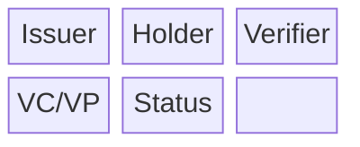
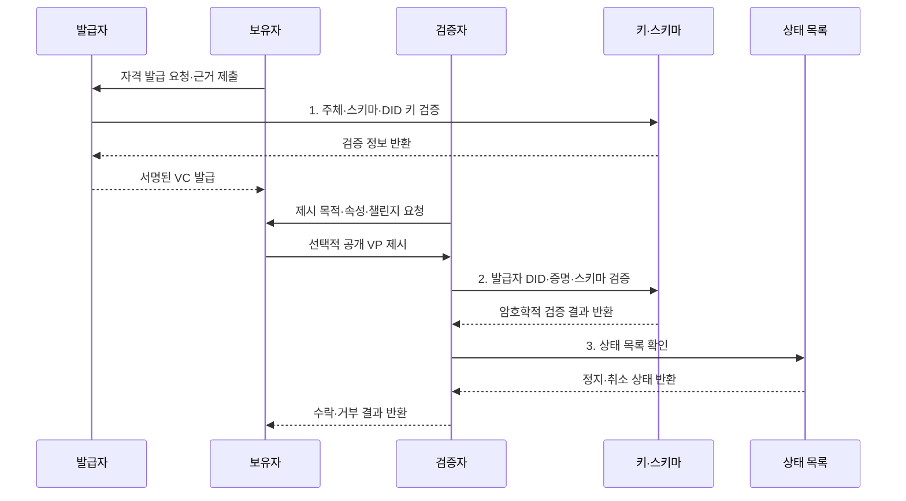

---
sidebar:
  order: 221
  label: "221. 검증가능 자격증명 (Verifiable Credential, VC)"
  badge:
    text: "기출 · 50%"
    variant: note
title: "검증가능 자격증명 (Verifiable Credential, VC)"
date: "2026-07-31T12:17:19+09:00"
tags:
- "notes-latest-tech"
weight: 221
extra:
  question_no: "221"
  source_status: "기출"
  source_history: "132회"
  priority: 50
  priority_note: "검증 가능 자격증명의 발급·검증 구조가 기출됨"
---

## Ⅰ. 개요

핵심 용어

**VC**는 발급자의 자격 주장에 암호학적 증명을 결합하여 보유자가 제시하고 검증자가 진위와 상태를 확인할 수 있는 디지털 자격증명이다.

- 정의/개념: **VC**는 발급자의 자격 주장에 암호학적 증명을 결합해 보유자가 제시하고 검증자가 확인하는 디지털 자격증명
- 배경/필요성: 원본 전체 제출·중앙 API 조회로 **과다 공개·기관 종속 발생**

#### 한줄 요약

- 발행기관의 디지털 도장이 찍힌 자격증을 지갑에 보관했다가, 회사의 목적에 맞춰 필요한 정보만 선택적으로 제출하는 방식

## Ⅱ. 특징

핵심 용어

**선택적 공개**는 검증 목적에 필요한 자격 속성만 보여 주고 나머지 개인정보는 숨기는 방식이다.

- **발급자·보유자·검증자**의 책임 분리
- **VC 원본·VP 제시물**의 제출 범위 구분
- 증명·스키마와 **상태 목록·선택적 공개** 검증
#### 한줄 요약

- 원본 자격증명과 제출용 봉투를 나누고, 봉투에는 상대가 꼭 확인해야 할 내용만 담되 도장·유효기간·취소 여부도 함께 검사함

## Ⅲ. 구조 및 구성요소

핵심 용어

**발급자·보유자·검증자**는 자격을 서명해 발급하고, 보관·제시하며, 증명과 상태를 확인하는 VC의 세 역할이다.

| 구성요소 | 책임 |
|:---|:---|
| Issuer | **주체 정보·VC 증명** 발급 |
| Holder | **VC 보관·VP 구성** 수행 |
| Verifier | **VP 유효성·업무 정책** 검증 |
| VC/VP | **claim·암호학적 proof** 포함 |
| Status | **자격 정지·취소 상태** 제공 |

#### 한줄 요약

- 학교는 자격증을 발행하고 사용자는 지갑에서 제출 봉투를 만들며 회사는 도장 목록과 취소 목록, 채용 규칙을 함께 확인함

## Ⅳ. 흐름도

핵심 용어

**VP**는 보유자가 하나 이상의 VC를 검증 요청의 목적과 조건에 맞게 구성하고 증명한 제출물이다.

**동작 원리**

1. **주체·스키마·DID 키 검증**: 발급 대상·형식·서명 키 확인
2. **발급자 DID·증명·스키마 검증**: 제시물 무결성·유효성 확인
3. **상태 목록 확인**: 정지·취소 조회 후 업무 정책 평가

#### 한줄 요약

- 학교가 확인해 발행한 증명서를 안전히 보관했다가 요청 목적에 맞게 최소 정보로 제출하고, 회사가 기술 검사와 채용 판단을 차례로 수행함

## Ⅴ. 종류 및 비교

핵심 용어

**상태 목록**은 자격증명의 정지·취소 여부를 개인정보 노출을 줄이면서 확인하게 하는 상태 정보다.

| 판단 기준 | 전자문서 증명서 | 중앙 API 조회 | Verifiable Credential |
|:---|:---|:---|:---|
| 적용 기준 | **단순 문서·수작업 검토** | **기관의 최신 상태 제공** | **상호운용·최소 공개 검증** |
| 핵심 특징 | **전자문서 파일 제출** | **발급기관 실시간 조회** | **보유자의 VP 직접 제시** |
| 한계 | **과다 공개·형식 종속** | **가용성·조회 추적·기관 종속** | **키 관리·상태 조회 상관관계** |

> 요약: **VC**는 최소 공개·상호운용, **중앙 API**는 기관 최신 상태 중심

#### 한줄 요약

- 파일 전체를 보내거나 학교 서버에 매번 묻는 대신 표준 증명서를 직접 제출하되, 회사는 도장이 진짜인지와 그 학교 자격을 인정할지를 모두 판단함

## Ⅵ. 실무 고려사항 및 대책

핵심 용어

**목적 제한**은 검증자가 요청 목적에 필요한 속성만 수집하고 다른 용도로 재사용하지 않도록 제한하는 원칙이다.

| 문제 | 대책 | 효과 |
|:---|:---|:---|
| 키 미검증으로 **위조 발급자 수락** | **신뢰 등록부·키 회전 이력** 검증 | **위조 자격 수락** 감소 |
| VP 재사용으로 **상관관계·재전송** | **챌린지·대상·만료** 결합 | **VP 재전송·추적** 감소 |
| 상태 조회로 **보유자 활동 노출** | **프라이버시 상태 목록·캐시** 적용 | **조회 추적성** 감소 |

#### 한줄 요약

- 핵심 운영 위험마다 실행 가능한 대책과 검증 효과를 함께 확인한다.

## Ⅶ. 결론

핵심 용어

**W3C VC Data Model 2.0**은 발급자·보유자·검증자 사이의 자격증명 표현과 교환 방식을 정의한 권고안이다.

- 상호운용·최소 공개는 **VC**, 기관 최신 상태 직접 확인은 **중앙 API** 선택

#### 한줄 요약

- 디지털 도장이 진짜라는 사실과 자격 내용이 믿을 만하고 현재 업무에 적합하다는 판단은 다르므로 발행·보관·제출·검증 전 과정을 함께 관리해야 함
