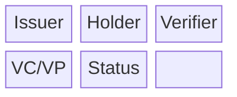
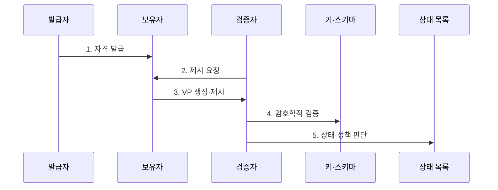

---
sidebar:
  order: 221
  label: "221. 검증가능 자격증명 (Verifiable Credential, VC)"
  badge:
    text: "기출 · 50%"
    variant: note
title: "검증가능 자격증명 (Verifiable Credential, VC)"
date: "2026-07-30T20:20:00+09:00"
tags:
- "notes-latest-tech"
weight: 221
extra:
  question_no: "221"
  source_status: "기출"
  source_history: "132회"
  priority: 50
  priority_note: "검증 가능 자격증명의 발급·검증 구조가 기출됨"
---

## 미리 알고가기

- **분산 식별자(DID)**: 중앙 플랫폼에 종속되지 않고 주체가 제어하는 분산 식별자
- **검증 가능 자격증명(VC)**: 발급자가 주장 내용에 암호학적 증명을 결합한 디지털 자격증명
- **검증 가능 제시물(VP)**: 보유자가 하나 이상의 VC를 요청 목적과 검증 조건에 맞게 구성한 제출물
- **선택적 공개(Selective Disclosure)**: 성인 여부만 확인할 때 생년월일 전체는 숨기듯 필요한 정보만 보여 주는 방법임
- **상태 목록(Status List)**: 자격의 정지·취소 여부를 개인정보 노출을 줄이며 확인하는 상태 정보

## Ⅰ. 개요

- 정의/개념: 발급자가 무결성을 보증한 디지털 자격증명
- 배경/필요성: 증명서 원본 전체 제출과 발급기관별 중앙 API 조회는 불필요한 개인정보를 노출하고 검증 절차를 특정 기관에 종속시킨다.

### 쉽게 이해하기 (학습용)

- 발행기관의 디지털 도장이 찍힌 자격증을 지갑에 보관했다가, 회사의 목적에 맞춰 필요한 정보만 선택적으로 제출하는 방식

## Ⅱ. 특징

- **1. 역할 분리**: 발급자·보유자·검증자가 발급·보관·판단 책임을 나눈다.
- **2. VC·VP 분리**: 원본 자격 주장과 요청별 제출 범위를 구분한다.
- **3. 검증 가능성**: 서명·스키마·상태·선택 공개로 무결성과 유효성을 확인한다.
### 쉽게 이해하기 (학습용)

- 원본 자격증명과 제출용 봉투를 나누고, 봉투에는 상대가 꼭 확인해야 할 내용만 담되 도장·유효기간·취소 여부도 함께 검사함

## Ⅲ. 구조 및 구성요소

| 구성요소 | 책임 |
|:---|:---|
| Issuer | Subject 정보에 서명해 VC를 발급함 |
| Holder | VC를 보관하고 VP로 제시함 |
| Verifier | VP 유효성과 업무 정책을 검증함 |
| VC/VP | claim과 암호학적 proof를 포함함 |
| Status | 자격 정지·취소 여부를 제공함 |

### 쉽게 이해하기 (학습용)

- 학교는 자격증을 발행하고 사용자는 지갑에서 제출 봉투를 만들며 회사는 도장 목록과 취소 목록, 채용 규칙을 함께 확인함

## Ⅳ. 흐름도

**동작 원리**

- **1. 자격 발급**: 발급자가 주체와 주장을 확인하고 스키마에 맞춰 VC에 서명
- **2. 제시 요청**: 검증자가 목적, 요구 속성, 챌린지와 유효시간 제시
- **3. VP 생성·제시**: 보유자가 VC를 선택하고 필요한 정보만 VP로 구성해 보유자 결합 증명
- **4. 암호학적 검증**: 발급자 키, 서명·증명, 스키마, 챌린지와 유효시간 확인
- **5. 상태·정책 판단**: 정지·취소 상태와 발급자 신뢰 및 업무 규칙을 평가해 수락 결정

### 쉽게 이해하기 (학습용)

- 학교가 확인해 발행한 증명서를 안전히 보관했다가 요청 목적에 맞게 최소 정보로 제출하고, 회사가 기술 검사와 채용 판단을 차례로 수행함

## Ⅴ. 종류 및 비교

| 판단 기준 | 전자문서 증명서 | 중앙 API 조회 | Verifiable Credential |
|:---|:---|:---|:---|
| 적용 기준 | 단순 문서 전달·수작업 검토 | 최신 상태를 기관이 중앙 제공 | 상호운용·최소 공개 검증 |
| 핵심 특징 | 전자문서 파일 제출 | 발급기관 서버 실시간 조회 | 보유자가 VP로 직접 제시 |
| 한계 | 과다 공개·형식 종속 | 가용성·조회 추적·기관 종속 | 키 관리·상태 조회 상관관계 |

### 쉽게 이해하기 (학습용)

- 파일 전체를 보내거나 학교 서버에 매번 묻는 대신 표준 증명서를 직접 제출하되, 회사는 도장이 진짜인지와 그 학교 자격을 인정할지를 모두 판단함

## Ⅵ. 실무 고려사항 및 대책

| 고려사항 | 대책 | 효과 |
|:---|:---|:---|
| **발급자·키 신뢰** 미검증 시 위조 발급자나 탈취 키의 자격을 수락 | 신뢰 등록부, 키 회전·폐기 이력, 발급 정책 검증 | 위조 키 **자격 수락률** 감소 |
| **재사용·상관관계** 미검증 시 VP 재전송과 반복 식별로 사생활 침해 | 챌린지·대상·만료 결합, 선택적 공개와 쌍별 식별자 | VP **상관 가능성** 축소 |
| **상태 조회 추적** 미검증 시 취소 확인 과정에서 보유자 활동 노출 | 개인정보 보호 상태 목록, 캐시와 최소 조회 설계 | 상태 조회 **보유자 추적성** 감소 |

### 쉽게 이해하기 (학습용)

- 핵심 운영 위험마다 실행 가능한 대책과 검증 효과를 함께 확인한다.

## Ⅶ. 결론

- 디지털 자격의 위변조와 과도한 정보 공개를 줄이기 위해 발행자 신뢰·스키마·보유자 결합·최소 공개·폐기 상태를 검토하여, 업무에 적합한 자격 검증에 VC를 활용해야 한다.

### 쉽게 이해하기 (학습용)

- 디지털 도장이 진짜라는 사실과 자격 내용이 믿을 만하고 현재 업무에 적합하다는 판단은 다르므로 발행·보관·제출·검증 전 과정을 함께 관리해야 함
