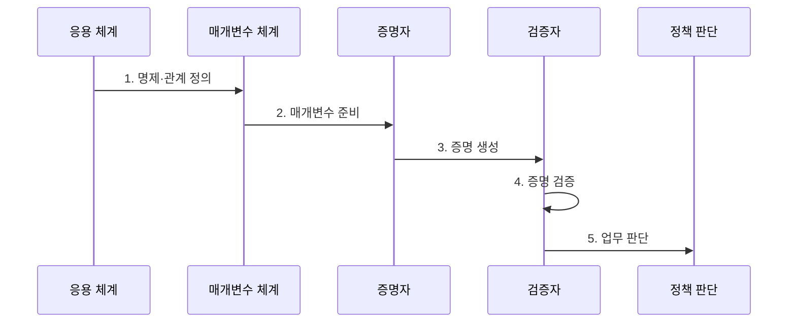

---
sidebar:
  order: 222
  label: "222. 영지식 증명 (Zero-Knowledge Proof, ZKP)"
  badge:
    text: "기출 · 70%"
    variant: note
title: "영지식 증명 (Zero-Knowledge Proof, ZKP)"
date: "2026-07-27T23:59:59+09:00"
tags:
- "notes-latest-tech"
weight: 222
extra:
  question_no: "222"
  source_status: "기출"
  source_history: "132회"
  priority: 70
  priority_note: "영지식 증명의 증명·검증·프라이버시가 유효함"
---

## 미리 알고 가기

- **영지식 증명(ZKP)**: 비밀 증거를 공개하지 않고 공개 명제가 참임을 입증하는 암호 기술
- **완전성(Completeness)**: 명제가 참인 경우, 올바른 증명자가 제시하는 증명은 검증자에 의해 항상 참으로 판정되어야 하는 성질임
- **건전성(Soundness)**: 명제가 거짓인 경우, 속임수를 쓰는 증명자가 제시하는 증명은 검증자에 의해 거의 항상 거짓으로 판정되어야 하는 성질임
- **신뢰 설정(Trusted Setup)**: 영지식 증명 시스템에서 초기 공개 파라미터를 생성하는 단계로, 유출 시 위조 증명이 가능해지므로 높은 신뢰 보안이 요구됨
- **비대화형(Non-interactive)**: 증명자와 검증자가 여러 차례 메시지를 주고받는 상호작용 과정 없이, 증명자가 단 한 번 제출하는 증명만으로 즉시 검증이 가능한 방식임
- **관계 표기 $R(x,w)=1$**: $x$는 누구나 볼 수 있는 공개 명제, $w$는 증명자만 아는 비밀 증거이며, $R(x,w)=1$은 그 증거가 명제의 조건을 실제로 만족한다는 뜻임
- **zk-SNARK·zk-STARK**: 각각 간결한 비대화형 증명과 투명한 확장형 증명으로, 신뢰 가정·증명 크기·검증 비용이 다름

## Ⅰ. 개요

- 정의/개념: 비밀을 공개하지 않고 명제의 참을 증명
- 기존 한계: 기존 검증 방식은 자격이나 거래 사실을 증명하려면 비밀번호·소득·거래 원본 등 불필요한 정보까지 공개해야 한다.

### 쉽게 이해하기 (학습용)

- 비밀번호를 말하지 않고도 잠긴 문을 열 수 있음을 보여주어, 비밀번호를 알고 있다는 사실만 상대가 믿게 만드는 암호 방식

## Ⅱ. 특징

- **완전성**: 참인 명제와 올바른 증거로 만든 증명을 검증자가 수락한다.
- **건전성**: 거짓 명제를 속여 통과시킬 확률을 무시할 만큼 작게 제한한다.
- **영지식성**: 검증 결과 외에 비밀 증거에 관한 정보를 드러내지 않는다.

### 쉽게 이해하기 (학습용)

- 정답이 있으면 통과하고 정답 없이 속일 가능성은 매우 작으며, 검사 과정에서는 정답 자체를 배우지 못하게 하는 세 가지 조건이 핵심임

## Ⅲ. 구조 및 구성요소

| 설계 요소 | 설명 |
|:---|:---|
| Statement | 검증자가 확인할 공개 명제 |
| Witness | 증명자만 아는 비밀 입력 |
| Relation·Parameter | 명제와 비밀의 만족 관계 및 증명 체계의 공개 매개변수 |
| Prover | witness로 proof를 생성함 |
| Verifier | statement와 proof를 검증함 |

> 요약: 공개 명제·비밀 정보 관계로 proof 생성·검증

### 쉽게 이해하기 (학습용)

- 공개 질문과 비밀 정답을 계산 규칙에 넣어 암호 증명서를 만들고, 검증자는 공개 질문과 증명서만으로 규칙을 만족했는지 확인함

## Ⅳ. 흐름도

### 동작 원리

1. **명제·관계 정의**: 공개할 명제와 비밀 증거가 만족해야 할 계산 관계를 회로로 표현
2. **매개변수 준비**: 증명 방식에 따라 신뢰 설정 또는 투명 공개 매개변수 생성
3. **증명 생성**: 증명자가 공개 명제와 비밀 증거로 영지식 증명 계산
4. **증명 검증**: 검증자가 공개 명제·매개변수·증명으로 완전성·건전성 조건 확인
5. **업무 판단**: 외부 입력 출처, 제출자 결합, 재사용 방지와 업무 정책을 별도 평가

> 요약: 비밀을 숨긴 proof로 명제 충족을 입증

### 쉽게 이해하기 (학습용)

- 무엇을 증명할지 정확히 문제로 만들고 준비 키를 안전하게 만든 뒤, 증명서 검사와 함께 입력 출처와 제출자·재사용 여부도 따로 확인함

## Ⅴ. 영지식 증명 방식 비교

| 판단 기준 | Interactive ZKP | zk-SNARK | zk-STARK |
|:---|:---|:---|:---|
| 적용 기준 | 온라인 인증·직접 검증 | 온체인 검증·작은 proof | 큰 계산·투명한 setup 요구 |
| 핵심 특징 | 여러 차례 질의·응답 | 짧은 비대화형 증명 | 투명 설정·해시 기반 증명 |
| 한계 | 상호작용·동시성 제약 | 신뢰 설정·곡선 가정 | 큰 증명·검증 비용 |

> 요약: SNARK·STARK의 가정·효율 차이를 비교

### 쉽게 이해하기 (학습용)

- 대화형은 현장에서 질문을 주고받고, SNARK는 작은 증명서를 만들며, STARK는 증명서가 더 크더라도 공개 준비 절차와 큰 계산 처리에 장점을 두는 방식임

## Ⅵ. 실무 고려사항 및 대책

| 고려사항 | 위험 | 대책 |
|:---|:---|:---|
| **회로·명제 오류** | 잘못 정의한 조건을 완벽히 증명 | 회로 검토·형식 검증, 경계값·악성 입력 시험 |
| **신뢰 설정 훼손** | 비밀 설정값 유출 시 위조 증명 가능 | 다자 설정 의식, 폐기 증적 또는 투명 설정 방식 선택 |
| **외부 입력 신뢰** | 수학적 증명은 맞지만 현실 입력이 허위 | 공인 발급자 서명, 제출자·챌린지 결합, 재사용 방지 |

## Ⅶ. 결론

- 원본 비밀 공개 없이 계산의 유효성을 확인하기 위해 증명 명제·회로·신뢰 설정·증명 비용·외부 입력 신뢰를 검토하여, 최소 정보 검증이 필요한 업무에 적합한 ZKP를 선택해야 한다.

### 쉽게 이해하기 (학습용)

- 암호 증명서가 수학 문제를 올바르게 풀었다는 사실은 알려 주지만 문제의 입력이 현실에서 참인지와 누가 제출했는지는 별도 확인해야 함
