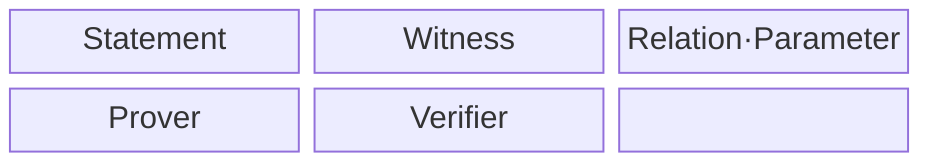
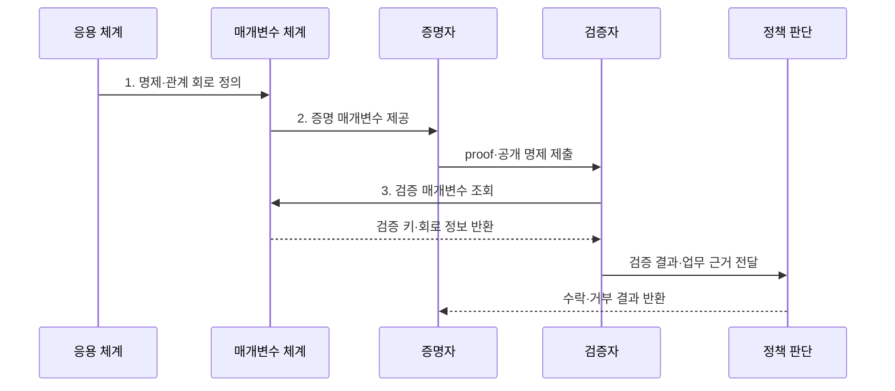

---
sidebar:
  order: 222
  label: "222. 영지식 증명 (Zero-Knowledge Proof, ZKP)"
  badge:
    text: "기출 · 70%"
    variant: note
title: "영지식 증명 (Zero-Knowledge Proof, ZKP)"
date: "2026-07-31T12:10:53+09:00"
tags:
- "notes-latest-tech"
weight: 222
extra:
  question_no: "222"
  source_status: "기출"
  source_history: "132회"
  priority: 70
  priority_note: "영지식 증명의 증명·검증·프라이버시가 유효함"
---

## 미리 알고가기

- **영지식 증명(ZKP)**: 비밀 증거를 공개하지 않고 공개 명제가 참임을 입증하는 암호 기술
- **완전성(Completeness)**: 명제가 참인 경우, 올바른 증명자가 제시하는 증명은 검증자에 의해 항상 참으로 판정되어야 하는 성질임
- **건전성(Soundness)**: 명제가 거짓인 경우, 속임수를 쓰는 증명자가 제시하는 증명은 검증자에 의해 거의 항상 거짓으로 판정되어야 하는 성질임
- **신뢰 설정(Trusted Setup)**: 영지식 증명 시스템에서 초기 공개 파라미터를 생성하는 단계로, 유출 시 위조 증명이 가능해지므로 높은 신뢰 보안이 요구됨
- **비대화형(Non-interactive)**: 증명자와 검증자가 여러 차례 메시지를 주고받는 상호작용 과정 없이, 증명자가 단 한 번 제출하는 증명만으로 즉시 검증이 가능한 방식임
- **관계 표기 $R(x,w)=1$**: $x$는 누구나 볼 수 있는 공개 명제, $w$는 증명자만 아는 비밀 증거이며, $R(x,w)=1$은 그 증거가 명제의 조건을 실제로 만족한다는 뜻임
- **zk-SNARK·zk-STARK**: 각각 간결한 비대화형 증명과 투명한 확장형 증명으로, 신뢰 가정·증명 크기·검증 비용이 다름

## Ⅰ. 개요

- 정의/개념: 비밀 증거를 공개하지 않고 명제가 참임을 입증하는 **ZKP 암호 기술**
- 배경/필요성: 원본 제출 검증은 비밀번호·소득·거래의 **과다 공개 유발**

### 쉽게 이해하기 (학습용)

- 비밀번호를 말하지 않고도 잠긴 문을 열 수 있음을 보여주어, 비밀번호를 알고 있다는 사실만 상대가 믿게 만드는 암호 방식

## Ⅱ. 특징

- 참인 명제의 올바른 증명을 수락하는 **완전성**
- 거짓 명제의 수락 확률을 제한하는 **건전성**
- 검증 결과 외 비밀을 숨기는 **영지식성**
### 쉽게 이해하기 (학습용)

- 정답이 있으면 통과하고 정답 없이 속일 가능성은 매우 작으며, 검사 과정에서는 정답 자체를 배우지 못하게 하는 세 가지 조건이 핵심임

## Ⅲ. 구조 및 구성요소

| 구성요소 | 책임 |
|:---|:---|
| Statement | 검증 대상 **공개 명제** |
| Witness | 증명자만 아는 **비밀 증거** |
| Relation·Parameter | **$R(x,w)=1$ 관계·공개 매개변수** |
| Prover | **witness 기반 proof** 생성 |
| Verifier | **statement·proof** 검증 |

### 쉽게 이해하기 (학습용)

- 공개 질문과 비밀 정답을 계산 규칙에 넣어 암호 증명서를 만들고, 검증자는 공개 질문과 증명서만으로 규칙을 만족했는지 확인함

## Ⅳ. 흐름도

**동작 원리**

1. **명제·관계 회로 정의**: 공개 명제·비밀 증거의 만족 조건 표현
2. **증명 매개변수 제공**: 신뢰 설정·투명 공개 매개변수 준비
3. **검증 매개변수 조회**: proof 검증용 키·회로 정보 확인

### 쉽게 이해하기 (학습용)

- 무엇을 증명할지 정확히 문제로 만들고 준비 키를 안전하게 만든 뒤, 증명서 검사와 함께 입력 출처와 제출자·재사용 여부도 따로 확인함

## Ⅴ. 종류 및 비교

| 판단 기준 | Interactive ZKP | zk-SNARK | zk-STARK |
|:---|:---|:---|:---|
| 적용 기준 | **온라인 인증·직접 검증** | **온체인 검증·작은 proof** | **큰 계산·투명 setup** |
| 핵심 특징 | **다회 질의·응답** | **짧은 비대화형 증명** | **투명 설정·해시 기반 증명** |
| 한계 | **상호작용·동시성 제약** | **신뢰 설정·곡선 가정** | **큰 증명·검증 비용** |

> 요약: **zk-SNARK**는 간결성, **zk-STARK**는 투명 설정·확장성 중심

### 쉽게 이해하기 (학습용)

- 대화형은 현장에서 질문을 주고받고, SNARK는 작은 증명서를 만들며, STARK는 증명서가 더 크더라도 공개 준비 절차와 큰 계산 처리에 장점을 두는 방식임

## Ⅵ. 실무 고려사항 및 대책

| 고려사항 | 대책 | 효과 |
|:---|:---|:---|
| 회로 오류로 **잘못된 조건 증명** | **형식 검증·경계값 시험** 적용 | **명제·업무 의미** 일치 |
| 설정값 유출로 **위조 증명 가능** | **다자 설정·폐기 증적** 또는 투명 설정 | **설정값 유출 위조 위험** 감소 |
| 허위 입력으로 **현실 사실성 불일치** | **발급자 서명·챌린지 결합** | **입력 출처·제출 시점** 검증 |

### 쉽게 이해하기 (학습용)

- 핵심 운영 위험마다 실행 가능한 대책과 검증 효과를 함께 확인한다.

## Ⅶ. 결론

- 작은 증명·온체인은 **zk-SNARK**, 투명 설정·대형 계산은 **zk-STARK** 선택

### 쉽게 이해하기 (학습용)

- 암호 증명서가 수학 문제를 올바르게 풀었다는 사실은 알려 주지만 문제의 입력이 현실에서 참인지와 누가 제출했는지는 별도 확인해야 함
