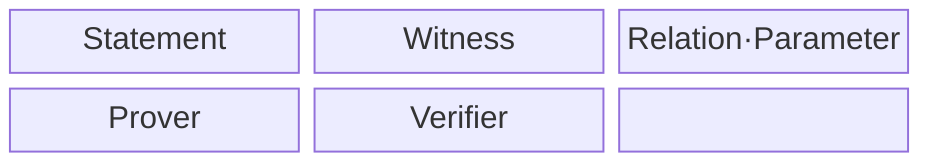
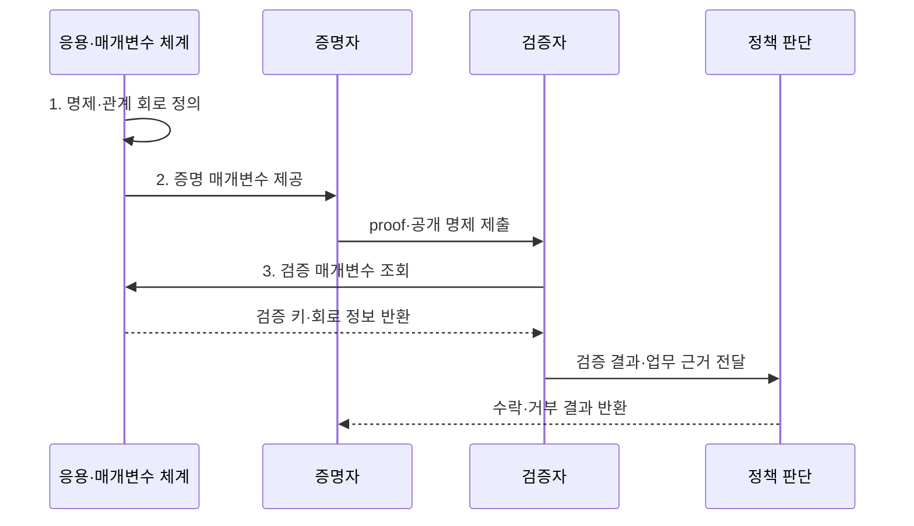

---
sidebar:
  order: 222
  label: "222. 영지식 증명 (Zero-Knowledge Proof, ZKP)"
  badge:
    text: "기출 · 70%"
    variant: note
title: "영지식 증명 (Zero-Knowledge Proof, ZKP)"
date: "2026-07-31T12:10:53+09:00"
tags:
- "notes-latest-tech"
weight: 222
extra:
  question_no: "222"
  source_status: "기출"
  source_history: "132회"
  priority: 70
  priority_note: "영지식 증명의 증명·검증·프라이버시가 유효함"
---

## Ⅰ. 개요

핵심 용어

- **영지식 증명(Zero-Knowledge Proof, ZKP)**: 증명자가 비밀 증거를 공개하지 않고도 공개 명제가 참임을 검증자에게 입증하는 암호 기술이다.

- 정의/개념: **영지식 증명(Zero-Knowledge Proof, ZKP)** 은 증명자가 비밀 증거를 공개하지 않고 공개 명제가 참임을 검증자에게 입증하는 암호 기술
- 배경/필요성: 원본 제출 검증은 비밀번호·소득·거래의 **과다 공개 유발**

#### 한줄 요약

- 비밀 증거를 공개하지 않고도 공개 명제가 참임을 검증하게 한다.

## Ⅱ. 특징

핵심 용어

- **영지식성**: 검증자가 명제의 참 여부 외에는 비밀 증거에 관한 추가 정보를 얻지 못하는 성질이다.

- 참인 명제의 올바른 증명을 수락하는 **완전성**
- 거짓 명제의 수락 확률을 제한하는 **건전성**
- 검증 결과 외 비밀을 숨기는 **영지식성**
#### 한줄 요약

- 완전성·건전성·영지식성을 함께 충족해야 한다.

## Ⅲ. 구조 및 구성요소

핵심 용어

- **관계 $R(x,w)=1$**: 공개 명제 $x$와 비밀 증거 $w$가 정해진 검증 조건을 만족한다는 뜻이다.

| 구성요소 | 책임 |
|:---|:---|
| Statement | 검증 대상 **공개 명제** |
| Witness | 증명자만 아는 **비밀 증거** |
| Relation·Parameter | **$R(x,w)=1$ 관계·공개 매개변수** |
| Prover | **witness 기반 proof** 생성 |
| Verifier | **statement·proof** 검증 |

#### 한줄 요약

- 증명자는 공개 명제와 비밀 증거로 증명을 만들고 검증자는 명제와 증명만 확인한다.

## Ⅳ. 흐름도

핵심 용어

- **비대화형 증명**: 증명자가 한 번 제출한 증명만으로 검증자가 명제의 참 여부를 확인하는 방식이다.

**동작 원리**

1. **명제·관계 회로 정의**: 공개 명제·비밀 증거의 만족 조건 표현
2. **증명 매개변수 제공**: 신뢰 설정·투명 공개 매개변수 준비
3. **검증 매개변수 조회**: proof 검증용 키·회로 정보 확인

#### 한줄 요약

- 명제와 회로를 정확히 정의하고 매개변수·입력 출처·제출자·재사용 여부를 검증한다.

## Ⅴ. 종류 및 비교

핵심 용어

- **영지식 확장 가능 투명 지식 논증(zk-STARK)**: 신뢰 설정 없이 투명한 공개 파라미터를 사용하고 대규모 계산의 증명을 지원하는 영지식 증명 방식이다.

| 판단 기준 | 대화형 영지식 증명(Interactive Zero-Knowledge Proof, Interactive ZKP) | 영지식 간결 비대화형 지식 논증(Zero-Knowledge Succinct Non-Interactive Argument of Knowledge, zk-SNARK) | 영지식 확장 가능 투명 지식 논증(Zero-Knowledge Scalable Transparent Argument of Knowledge, zk-STARK) |
|:---|:---|:---|:---|
| 적용 기준 | **온라인 인증·직접 검증** | **온체인 검증·작은 proof** | **큰 계산·투명 setup** |
| 핵심 특징 | **다회 질의·응답** | **짧은 비대화형 증명** | **투명 설정·해시 기반 증명** |
| 한계 | **상호작용·동시성 제약** | **신뢰 설정·곡선 가정** | **큰 증명·검증 비용** |

> 요약: **zk-SNARK** 는 간결성, **zk-STARK** 는 투명 설정·확장성 중심

#### 한줄 요약

- 대화형은 질의·응답, zk-SNARK는 작은 증명, zk-STARK는 투명 설정과 큰 계산에 적합하다.

## Ⅵ. 실무 고려사항 및 대책

핵심 용어

- **신뢰 설정**: 일부 영지식 증명 방식이 사용할 초기 공개 파라미터를 생성하고 비밀 잔여물을 폐기하는 절차다.

| 문제 | 대책 | 효과 |
|:---|:---|:---|
| 회로 오류로 **잘못된 조건 증명** | **형식 검증·경계값 시험** 적용 | **명제·업무 의미** 일치 |
| 설정값 유출로 **위조 증명 가능** | **다자 설정·폐기 증적** 또는 투명 설정 | **설정값 유출 위조 위험** 감소 |
| 허위 입력으로 **현실 사실성 불일치** | **발급자 서명·챌린지 결합** | **입력 출처·제출 시점** 검증 |

#### 한줄 요약

- 핵심 운영 위험마다 실행 가능한 대책과 검증 효과를 함께 확인한다.

## Ⅶ. 결론

핵심 용어

- **건전성**: 거짓 명제를 가진 부정한 증명자가 검증을 통과할 확률이 무시할 만큼 작아야 하는 성질이다.

- 작은 증명·온체인은 **영지식 간결 비대화형 지식 논증(Zero-Knowledge Succinct Non-Interactive Argument of Knowledge, zk-SNARK)**, 투명 설정·대형 계산은 **영지식 확장 가능 투명 지식 논증(Zero-Knowledge Scalable Transparent Argument of Knowledge, zk-STARK)** 선택

#### 한줄 요약

- 수학적 증명 검증과 현실 입력의 진위·제출자 확인은 별도로 수행해야 한다.
