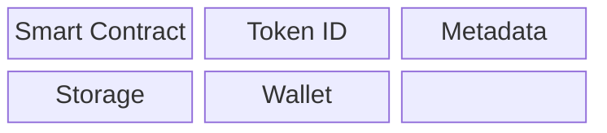
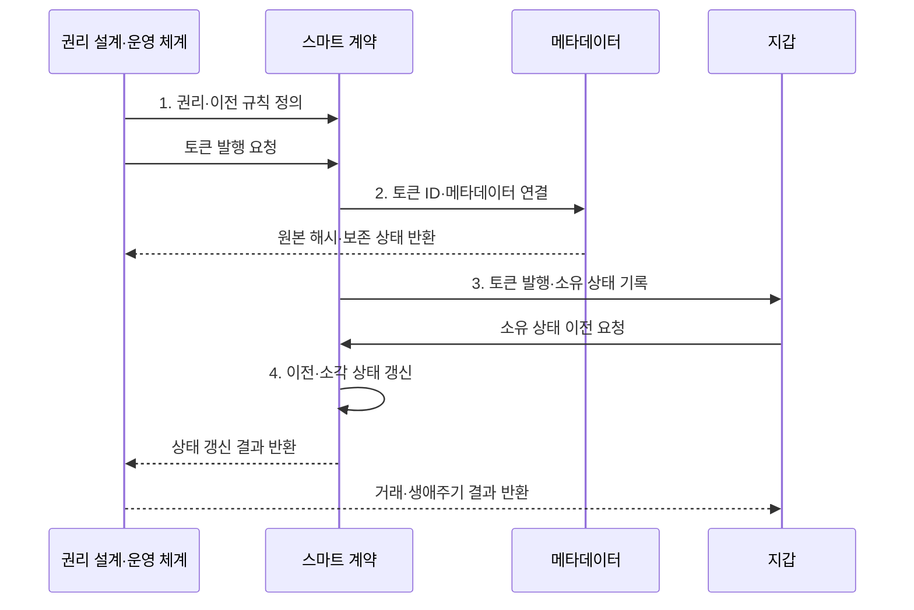

---
sidebar:
  order: 223
  label: "223. 대체 불가능 토큰 (NFT)"
  badge:
    text: "기출 · 30%"
    variant: note
title: "대체 불가능 토큰 (Non-Fungible Token)"
date: "2026-07-31T12:11:34+09:00"
tags:
- "notes-latest-tech"
weight: 223
extra:
  question_no: "223"
  source_status: "기출"
  source_history: "125회"
  priority: 30
  priority_note: "대체 불가 토큰은 최근 독립 출제 흐름이 약함"
---

## Ⅰ. 개요

핵심 용어

**NFT**는 블록체인에서 고유 식별자별 소유 상태와 이전 이력을 기록하는 대체 불가능 토큰이다.

- 정의/개념: 블록체인에서 고유 식별자와 소유 상태를 기록하는 **대체 불가능 토큰(NFT)**
- 배경/필요성: 중앙 서비스 자산은 외부에서 **고유성·소유 이력 검증 불가**

#### 한줄 요약

- 블록체인 장부에 기록된 고유 번호표로, 해당 번호표의 통제권과 소유자 및 이동 이력을 증명하는 기술

## Ⅱ. 특징

핵심 용어

**대체 불가능성**은 각 토큰이 고유 식별자와 속성을 가져 다른 토큰과 일대일로 동일하게 교환되지 않는 성질이다.

- 계약 주소·토큰 ID 조합으로 **고유 단위 식별**
- 스마트 계약으로 **발행·승인·이전 상태** 집행
- 토큰 소유와 **저작권·원본 보존** 분리
#### 한줄 요약

- 번호표의 주인은 장부로 알 수 있지만 번호표가 가리키는 그림과 저작권, 재판매 수익까지 자동으로 따라오는 것은 아님

## Ⅲ. 구조 및 구성요소

핵심 용어

**메타데이터**는 NFT가 가리키는 콘텐츠 주소·창작자·속성값 등을 표현하는 구조화된 데이터다.

| 구성요소 | 책임 |
|:---|:---|
| Smart Contract | **발행·소유·전송 상태** 집행 |
| Token ID | 계약 안의 **고유 단위** 식별 |
| Metadata | **토큰 속성·원본 참조** 기술 |
| Storage | **IPFS 원본·메타데이터** 보존 |
| Wallet | **키 기반 토큰 통제권** 행사 |

#### 한줄 요약

- 블록체인 번호표, 설명서 주소, 실제 보관 창고, 지갑 열쇠, 저작권 계약서가 서로 연결돼야 하나의 쓸 수 있는 디지털 자산이 됨

## Ⅳ. 흐름도

핵심 용어

**민팅**은 스마트 계약이 새 토큰 식별자와 최초 소유 상태를 블록체인에 생성하는 과정이다.

**동작 원리**

1. **권리·이전 규칙 정의**: 이용권·양도·만료·분쟁 범위 명시
2. **토큰 ID·메타데이터 연결**: 내용 해시로 설명·원본 결합
3. **토큰 발행·소유 상태 기록**: 계약 주소·토큰 ID·소유자 생성
4. **이전·소각 상태 갱신**: 지갑 서명·승인 규칙 검증

#### 한줄 요약

- 무엇을 가진 것으로 볼지 계약부터 정하고 번호표를 발행해 설명서와 원본을 연결한 뒤, 이동·사용·분실·폐기 기록을 계속 관리함

## Ⅴ. 종류 및 비교

핵심 용어

**ERC-721**은 이더리움에서 고유 토큰의 소유·조회·이전 인터페이스를 정의한 표준이다.

| 판단 기준 | ERC-721 | ERC-1155 | 중앙 DB Asset |
|:---|:---|:---|:---|
| 적용 기준 | **고유 수집품·증서·입장권** | **게임 품목·복합 자산** | **폐쇄형 서비스 내부 자산** |
| 핵심 특징 | **ID별 고유 토큰** | **유형·수량 통합 관리** | **운영자 DB 소유 상태** |
| 한계 | **발행 비용·원본 분리** | **계약·권한 복잡성** | **운영자 종속·이동 제한** |

> 요약: **ERC-721**은 고유 단일 자산, **ERC-1155**는 유형·수량 통합

#### 한줄 요약

- ERC-721은 고유 번호가 붙은 한 장의 표, ERC-1155는 여러 종류와 수량을 한 장부에서 묶어 다루는 창고, 중앙 DB는 서비스 회사가 관리하는 내부 창고임

## Ⅵ. 실무 고려사항 및 대책

핵심 용어

**IPFS 핀 고정**은 내용 주소로 참조한 파일을 노드가 계속 보관하도록 지정해 외부 콘텐츠의 가용성을 유지하는 운영 방식이다.

| 문제 | 대책 | 효과 |
|:---|:---|:---|
| 토큰 소유로 **법적 권리 혼동** | **이용권 계약·양도 범위** 명시 | **저작권 오인** 방지 |
| 원본 소실로 **참조 콘텐츠 접근 불가** | **내용 해시·IPFS 핀·복제** 운영 | **원본 장기 접근성** 확보 |
| 키 사고로 **무단 이전·영구 손실** | **하드웨어 지갑·다중 승인** 적용 | **무단 이전·키 분실 위험** 감소 |

#### 한줄 요약

- 핵심 운영 위험마다 실행 가능한 대책과 검증 효과를 함께 확인한다.

## Ⅶ. 결론

핵심 용어

**소유 상태**는 특정 토큰을 이전할 수 있는 블록체인 주소를 장부에 기록한 정보이며 저작권 자체를 뜻하지는 않는다.

- 고유 단일 자산은 **ERC-721**, 유형·수량 통합은 **ERC-1155** 선택

#### 한줄 요약

- 블록체인 번호표만 믿지 말고 누가 발행했는지, 원본이 남아 있는지, 어떤 권리를 받는지와 지갑을 안전하게 지키는지를 함께 확인해야 함
