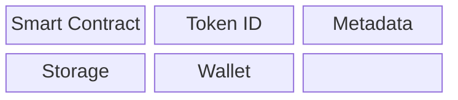
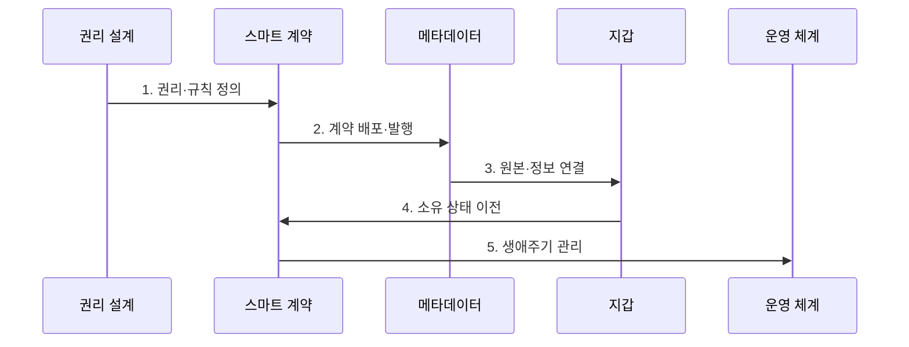

---
sidebar:
  order: 223
  label: "223. 대체 불가능 토큰 (NFT)"
  badge:
    text: "기출 · 30%"
    variant: note
title: "대체 불가능 토큰 (Non-Fungible Token)"
date: "2026-07-30T20:20:00+09:00"
tags:
- "notes-latest-tech"
weight: 223
extra:
  question_no: "223"
  source_status: "기출"
  source_history: "125회"
  priority: 30
  priority_note: "대체 불가 토큰은 최근 독립 출제 흐름이 약함"
---

## 미리 알고가기

- **대체 불가능(Non-Fungible)**: 각 단위가 독특하고 개별적인 가치를 지녀, $1$대$1$로 동일하게 상호 교환할 수 없는 성질임
- **메타데이터(Metadata)**: NFT가 가리키는 이미지 파일 주소, 창작자 정보, 속성값 등을 담고 있는 구조화된 데이터 명세서임
- **IPFS(InterPlanetary File System)**: 내용 해시로 파일을 찾는 분산 파일 프로토콜로, 지속 보존에는 핀 고정과 복제 운영 필요
- **ERC-721**: 이더리움에서 고유 토큰의 소유·이전 인터페이스를 정의한 표준
- **ERC-1155**: 하나의 계약에서 대체 가능·대체 불가능 토큰의 유형과 수량을 함께 관리하는 표준

## Ⅰ. 개요

- 정의/개념: 블록체인에서 고유 토큰의 소유를 기록
- 배경/필요성: 중앙 서비스에 종속된 디지털 항목은 서비스 밖에서 고유성·소유 상태·이전 이력을 공통된 방식으로 검증하기 어렵다.

### 쉽게 이해하기 (학습용)

- 블록체인 장부에 기록된 고유 번호표로, 해당 번호표의 통제권과 소유자 및 이동 이력을 증명하는 기술

## Ⅱ. 특징

- **1. 고유 식별**: 계약 주소와 토큰 ID 조합이 장부의 개별 토큰을 구분한다.
- **2. 소유 상태 전이**: 스마트 계약이 발행·승인·이전 규칙을 집행한다.
- **3. 권리·원본 분리**: 토큰 소유는 저작권·원본 보존·로열티를 자동 보장하지 않는다.
### 쉽게 이해하기 (학습용)

- 번호표의 주인은 장부로 알 수 있지만 번호표가 가리키는 그림과 저작권, 재판매 수익까지 자동으로 따라오는 것은 아님

## Ⅲ. 구조 및 구성요소

| 구성요소 | 책임 |
|:---|:---|
| Smart Contract | 발행·소유·전송 상태를 집행함 |
| Token ID | 계약 안의 고유 단위를 식별함 |
| Metadata | 토큰 속성과 원본 참조를 기술함 |
| Storage | 메타데이터·원본을 보존함 |
| Wallet | 키로 토큰 통제권을 행사함 |

### 쉽게 이해하기 (학습용)

- 블록체인 번호표, 설명서 주소, 실제 보관 창고, 지갑 열쇠, 저작권 계약서가 서로 연결돼야 하나의 쓸 수 있는 디지털 자산이 됨

## Ⅳ. 흐름도

**동작 원리**

- **1. 권리·규칙 정의**: 토큰 소유가 의미하는 이용권·양도·만료·분쟁 규칙 명시
- **2. 계약 배포·발행**: 스마트 계약을 배포하고 계약 주소와 토큰 ID 생성
- **3. 원본·정보 연결**: 메타데이터 주소와 내용 해시로 토큰·설명·원본 연결
- **4. 소유 상태 이전**: 지갑 서명과 승인 규칙을 검증해 장부의 소유자 상태 갱신
- **5. 생애주기 관리**: 원본 보존, 메타데이터 변경, 사용·소각과 지갑 복구 관리

### 쉽게 이해하기 (학습용)

- 무엇을 가진 것으로 볼지 계약부터 정하고 번호표를 발행해 설명서와 원본을 연결한 뒤, 이동·사용·분실·폐기 기록을 계속 관리함

## Ⅴ. 종류 및 비교

| 판단 기준 | ERC-721 | ERC-1155 | 중앙 DB Asset |
|:---|:---|:---|:---|
| 적용 기준 | 고유 수집품·증서·입장권 | 게임 품목·복합 자산 묶음 | 폐쇄형 서비스 내부 자산 |
| 핵심 특징 | ID별 고유 토큰 | 유형·수량 통합 관리 | 운영자 DB 소유 상태 |
| 한계 | 발행 비용·원본 분리 | 계약·권한 복잡성 | 운영자 종속·외부 이동 제한 |

### 쉽게 이해하기 (학습용)

- ERC-721은 고유 번호가 붙은 한 장의 표, ERC-1155는 여러 종류와 수량을 한 장부에서 묶어 다루는 창고, 중앙 DB는 서비스 회사가 관리하는 내부 창고임

## Ⅵ. 실무 고려사항 및 대책

| 고려사항 | 대책 | 효과 |
|:---|:---|:---|
| **토큰·법적 권리 혼동** 미검증 시 소유자가 저작권·이용권을 잘못 인식 | 이용권 계약, 발행자·권리자 검증, 양도 범위 명시 | 토큰 소유와 **법적 이용권의 혼동** 방지 |
| **원본·메타데이터 소실** 미검증 시 토큰은 남아도 참조 콘텐츠 접근 불가 | 내용 해시, 분산 복제·핀 고정, 변경·보존 책임 정의 | 참조 콘텐츠의 **장기 접근 가능성** 확보 |
| **키 탈취·분실** 미검증 시 무단 이전 또는 영구 접근 상실 | 하드웨어 지갑, 다중 승인, 사회적·계약 기반 복구 절차 | 키 사고 시 **무단 이전·영구 손실** 감소 |

### 쉽게 이해하기 (학습용)

- 핵심 운영 위험마다 실행 가능한 대책과 검증 효과를 함께 확인한다.

## Ⅶ. 결론

- 디지털 소유 증표와 실제 권리를 혼동하는 문제를 막기 위해 발행자·원본 보존·메타데이터·이용권 계약·지갑 복구를 검토하여, 고유 증표가 필요한 거래에만 NFT를 적용해야 한다.

### 쉽게 이해하기 (학습용)

- 블록체인 번호표만 믿지 말고 누가 발행했는지, 원본이 남아 있는지, 어떤 권리를 받는지와 지갑을 안전하게 지키는지를 함께 확인해야 함
