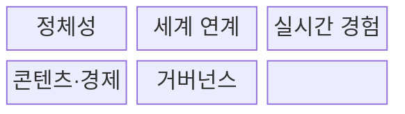
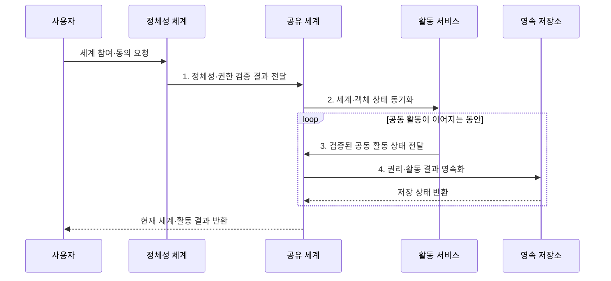

---
sidebar:
  order: 224
  label: "224. 메타버스 (Metaverse)"
  badge:
    text: "기출 · 30%"
    variant: note
title: "메타버스 (Metaverse)"
date: "2026-07-31T12:16:22+09:00"
tags:
- "notes-latest-tech"
weight: 224
extra:
  question_no: "224"
  source_status: "기출"
  source_history: "125회"
  priority: 30
  priority_note: "메타버스는 최근 독립 출제 흐름이 약함"
---

## 미리 알고가기

- **메타버스(metaverse)**: 초월·너머를 뜻하는 meta와 세계를 뜻하는 universe의 합성어로, 지속되는 공유 가상 공간에서 사회·업무·경제 활동을 수행하는 생태계
- **디지털 트윈(Digital Twin)**: 물리적 세계의 사물이나 시스템을 디지털 공간에 똑같이 복제하여 모니터링과 분석을 최적화하는 기술임
- **아바타(Avatar)**: 가상 세계에서 사용자의 신체적 대리인 역할을 수행하는 그래픽 이미지나 캐릭터 객체임

## Ⅰ. 개요

- 정의/개념: 지속형 공유 가상공간에서 사회·경제 활동과 권리를 운영하는 **메타버스 생태계**
- 배경/필요성: 단발성 3D 서비스는 종료 후 **관계·공동 상태·활동 결과 단절**

### 쉽게 이해하기 (학습용)

- 사람들이 들어오고 나가도 활동 결과와 관계가 남아 다음으로 이어지는 공동 디지털 생활공간

## Ⅱ. 특징

- 이용자가 떠난 뒤에도 **세계·활동 상태** 유지
- 아바타·공간 음향 기반 **실시간 상호작용**
- 정체성·콘텐츠·경제를 묶는 **운영 규칙**
### 쉽게 이해하기 (학습용)

- 장소만 3D로 만드는 것이 아니라 누가 무엇을 할 수 있고 물건과 활동 결과가 어떻게 남고 다른 공간으로 옮겨지는지까지 정해야 함

## Ⅲ. 구조 및 구성요소

| 구성요소 | 책임 |
|:---|:---|
| 정체성 | **사용자·에이전트 인증·평판** 관리 |
| 세계 연계 | **가상·물리 세계 상태** 연결 |
| 실시간 경험 | **아바타·객체 사건** 동기화 |
| 콘텐츠·경제 | **재화 생성·소유·거래** 지원 |
| 거버넌스 | **안전·분쟁·접근 정책** 집행 |

### 쉽게 이해하기 (학습용)

- 공동 놀이터를 그리는 기술 외에 출입증, 물건 보관소, 거래 규칙, 안전요원과 다른 놀이터로 옮기는 통로가 함께 필요함

## Ⅳ. 흐름도

**동작 원리**

1. **정체성·권한 검증 결과 전달**: 인증·동의·연령·역할 확인
2. **세계·객체 상태 동기화**: 권위 상태를 참여자에게 전파
3. **검증된 공동 활동 상태 전달**: 협업·거래 규칙 적용
4. **권리·활동 결과 영속화**: 재접속용 세계·권리 상태 저장

### 쉽게 이해하기 (학습용)

- 로그인해 가능한 공간과 물건을 확인하고 함께 활동한 결과를 규칙에 따라 저장해 다음에 들어왔을 때 이어서 사용함

## Ⅴ. 종류 및 비교

| 판단 기준 | 단일 VR·온라인 세계 | 디지털 트윈 | 메타버스 생태계 |
|:---|:---|:---|:---|
| 적용 기준 | **단일 게임·회의·몰입** | **물리 자산 분석·제어** | **지속적 공동 활동·경제** |
| 핵심 특징 | **단일 몰입형 서비스** | **물리 자산 디지털 대응체** | **지속형 공유 활동 생태계** |
| 한계 | **서비스 밖 상태·권리 단절** | **모델 오류의 현실 전파** | **안전·경제·상호운용 복잡** |

> 요약: **디지털 트윈**은 물리 자산, **메타버스**는 지속 공동 활동 중심

### 쉽게 이해하기 (학습용)

- VR 회의방 하나나 공장 복제 화면 하나가 곧 메타버스인 것이 아니라 여러 활동과 사람의 상태가 지속되고 연결되는 운영 체계가 더 필요함

## Ⅵ. 실무 고려사항 및 대책

| 고려사항 | 대책 | 효과 |
|:---|:---|:---|
| 지연·충돌로 **실시간 상태 불일치** | **권위 상태·지연 보상·재동기화** | **세계 상태 일관성** 확보 |
| 사칭·괴롭힘으로 **사용자 안전 침해** | **연령·역할·신고·제재 정책** | **사용자 피해 범위** 축소 |
| 플랫폼 종료로 **가상 자산 권리 분쟁** | **권리 계약·내보내기·환불** 절차 | **자산 이전·환불 권리** 보장 |

### 쉽게 이해하기 (학습용)

- 핵심 운영 위험마다 실행 가능한 대책과 검증 효과를 함께 확인한다.

## Ⅶ. 결론

- 물리 자산 분석은 **디지털 트윈**, 지속 공동 활동은 **메타버스** 선택

### 쉽게 이해하기 (학습용)

- 화려한 3D 화면보다 사람들이 안심하고 함께 활동하며 결과와 권리를 다음 접속과 다른 공간까지 올바르게 이어가는지가 핵심임
