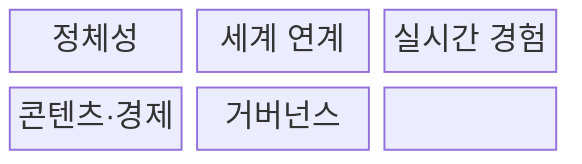
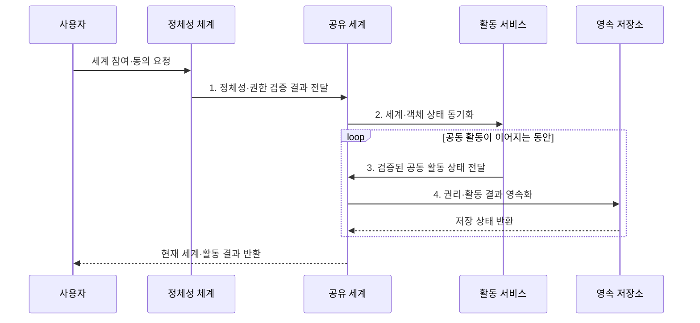

---
sidebar:
  order: 224
  label: "224. 메타버스 (Metaverse)"
  badge:
    text: "기출 · 30%"
    variant: note
title: "메타버스 (Metaverse)"
date: "2026-07-31T12:16:22+09:00"
tags:
- "notes-latest-tech"
weight: 224
extra:
  question_no: "224"
  source_status: "기출"
  source_history: "125회"
  priority: 30
  priority_note: "메타버스는 최근 독립 출제 흐름이 약함"
---

## Ⅰ. 개요

핵심 용어

- **메타버스(Metaverse)**: 지속되는 공유 가상공간에서 이용자가 사회·업무·경제 활동과 디지털 권리를 이어가는 서비스 생태계다.

- 정의/개념: 지속형 공유 가상공간에서 사회·경제 활동과 권리를 운영하는 **메타버스(Metaverse) 생태계**
- 배경/필요성: 단발성 **3차원(Three-Dimensional, 3D)** 서비스는 종료 후 **관계·공동 상태·활동 결과 단절**

#### 한줄 요약

- 이용자가 접속을 종료해도 공동 상태·관계·활동 결과가 지속되는 가상공간이다.

## Ⅱ. 특징

핵심 용어

- **지속성**: 이용자가 접속을 종료한 뒤에도 가상 세계의 상태·관계·활동 결과가 보존되는 성질이다.

- 이용자가 떠난 뒤에도 **세계·활동 상태** 유지
- 아바타·공간 음향 기반 **실시간 상호작용**
- 정체성·콘텐츠·경제를 묶는 **운영 규칙**
#### 한줄 요약

- 3차원 공간뿐 아니라 정체성·권리·활동 결과의 지속성과 이전 규칙이 필요하다.

## Ⅲ. 구조 및 구성요소

핵심 용어

- **아바타**: 가상 세계에서 사용자의 정체성과 행위를 표현하는 디지털 대리 객체다.

| 구성요소 | 책임 |
|:---|:---|
| 정체성 | **사용자·에이전트 인증·평판** 관리 |
| 세계 연계 | **가상·물리 세계 상태** 연결 |
| 실시간 경험 | **아바타·객체 사건** 동기화 |
| 콘텐츠·경제 | **재화 생성·소유·거래** 지원 |
| 거버넌스 | **안전·분쟁·접근 정책** 집행 |

#### 한줄 요약

- 정체성·세계 상태·실시간 경험·경제·거버넌스를 함께 구성해야 한다.

## Ⅳ. 흐름도

핵심 용어

- **공동 상태 동기화**: 여러 이용자에게 가상 공간과 객체의 변경 결과를 일관되게 전달하는 과정이다.

**동작 원리**

1. **정체성·권한 검증 결과 전달**: 인증·동의·연령·역할 확인
2. **세계·객체 상태 동기화**: 권위 상태를 참여자에게 전파
3. **검증된 공동 활동 상태 전달**: 협업·거래 규칙 적용
4. **권리·활동 결과 영속화**: 재접속용 세계·권리 상태 저장

#### 한줄 요약

- 정체성과 권한을 확인하고 공동 활동 결과와 권리를 영속화한다.

## Ⅴ. 종류 및 비교

핵심 용어

- **디지털 트윈(Digital Twin)**: 물리 대상의 상태와 이력을 가상 표현에 동기화하여 분석·예측을 지원하는 기술이다.

| 판단 기준 | 단일 가상현실(Virtual Reality, VR)·온라인 세계 | 디지털 트윈 | 메타버스 생태계 |
|:---|:---|:---|:---|
| 적용 기준 | **단일 게임·회의·몰입** | **물리 자산 분석·제어** | **지속적 공동 활동·경제** |
| 핵심 특징 | **단일 몰입형 서비스** | **물리 자산 디지털 대응체** | **지속형 공유 활동 생태계** |
| 한계 | **서비스 밖 상태·권리 단절** | **모델 오류의 현실 전파** | **안전·경제·상호운용 복잡** |

> 요약: **디지털 트윈** 은 물리 자산, **메타버스** 는 지속 공동 활동 중심

#### 한줄 요약

- 단일 가상현실 서비스와 달리 메타버스는 여러 이용자의 상태·활동·권리가 지속된다.

## Ⅵ. 실무 고려사항 및 대책

핵심 용어

- **가상 자산 권리**: 디지털 객체의 사용·이전·수익 권한과 이를 집행하는 플랫폼 규칙의 결합이다.

| 문제 | 대책 | 효과 |
|:---|:---|:---|
| 지연·충돌로 **실시간 상태 불일치** | **권위 상태·지연 보상·재동기화** | **세계 상태 일관성** 확보 |
| 사칭·괴롭힘으로 **사용자 안전 침해** | **연령·역할·신고·제재 정책** | **사용자 피해 범위** 축소 |
| 플랫폼 종료로 **가상 자산 권리 분쟁** | **권리 계약·내보내기·환불** 절차 | **자산 이전·환불 권리** 보장 |

#### 한줄 요약

- 핵심 운영 위험마다 실행 가능한 대책과 검증 효과를 함께 확인한다.

## Ⅶ. 결론

핵심 용어

- **상호운용성**: 서로 다른 가상공간이 정체성·자산·활동 데이터를 합의된 형식과 권한으로 교환하는 능력이다.

- 물리 자산 분석은 **디지털 트윈**, 지속 공동 활동은 **메타버스** 선택

#### 한줄 요약

- 화면 표현보다 공동 활동 결과와 권리를 다음 접속과 다른 공간까지 이어가는지가 중요하다.
