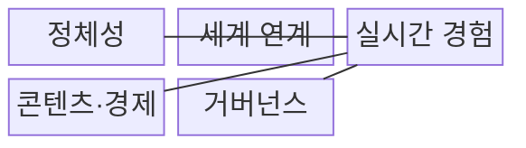
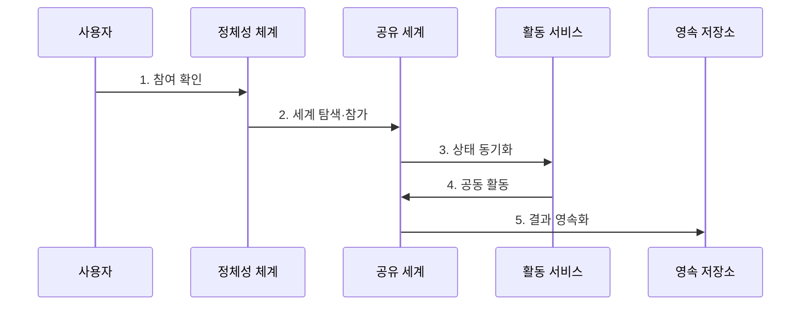

---
sidebar:
  order: 224
  label: "224. 메타버스 (Metaverse)"
  badge:
    text: "기출 · 30%"
    variant: note
title: "메타버스 (Metaverse)"
date: "2026-07-30T11:10:21+09:00"
tags:
- "notes-latest-tech"
weight: 224
extra:
  question_no: "224"
  source_status: "기출"
  source_history: "125회"
  priority: 30
  priority_note: "메타버스는 최근 독립 출제 흐름이 약함"
---

## 미리 알고 가기

- **메타버스(metaverse)**: 초월·너머를 뜻하는 meta와 세계를 뜻하는 universe의 합성어로, 지속되는 공유 가상 공간에서 사회·업무·경제 활동을 수행하는 생태계
- **디지털 트윈(Digital Twin)**: 물리적 세계의 사물이나 시스템을 디지털 공간에 똑같이 복제하여 모니터링과 분석을 최적화하는 기술임
- **아바타(Avatar)**: 가상 세계에서 사용자의 신체적 대리인 역할을 수행하는 그래픽 이미지나 캐릭터 객체임
- **라이프로깅(Lifelogging)**: 사용자의 일상적인 활동과 경험 정보를 센서와 카메라로 캡처하여 저장, 공유, 분석하는 메타버스의 구성 범주 중 하나임
- **거울 세계(Mirror Worlds)**: 현실 세계의 정보를 사실적으로 재현하고 확장하여 인터넷 맵이나 위치 기반 서비스 형태로 구현한 메타버스의 일종임

## Ⅰ. 개요

- 정의/개념: 지속형 가상 공간에서 상호작용하는 생태계
- 기존 한계: 단발성 화상회의와 개별 3D 콘텐츠는 세션이 끝나면 사용자 관계·공동 상태·활동 결과가 단절된다.

### 쉽게 이해하기 (학습용)

- 사람들이 들어오고 나가도 활동 결과와 관계가 남아 다음으로 이어지는 공동 디지털 생활공간

## Ⅱ. 특징

- **지속성·동시성**: 사용자가 떠나도 공유 세계와 활동 결과가 유지된다.
- **체화·현존감**: 아바타·공간 음향·실시간 상호작용으로 공동 경험을 만든다.
- **생태계 운영**: 정체성·콘텐츠·경제·안전 규칙이 활동과 권리를 연결한다.

### 쉽게 이해하기 (학습용)

- 장소만 3D로 만드는 것이 아니라 누가 무엇을 할 수 있고 물건과 활동 결과가 어떻게 남고 다른 공간으로 옮겨지는지까지 정해야 함

## Ⅲ. 구조 및 구성요소

| 구성요소 | 책임 |
|:---|:---|
| 정체성 | 사용자·에이전트의 인증·평판 관리 |
| 세계 연계 | 가상·물리 세계 상태를 연결함 |
| 실시간 경험 | 아바타·객체 사건을 동기화함 |
| 콘텐츠·경제 | 재화 생성·소유·거래를 지원함 |
| 거버넌스 | 안전·분쟁·접근 정책을 집행함 |

> 요약: 정체성·지속 공유 환경·거버넌스를 연결

### 쉽게 이해하기 (학습용)

- 공동 놀이터를 그리는 기술 외에 출입증, 물건 보관소, 거래 규칙, 안전요원과 다른 놀이터로 옮기는 통로가 함께 필요함

## Ⅳ. 흐름도

### 동작 원리

1. **참여 확인**: 사용자·장치 인증과 동의, 연령·역할·안전 정책 확인
2. **세계 탐색·참가**: 접근 가능한 공간을 찾고 아바타·권한·공간 자산 로드
3. **상태 동기화**: 권위 서버가 사용자·객체 사건을 검증해 참여자에게 전파
4. **공동 활동**: 협업·창작·거래를 수행하고 권리·경제·안전 규칙 집행
5. **결과 영속화**: 세계 상태와 권리·활동 결과를 저장해 재접속 시 복원

> 요약: 참여 사건으로 권위 상태를 갱신·공유·저장

### 쉽게 이해하기 (학습용)

- 로그인해 가능한 공간과 물건을 확인하고 함께 활동한 결과를 규칙에 따라 저장해 다음에 들어왔을 때 이어서 사용함

## Ⅴ. 가상·현실 융합 서비스 비교

| 판단 기준 | 단일 VR·온라인 세계 | 디지털 트윈 | 메타버스 생태계 |
|:---|:---|:---|:---|
| 적용 기준 | 단일 게임·회의·몰입 서비스 | 물리 자산의 상태 분석·제어 | 지속적 공동 활동·경제·이동 |
| 핵심 특징 | 단일 몰입형 서비스 | 물리 자산의 디지털 대응체 | 지속형 공유 활동 생태계 |
| 한계 | 서비스 밖 상태·권리 단절 | 모델 오류의 현실 전파 | 안전·경제·상호운용 복잡 |

> 요약: 지속 활동·정체성·경제·거버넌스를 연결

### 쉽게 이해하기 (학습용)

- VR 회의방 하나나 공장 복제 화면 하나가 곧 메타버스인 것이 아니라 여러 활동과 사람의 상태가 지속되고 연결되는 운영 체계가 더 필요함

## Ⅵ. 실무 고려사항 및 대책

| 고려사항 | 대책 | 효과 |
|:---|:---|:---|
| **실시간 상태 불일치** 미검증 시 지연·충돌로 참여자마다 다른 세계 관측 | 권위 상태, 지연 보상, 충돌 해결과 재동기화 | 참여자 간 **가상 세계 상태 일관성** 확보 |
| **신원·행동 안전** 미검증 시 사칭·괴롭힘·유해 콘텐츠 피해 | 연령·역할 정책, 신고·차단, 행동 감사와 단계적 제재 | 사칭·괴롭힘의 **사용자 피해 범위** 축소 |
| **가상 자산 권리** 미검증 시 플랫폼 종료·이동 시 소유·이용권 분쟁 | 권리 계약, 내보내기 형식, 종료·환불·분쟁 절차 | 플랫폼 이동·종료 시 **가상 자산 권리** 보존 |

## Ⅶ. 결론

- 일회성 3D 화면과 실질적 가상공간을 구분하기 위해 지속 상태·다중 사용자 상호작용·상호운용·권리·안전 규칙을 검토하여, 지속적 공동 활동이 필요한 서비스에 메타버스를 적용해야 한다.

### 쉽게 이해하기 (학습용)

- 화려한 3D 화면보다 사람들이 안심하고 함께 활동하며 결과와 권리를 다음 접속과 다른 공간까지 올바르게 이어가는지가 핵심임
